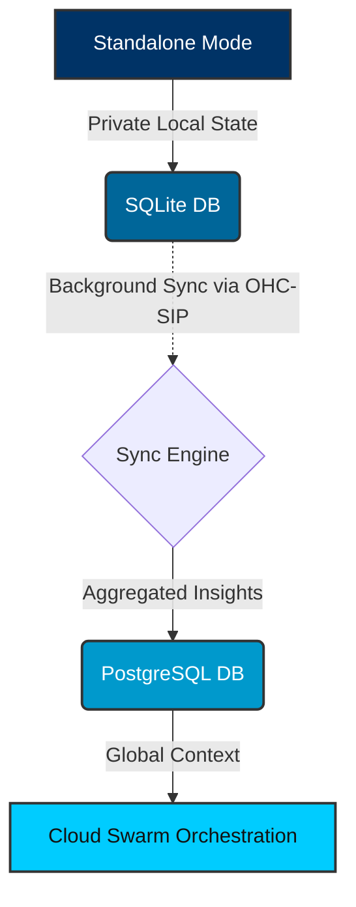

<div markdown="1" style="backdrop-filter: blur(20px) saturate(200%); font-family: 'Outfit', 'Inter', sans-serif; border: 1px solid rgba(255, 255, 255, 0.1); padding: 20px; border-radius: 12px; background: rgba(255, 255, 255, 0.05); color: #fff;">

# Interactive Hybrid MCP RAG Playbook

Welcome to the Hybrid Model Context Protocol (MCP) RAG Protocol playbook. This playbook details how OHC bridges local SQLite execution with cloud-native PostgreSQL scaling, enabling private offline execution that scales dynamically.

## 1. Architectural Overview

The Hybrid MCP RAG system solves the binary choice between local privacy and cloud scalability.



## 2. Core Components

1.  **Sync Daemon (Standalone)**: A lightweight Go daemon running in Standalone Mode that monitors local SQLite changes for RAG context (e.g., semantic summaries, non-PII vector embeddings).
2.  **API Gateway (Cloud)**: An endpoint on the OHC Cloud Gateway to receive and authenticate incoming sync payloads from Standalone clients.
3.  **Conflict Resolution Engine**: Since data might diverge, a Last-Write-Wins (LWW) or CRDT-based merging strategy for context memories.

## 3. API Endpoints

### 3.1 Fetch Pending Syncs
**Endpoint:** `GET /api/v1/rag/sync/pending`

Retrieves records from the local DB that need syncing to the cloud.

### 3.2 Process Incoming Sync
**Endpoint:** `POST /api/v1/rag/sync/process`

Handles data pushed from a standalone client into the cloud DB.

**Payload:**
```json
{
  "records": [
    {
      "id": "mem_123",
      "context": "Agent decided to use Glassmorphism",
      "sync_status": "pending"
    }
  ]
}
```

</div>
