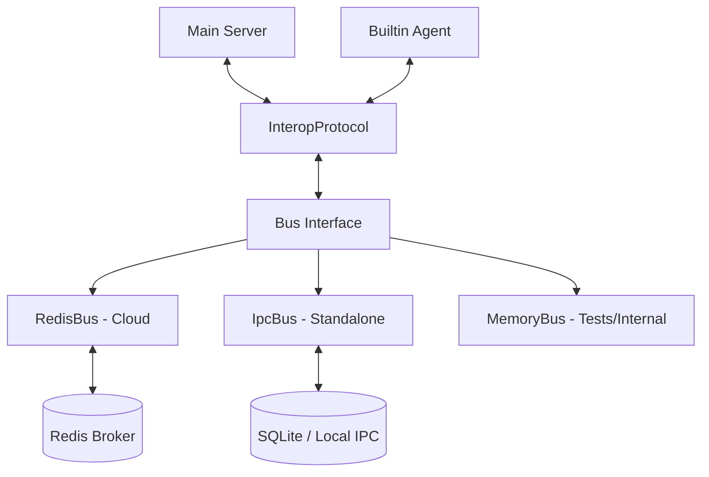

# Teammate Mesh Interop Layer Architecture

## Overview
The Interop Layer ensures that the OHC Swarm communicates with zero latency and perfect alignment across both Cloud and Standalone environments. The main server and builtin agent microservice stay in sync seamlessly, regardless of whether the system operates online via Redis Pub/Sub (Cloud) or offline via local IPC (Standalone).

## Transport Layer
The interop architecture is heavily abstracted across different transport mechanisms to accommodate varying deployments without changing the application logic. All wire formats utilize Protobufs (`src/proto/interop.proto`).

- **RedisBus (`MODE_CLOUD`)**: Uses Redis Pub/Sub for messaging and Redis commands (`SET NX EX`) for distributed locking.
- **IpcBus (`MODE_STANDALONE`)**: Uses a local SQLite-backed database (`bus_messages`, `bus_locks`) for inter-process communication and local file advisory locking.
- **MemoryBus**: Designed for internal fast routing and test mocks.

## Core Protocol Capabilities
1. **Teammate Mesh Communication (`JobDispatch` & `JobAck`)**
   The protocol reliably dispatches background jobs from the main server to the builtin agent.
   - Retry logic and exponential backoff are built into `dispatch_job`.
   - Acknowledgments (`system:job_ack:{id}`) ensure survivability across network partitions and reconnections.

2. **Distributed Locking**
   A uniform locking scheme guarantees that concurrent swarm access to the same tenant resource remains consistent. Both `RedisBus` (using Redlock-like logic) and `IpcBus` implement the same `DistributedLock` trait.

3. **State Handoff (`StateHandoff`)**
   Cross-mode switching involves idempotently synchronizing mission state, AI context, and customer data. When a mode switches (Cloud ↔ Standalone), the state snapshot is dispatched over `system:state_handoff`.

4. **Health Monitoring (`HealthPing` & `HealthAck`)**
   Cross-mode health check probes (`HealthMonitor`) confirm the builtin agent is alive. Pings and Acks share the identical protobuf structures regardless of the transport medium.

## Handoff Semantics
- Uses an idempotency lock (`handoff:processed:{mission_id}`) to ensure a mode handoff payload is strictly executed once.
- Requires both an execution lock and a persistent bus delivery mechanism.