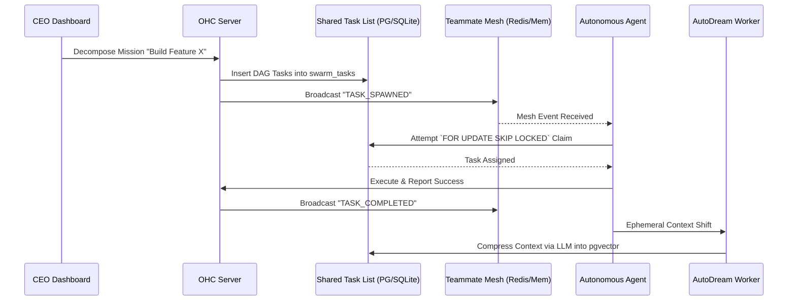

<div markdown="1" style="backdrop-filter: blur(20px) saturate(200%); font-family: Outfit, Inter, sans-serif; border: 1px solid rgba(255, 255, 255, 0.1); padding: 20px; border-radius: 12px; background: rgba(255, 255, 255, 0.05);">

# Design Doc: KAIROS Orchestration
**Author:** Antigravity, Principal Product Architect & Visionary (L7)
**Status:** Approved
**Last Updated:** 2026-04-04

## 1. Overview
The OHC Swarm demands a highly scalable, fault-tolerant backbone to coordinate long-running distributed agentic workloads. **KAIROS Orchestration** is the core blueprint that unites our "Shared Task List", "Teammate Mesh APIs", and "AutoDream Vector Data Pipelines" into a seamless Hybrid Agentic OS.

## 2. Core Components

### 2.1 Shared Task List
A distributed state machine for tracking and orchestrating asynchronous tasks across the swarm. KAIROS utilizes `swarm_tasks` for mission-critical steps and `shared_tasks` for inter-agent delegation.
*   **PostgreSQL Native (Cloud)**: Relies on `FOR UPDATE SKIP LOCKED` inside explicit transactions (`tx.Begin()`) for lock-free concurrency and zero TOCTOU (Time-Of-Check to Time-Of-Use) race conditions across parallel K8s agent pods. Explicit `organization_id` filtering is strictly enforced for tenant isolation.
*   **SQLite Fallback (Standalone)**: Degrades to single-node concurrency guarantees, utilizing local table locks (a two-step select-then-update via `UPDATE ... RETURNING` workaround) or mutexes to preserve transactional integrity for single-user workloads.
*   **DAG Dependencies**: Enforces sequence and parallel task unblocking (e.g., frontend tasks block on backend completion).

### 2.2 Teammate Mesh APIs
A high-throughput realtime event bus that allows agents to broadcast intent, coordinate memory, and perform lock arbitration.
*   **Cloud Architecture**: Agents publish to production Redis Pub/Sub channels (e.g., `mesh:tasks`, `mesh:sync`). Centrifuge handles downstream WebSocket propagation to the human CEO dashboard.
*   **Standalone Architecture**: Fallbacks to in-memory Go channels natively, guaranteeing the OS never fails simply because a heavy dependency (Redis) is offline.
*   **Zero Secrets**: Relies entirely on SPIFFE/SPIRE Workload APIs to establish mTLS mesh identities.

### 2.3 AutoDream Vector Data Pipelines
A semantic memory consolidation pipeline running passively to translate ephemeral session contexts into durable, vectorized truth.
*   **Pipeline Logic**: Background workers monitor `agent_session_data` (older than 24 hours) and trigger Minimax/LLM summarization jobs (`AutoDreamWorker`), transforming short-term token buffers into high-dimensional `pgvector` records in `autodream_memories` and `swarm_truth_embeddings`.
*   **Cloud Mode**: Uses `pgvector` for exact Nearest Neighbor search (`ORDER BY embedding <-> $1`).
*   **Local Degration**: In SQLite, falls back to recency-based full-text extraction (`ORDER BY created_at DESC`).

## 3. Sequence Flow (Master Loop)



## 4. DB Schema References

**Task Tracking (`swarm_tasks`)**
```sql
CREATE TABLE IF NOT EXISTS swarm_tasks (
    id UUID PRIMARY KEY DEFAULT gen_random_uuid(),
    mission_id TEXT NOT NULL,
    parent_plan_id TEXT,
    dependencies JSONB NOT NULL DEFAULT '[]',
    title TEXT NOT NULL,
    status TEXT NOT NULL DEFAULT 'PENDING',
    assigned_agent_id TEXT,
    payload JSONB
);
```

**Memory Consolidation (`autodream_memories`)**
```sql
CREATE EXTENSION IF NOT EXISTS vector;
CREATE TABLE IF NOT EXISTS autodream_memories (
    id UUID PRIMARY KEY DEFAULT gen_random_uuid(),
    content TEXT NOT NULL,
    embedding VECTOR(1536),
    source_mission_id TEXT
);
```

## 5. Visual Excellence
This architecture must not be exposed as dry infrastructure. The frontend dashboard tracking KAIROS metrics will deploy the OHC "Premium Feel":
*   `backdrop-filter: blur(20px) saturate(200%)`
*   Fluid, ghostly data layer representations for Redis pub/sub streams.

</div>
