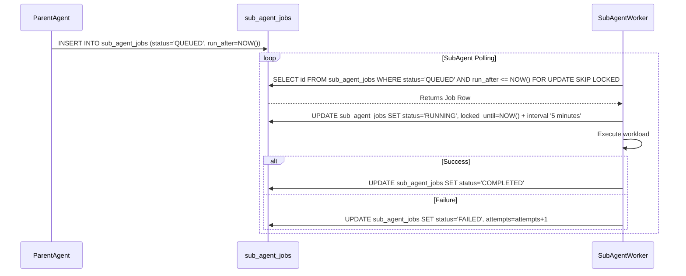

<div markdown="1" style="backdrop-filter: blur(20px) saturate(200%); font-family: 'Outfit', 'Inter', sans-serif; border: 1px solid rgba(255, 255, 255, 0.1); padding: 20px; border-radius: 12px; background: rgba(255, 255, 255, 0.03); color: #fff;">

# Phase 4: KAIROS Orchestration Design (Sub-Agent Orchestration Queue)
**Author:** Principal Product Architect & KAIROS Orchestrator (L7)

## Overview
For isolating smaller sub-tasks and managing them across the OHC Swarm, KAIROS leverages a dedicated `sub_agent_jobs` queue. This background queue manages sub-agent lifecycles securely in isolated production pods, ensuring absolute autonomy for sub-agents executing localized workloads.

## 1. Database Schema Definition (Queue)
- Jobs have exponential backoff for retries (`attempts`, `max_attempts`).
- Lock durations managed via `locked_until`.

```sql
CREATE TABLE IF NOT EXISTS sub_agent_jobs (
    id TEXT PRIMARY KEY,
    parent_task_id TEXT,
    agent_role TEXT NOT NULL,
    payload JSONB NOT NULL,
    status TEXT NOT NULL DEFAULT 'QUEUED', -- QUEUED, RUNNING, FAILED, COMPLETED
    attempts INTEGER DEFAULT 0,
    max_attempts INTEGER DEFAULT 3,
    run_after DATETIME DEFAULT CURRENT_TIMESTAMP,
    locked_until DATETIME,
    created_at DATETIME DEFAULT CURRENT_TIMESTAMP,
    updated_at DATETIME DEFAULT CURRENT_TIMESTAMP
);
CREATE INDEX IF NOT EXISTS idx_jobs_runnable ON sub_agent_jobs (status, run_after) WHERE status = 'QUEUED';
```

## 2. Sub-Agent Execution Sequence


## 3. Realtime Teammate Mesh Coordination
Sub-agents communicate progress and results back to the Teammate Mesh:
- **Cloud Mode:** Publishes progress via Redis Pub/Sub (`mesh:coordination`).
- **Standalone Mode:** Uses local Go channel routing.

</div>