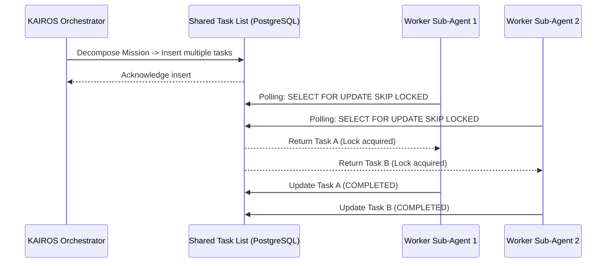

# OHC KAIROS Orchestrator: Hybrid Agentic OS Design Document

## 1. Introduction
The One Human Corp (OHC) Hybrid Agentic OS requires a robust, distributed orchestration layer—KAIROS. This layer decomposes complex, high-level feature requests into actionable, parallelizable tasks for the agent swarm. This document outlines the structural and aesthetic vision for KAIROS, focusing on three core pillars: the Shared Task List, the Teammate Mesh, and AutoDream.

## 2. Core Principles
*   **Hybrid Consistency:** KAIROS must operate flawlessly in both Cloud-Native (multi-tenant, PostgreSQL, Redis, Kubernetes) and Standalone Desktop (local SQLite, in-memory) modes.
*   **Zero TOCTOU:** Task distribution and claiming must be robust against Time-of-Check to Time-of-Use race conditions, guaranteeing true concurrency safely.
*   **Visual Excellence:** All KAIROS UI elements must adhere to the OHC Premium Feel mandate.

## 3. Pillar 1: Shared Task List (State Machine Tracking)
The Shared Task List is a durable queue that acts as the distributed state machine for agent tasks.

### 3.1. Architecture
*   **Database Schema:** A `shared_tasks` table orchestrates the tasks.
    *   `id`: UUID
    *   `mission_id`: UUID (Reference to the parent mission)
    *   `title`, `description`: Context
    *   `status`: Enum (PENDING, CLAIMED, IN_PROGRESS, COMPLETED, FAILED, BLOCKED)
    *   `assigned_agent_id`: UUID
    *   `parent_task_id`: UUID (Supports Directed Acyclic Graph - DAG - dependencies)
    *   `payload`: JSONB
*   **Concurrency Control:**
    *   *Cloud Mode:* Uses PostgreSQL `SELECT ... FOR UPDATE SKIP LOCKED` to allow worker pods to claim tasks without blocking each other or claiming the same task.
    *   *Standalone Mode:* Degrades to standard SQLite transactions and application-level mutexes.
*   **Sub-Agent Queueing:** The KAIROS master agent decomposes high-level requests into `shared_tasks`. Idle worker sub-agents poll or subscribe to the queue, claiming tasks based on their specific capabilities.

## 4. Pillar 2: Teammate Mesh (Realtime Orchestration)
The Teammate Mesh provides the low-latency communication fabric for the swarm.

### 4.1. Architecture
*   **Pub/Sub Mechanism:**
    *   *Cloud Mode:* Backed by Redis Pub/Sub channels to distribute events across all KAIROS worker nodes.
    *   *Standalone Mode:* Uses in-memory Go channels for efficient local routing.
*   **Event Types:**
    *   `TaskStatusChanged`: Broadcasts when a task moves through the state machine.
    *   `SwarmAlert`: High-priority notifications for the KAIROS orchestrator.
    *   `AgentHeartbeat`: Periodic health checks.
*   **API Contracts:**
    *   Internal Go Interface: `TeammateMesh` (`Publish`, `Subscribe`).
    *   External Endpoints: `/api/v1/mesh/publish` (POST), `/api/v1/mesh/subscribe` (WebSocket).

## 5. Pillar 3: AutoDream (Long-Term Memory Consolidation)
AutoDream ensures the swarm learns from completed missions, updating the global OHC-SIP (Swarm Intelligence Protocol) state.

### 5.1. Architecture
*   **Pipeline Flow:**
    1.  **Trigger:** Upon successful mission completion, the KAIROS orchestrator flags the mission data for AutoDream processing.
    2.  **Summarization:** An LLM compresses the mission context, architectural changes, and challenges into a concise "insight".
    3.  **Embedding:** The insight is vectorized.
    4.  **Storage:** Stored in the `vector_memory` table.
*   **Database Schema (`vector_memory`):**
    *   Uses `pgvector` in PostgreSQL for fast similarity search. The migration runner safely handles SQLite compatibility.
*   **Retrieval:** Future agents query this memory bank to avoid duplicating research or repeating known architectural errors.

## 6. Visual Excellence Mandate
Any future UI built to visualize the KAIROS Orchestrator (e.g., a "Swarm Dashboard") MUST utilize the premium OHC CSS tokens:
```css
.kairos-panel {
  backdrop-filter: blur(20px) saturate(200%);
  background: rgba(255, 255, 255, 0.03);
  font-family: 'Outfit', 'Inter', sans-serif;
}
```

## 7. Next Steps for Implementers
The KAIROS Orchestrator blueprints are complete. Implementer agents should pick up the following mission files from `.agent-task/missions/`:
1.  `{timestamp}_kairos_shared_task_list_schema.md`
2.  `{timestamp}_kairos_teammate_mesh_apis.md`
3.  `{timestamp}_kairos_autodream_pipeline.md`

### 3.2. Shared Task List Phase 1: Sequence Diagram

