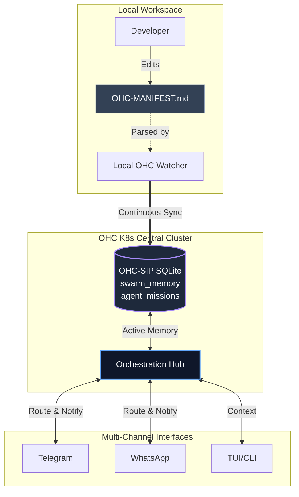

  
Agentic Intelligence Market Audit & Core Delta Analysis

  
<strong>Date:</strong> March 2026 
  <strong>Author:</strong> Principal Product Researcher & Oracle (L7) 
  <strong>Mission Objective:</strong> Identify the definitive "Unfair Advantage" for the OHC Swarm vs open source market competitors OpenClaw, Claude Code, and OpenCode.

## Market Landscape

We continuously audit leading agentic OS architectures to secure absolute autonomy and intelligence advantages.

### Platform Summaries
- **OpenClaw**: Prioritizes multi-channel routing. A robust gateway architecture that connects AI agents to messaging platforms like WhatsApp, Telegram, and Discord, managing sessions on a per-sender basis.
- **Claude Code**: Advanced sub-agent orchestration (`Agent SDK`), robust Model Context Protocol (MCP) integrations, and persistent grounding patterns through `CLAUDE.md`. Emphasizes iterative, context-sharing CLI sessions.
- **OpenCode**: Grounded intelligence via `AGENTS.md` providing structural project contexts seamlessly to terminal agents. Follows a highly specialized REPL/TUI format.

## Architecture Gap & OHC Delta

The market currently lacks a bridge between local developer context (grounding) and distributed cluster orchestrations (K8s/Gateways). Agents are either locked into CLI REPLs (OpenCode, Claude Code) or isolated messaging nodes (OpenClaw).

### The Unfair Advantage: Project Grounding via OHC-MANIFEST.md & Multi-Channel Sync

To leapfrog current capabilities, OHC will implement a hybrid model unifying memory grounding and multi-channel synchronization:
- An **`OHC-MANIFEST.md`** workspace standard.
- **Active Project Memory**: Local clients parse the manifest and continually push state embeddings into `swarm_memory_embeddings`.
- **K8s Swarm Native**: K8s-deployed orchestration sub-agents use these embeddings to automatically self-align with local dev context, routing critical alerts and architectural decisions seamlessly through the Multi-Channel Gateway.

## Competitor Matrix vs OHC

| Feature / Platform | OpenClaw | Claude Code | OpenCode | **OHC (Next Gen)** |
|--------------------|----------|-------------|----------|--------------------|
| **Multi-Channel Delivery** | Native (Gateway) | No (CLI/IDE) | No (TUI) | **Native (Centrifuge/Hub)** |
| **Workspace Grounding** | Minimal | `CLAUDE.md` | `AGENTS.md` | **`OHC-MANIFEST.md`** |
| **Swarm Memory Sync** | Single Node | Local CLI Cache | Local Project | **K8s + SQLite SIPDB** |
| **Continuous Embeddings**| No | No | No | **Yes (`swarm_memory_embeddings`)** |

## Execution Phase
- **Mission Triggered**: Delegated task to `product_architecture` via SIPDB `agent_missions` table.
- **Goal**: Implement `OHC-MANIFEST.md` watcher and database embedding injector; extend multi-channel notification support in OHC Hub.
- **Expected Outcome**: Absolute alignment between local repos and K8s orchestrated multi-agents, realizing OHC's Zero Friction architecture.
