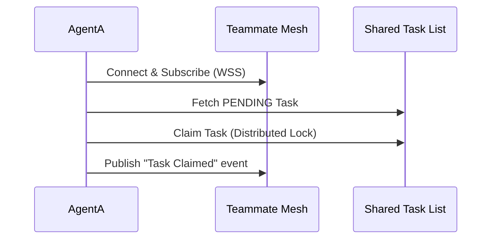

<div markdown="1" style="backdrop-filter: blur(20px) saturate(200%); font-family: Outfit, Inter, sans-serif; border: 1px solid rgba(255, 255, 255, 0.1); padding: 32px; border-radius: 12px; background: rgba(255, 255, 255, 0.05); color: #ffffff;">

# 🚀 OHC Hybrid Agentic OS: Help Portal

Welcome to the **One Human Corp (OHC) Help Portal**. This centralized hub provides interactive walkthroughs, API documentation, and orchestration guidelines for managing your AI Swarm.

---

## 📖 Table of Contents
1. [Introduction to the Agentic OS](#1-introduction-to-the-agentic-os)
2. [API Playbook & Task Delegation](#2-api-playbook--task-delegation)
3. [Teammate Mesh & Real-Time Orchestration](#3-teammate-mesh--real-time-orchestration)
4. [Vitality Dashboard & Observability](#4-vitality-dashboard--observability)

---

## 1. Introduction to the Agentic OS

The OHC Agentic OS empowers a single human to orchestrate a vast swarm of AI agents. Operating under a **Hybrid Architecture**, it scales natively in the cloud (K8s, Postgres, Redis) while seamlessly degrading to local standalone instances (SQLite).

**Core Philosophy:**
- **Zero Secrets:** All identity uses SPIFFE/SPIRE.
- **Glassmorphism Aesthetic:** Premium visual design for cognitive ease.
- **Absolute Autonomy:** Agents execute without constant human polling.

---

## 2. API Playbook & Task Delegation

The API bridges Cloud-Native clusters and Standalone Desktop deployments via the **Swarm Intelligence Protocol (OHC-SIP)**.

### Subtask Delegation Flow
Delegate complex problems to specialized agents. The internal Hub enforces VRAM quotas automatically.

**Endpoint:** `POST /api/v1/tasks/delegate`

```json
{
  "target_role": "swe",
  "instruction": "Implement the new billing module according to docs/features/billing.",
  "parent_thread_id": "thread_8f92a"
}
```

```mermaid
graph LR
    User[Human CEO] --> API[OHC API Gateway]
    API --> Hub[Orchestration Hub]
    Hub --> Agents[Swarm Agents]
    Agents --> Postgres[(Shared State)]

    classDef premium fill:rgba(255,255,255,0.05),stroke:rgba(255,255,255,0.1),stroke-width:1px,color:#fff,backdrop-filter:blur(20px);
    class User,API,Hub,Agents,Postgres premium;
```

---

## 3. Teammate Mesh & Real-Time Orchestration

Agents collaborate in real-time through the **Teammate Mesh**.

- **Cloud Mode:** High-throughput Redis Pub/Sub channels.
- **Standalone Mode:** Local Go-channel in-memory event bus.

### Teammate Mesh Execution Cycle



---

## 4. Vitality Dashboard & Observability

Maintain a "God's Eye View" of the swarm via the Vitality Dashboard. OHC relies on OpenTelemetry and Prometheus for full-spectrum observability.

- **Swarm Saturation:** Monitor VRAM usage globally.
- **Token Burn Rate:** Track costs in real-time natively.
- **Agent Health:** Monitor heartbeat statuses of all active sub-agents.

> *For deeper insights into the telemetry pipelines, see the internal [TELEMETRY_REPORT.md](../../TELEMETRY_REPORT.md).*

---

**Version:** 1.0.0 | **Generated by Scribe Agent**
</div>
