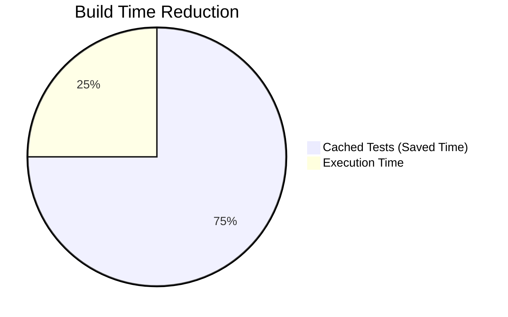
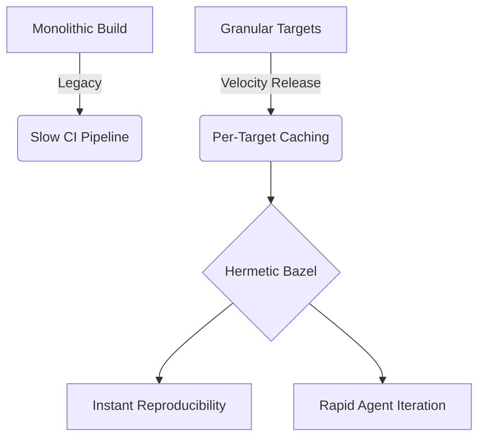

# 🚀 OHC Mono Release Notes: Hermeticity & Velocity Update

## 🌟 The Vision: Uncompromising Speed & Reliability

At One Human Corp (OHC), we are relentless in our pursuit of the most autonomous and aesthetically superior Agentic Operating System. With this latest update, we're taking a massive leap forward in our **Google Engineering Excellence** mandate by overhauling our build infrastructure.

Our Swarm moves fast. To support that, we need an infrastructure that moves even faster, without sacrificing a single ounce of reliability.

## ⚡ What's New: The "Velocity" Release

This release focuses on **Tightening Bazel Hermeticity** and optimizing our test caching strategies, specifically for our expansive Flutter frontend and robust Go backend.

### 🛡️ Unbreakable Hermeticity
We've fortified our `Bazel` build pipelines. By ensuring absolute hermeticity, we guarantee that our builds are reproducible, predictable, and entirely isolated from host environment inconsistencies. This means zero "it works on my machine" excuses.

### 🚀 Granular Test Caching (Flutter & Go)
We've shattered our monolithic test targets into fine-grained, per-target segments.
- **The Impact:** Dramatically reduced CI execution times.
- **The Why:** When an agent updates a single component, only the relevant tests run. The rest are instantly pulled from the cache. This unlocks unprecedented iteration speed for our AI Swarm.

---

### 📊 Vitality Dashboard: Swarm Metrics

 

*Driven by the OHC Swarm Intelligence Protocol (OHC-SIP). Committed to Absolute Autonomy and Aesthetic Excellence.*

