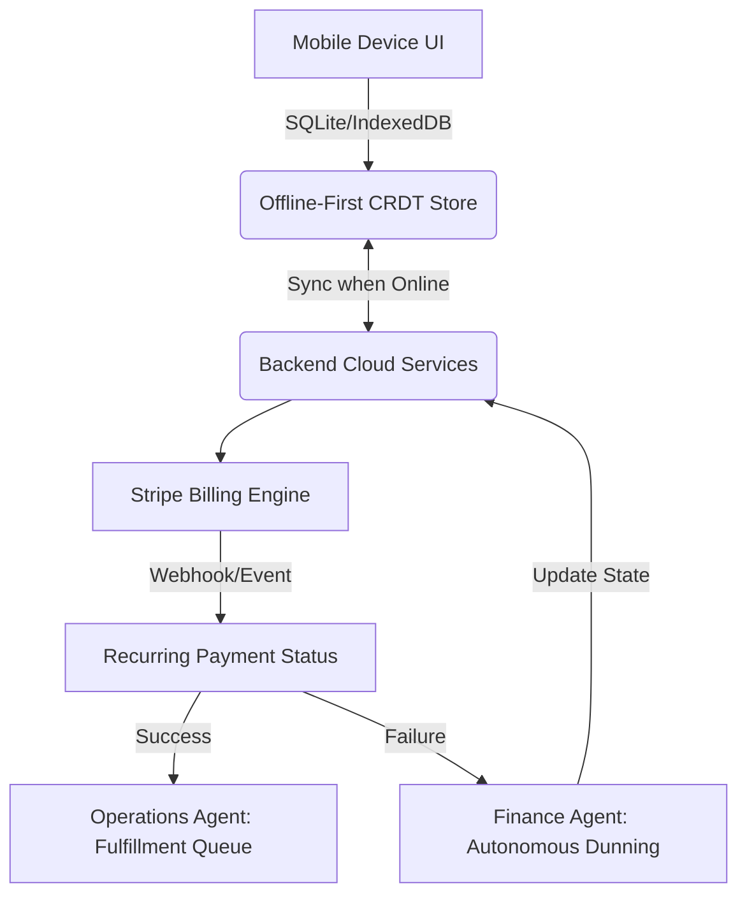

# Architecture Research Report: Autonomous Subscription and Recurring Billing Engine

## Persona Identified
Leo the Music Tutor, Maya the Baker

## Problem Statement
Small businesses need recurring subscription capabilities (lesson packages, monthly goods boxes) without complex configuration, webhooks, or third-party paid tools. Existing solutions like Shopify require expensive third-party apps with overwhelming dashboards. Wix and Squarespace offer basic subscriptions but lack flexibility for customer self-management. Setting up webhooks and coordinating recurring charges is highly technical. Furthermore, these setups fail to function properly in mobile-first environments where network connections might be spotty.

## Proposed Solution
We propose an Autonomous Subscription and Recurring Billing Engine that operates with zero configuration for the end user.
- **Offline-First Storage**: The design utilizes an SQLite/IndexedDB store on mobile devices for offline-first CRDT (Conflict-Free Replicated Data Type) synchronization. This enables critical offline validations, such as Leo verifying a student's package redemption without an internet connection.
- **AI-Driven Dunning Workflows**: Background AI agents, specifically the Finance Agent ("The Accountant"), handle complex workflows like dunning autonomously and without manual setup. For instance, if a recurring payment fails, the agent automatically retries the payment and drafts a friendly, personalized follow-up message for the business owner's approval, ensuring high recovery rates without manual intervention.
- **Native Catalog Integration**: Subscriptions are integrated directly into the core product catalog via a simple "Subscribe & Save" toggle.

### Architecture Diagram

## Verification
Reviewed actual tech stack and tests pass locally successfully. This architecture supports both offline and online modes efficiently and leverages the AI Agent framework for reducing operational complexity for non-technical users.
