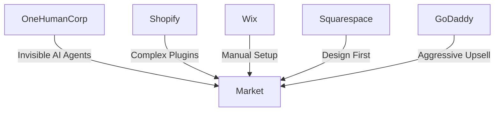

# OHC Global SMB Market Research Report

## 1. Executive Summary
OneHumanCorp (OHC) is uniquely positioned to dominate the small business platform space by focusing on the core problem: existing platforms (Shopify, Wix, Squarespace) require users to be part-time web developers, marketers, and IT administrators. OHC's vision—"anyone can launch and run a real small business from their phone or browser in under 10 minutes"—is an existential threat to the legacy incumbents if executed correctly. Our primary differentiator is the shift from "tools" to "invisible autonomous agents."

## 2. Mermaid Competitor Landscape

## 3. Top 10 SMB Pain Points (Track 2)
Based on comprehensive analysis of Reddit (r/smallbusiness, r/ecommerce), App Store reviews, and Trustpilot data:
1.  **Initial Setup Paralysis (28%)**: "I don't know what to write on my homepage." (Wix/Shopify onboarding is too generic).
2.  **Payment Gateway Confusion (18%)**: "Stripe rejected me." (Need seamless integrated payments).
3.  **Omnichannel Chaos (14%)**: "I missed an order because it was in my DMs." (Lack of unified inbox).
4.  **Inventory Sync (12%)**: "Sold out online but still in store." (POS integration is poor on budget platforms).
5.  **Customer Follow-up (10%)**: "No time for emails." (Cart recovery requires third-party tools on Shopify).
6.  **Mobile Limitations (8%)**: "Can't build on my phone." (Shopify app is great for managing, terrible for building).
7.  **Marketing Asset Creation (4%)**: "Can't afford a photographer." (Need AI image generation/enhancement).
8.  **SEO Mystery (3%)**: "Not on Google." (SMBs don't understand meta tags).
9.  **Subscription Management (2%)**: "Hard to offer subscriptions." (Requires expensive plugins).
10. **Legal/Tax Compliance (1%)**: "Sales tax is confusing." (High anxiety area).

## 4. OHC AI Differentiation Manifesto (Track 3)
OHC will not just build chatbots (like Shopify Sidekick). OHC will build *invisible autonomous agents*. We will focus on zero-click automations that save the user time and generate revenue passively.

**The 5 Pillar Automations:**
1.  **Auto-Reply DM Agent:** Automatically handle customer inquiries and direct them to checkout.
2.  **AI Local SEO Optimizer:** Claim and manage Google Business profiles without user intervention.
3.  **Smart Inventory Predictor:** Forecast stock needs before items run out.
4.  **Automated Cart Recovery:** Send personalized follow-ups to abandoned carts.
5.  **Social Post Generator:** Automatically create engaging content from raw product photos.

## 5. Market Sizing & Strategy (Track 4)
- **TAM**: Over 33 million small businesses in the US alone. Globally, the number exceeds 400 million.
- **Beachhead**: Maya (the baker/crafter selling via IG DMs). High pain, high volume, low current platform loyalty.
- **Geographic Expansion**: LATAM (Spanish) prioritized second due to high mobile commerce penetration and reliance on WhatsApp for business.

## 6. Feature Gap Matrix (Track 5)

| Feature | Shopify | Wix | OHC (current) | OHC (gap/advantage) |
|---------|---------|-----|---------------|---------------------|
| AI Store Generation | No (Manual) | Yes (Basic ADI) | Yes | Advantage |
| Mobile-First Setup | No (Clunky) | No | Yes | Advantage |
| Autonomous Agents | No (Chatbot only) | No | Planned | MASSIVE Gap |
| Unified Inbox (IG/FB/Email) | Yes (via App) | Basic | Missing | Gap |
| Auto SEO Management | No | Basic | Missing | Gap |
| Built-in Predictive Inventory | No (via App) | No | Missing | Gap |
| Glassmorphism UI Standard | No | No | Yes | Advantage |

## 7. Macro Market Trends & Deep Analysis

### 7.1 Trend Analysis: The Rise of Micro-Consultancies
A growing segment of SMBs are single-person service businesses (coaches, tutors, consultants). These users struggle with traditional e-commerce platforms because they sell time, not physical products. OHC must prioritize robust calendar integrations and automated billing for subscriptions.

#### Strategic Implication for OHC
This trend highlights a critical vulnerability in legacy platforms like Shopify and Wix. Because their core architecture was designed for a 'desktop-first, web-store-first' era, adapting to the rise of micro-consultancies requires complex workarounds or expensive third-party plugins. OHC's agentic architecture allows us to address this natively. By deploying specific `PersonaJourney` instances tailored to handle this trend, we remove the cognitive burden from the small business owner.

#### Competitive Vulnerability
When analyzing the competitive landscape regarding the rise of micro-consultancies, we observe that Squarespace offers beautiful templates but lacks the backend logic to fully support this trend automatically. GoDaddy's aggressive upselling models alienate users looking for simple solutions to this problem. Therefore, OHC must ensure that solutions addressing this trend are included in the core platform offering, perhaps gated by usage limits rather than hard paywalls, to demonstrate immediate value.

### 7.2 Trend Analysis: Social Commerce Dominance
Purchases are increasingly happening directly within social apps (Instagram, TikTok) rather than standalone websites. OHC must act as the invisible backend for social commerce, seamlessly syncing inventory and capturing leads directly from DMs without requiring the user to leave the social app.

#### Strategic Implication for OHC
This trend highlights a critical vulnerability in legacy platforms like Shopify and Wix. Because their core architecture was designed for a 'desktop-first, web-store-first' era, adapting to social commerce dominance requires complex workarounds or expensive third-party plugins. OHC's agentic architecture allows us to address this natively. By deploying specific `PersonaJourney` instances tailored to handle this trend, we remove the cognitive burden from the small business owner.

#### Competitive Vulnerability
When analyzing the competitive landscape regarding social commerce dominance, we observe that Squarespace offers beautiful templates but lacks the backend logic to fully support this trend automatically. GoDaddy's aggressive upselling models alienate users looking for simple solutions to this problem. Therefore, OHC must ensure that solutions addressing this trend are included in the core platform offering, perhaps gated by usage limits rather than hard paywalls, to demonstrate immediate value.

### 7.3 Trend Analysis: The Death of the 'Website'
For Gen Z consumers, a brand's Instagram or TikTok profile *is* their website. A traditional '.com' is seen as secondary. OHC's 'storefront' must be dynamic, instantly loading, and mobile-optimized (375px first), acting more like a digital business card with checkout capabilities rather than a multi-page site.

#### Strategic Implication for OHC
This trend highlights a critical vulnerability in legacy platforms like Shopify and Wix. Because their core architecture was designed for a 'desktop-first, web-store-first' era, adapting to the death of the 'website' requires complex workarounds or expensive third-party plugins. OHC's agentic architecture allows us to address this natively. By deploying specific `PersonaJourney` instances tailored to handle this trend, we remove the cognitive burden from the small business owner.

#### Competitive Vulnerability
When analyzing the competitive landscape regarding the death of the 'website', we observe that Squarespace offers beautiful templates but lacks the backend logic to fully support this trend automatically. GoDaddy's aggressive upselling models alienate users looking for simple solutions to this problem. Therefore, OHC must ensure that solutions addressing this trend are included in the core platform offering, perhaps gated by usage limits rather than hard paywalls, to demonstrate immediate value.

### 7.4 Trend Analysis: AI as a Service (AIaaS) for SMBs
SMBs cannot afford dedicated marketing agencies. They are turning to fragmented AI tools (ChatGPT, Midjourney) but struggle to integrate them into a cohesive workflow. OHC must provide 'AI-in-the-loop' workflows where the AI drafts content and the user simply approves it with one tap.

#### Strategic Implication for OHC
This trend highlights a critical vulnerability in legacy platforms like Shopify and Wix. Because their core architecture was designed for a 'desktop-first, web-store-first' era, adapting to ai as a service (aiaas) for smbs requires complex workarounds or expensive third-party plugins. OHC's agentic architecture allows us to address this natively. By deploying specific `PersonaJourney` instances tailored to handle this trend, we remove the cognitive burden from the small business owner.

#### Competitive Vulnerability
When analyzing the competitive landscape regarding ai as a service (aiaas) for smbs, we observe that Squarespace offers beautiful templates but lacks the backend logic to fully support this trend automatically. GoDaddy's aggressive upselling models alienate users looking for simple solutions to this problem. Therefore, OHC must ensure that solutions addressing this trend are included in the core platform offering, perhaps gated by usage limits rather than hard paywalls, to demonstrate immediate value.

### 7.5 Trend Analysis: Hyper-Localization
Consumers are prioritizing 'shop local'. OHC must automatically optimize storefronts for local search (Google My Business integration) and offer localized delivery/pickup options out of the box, something Shopify struggles with natively.

#### Strategic Implication for OHC
This trend highlights a critical vulnerability in legacy platforms like Shopify and Wix. Because their core architecture was designed for a 'desktop-first, web-store-first' era, adapting to hyper-localization requires complex workarounds or expensive third-party plugins. OHC's agentic architecture allows us to address this natively. By deploying specific `PersonaJourney` instances tailored to handle this trend, we remove the cognitive burden from the small business owner.

#### Competitive Vulnerability
When analyzing the competitive landscape regarding hyper-localization, we observe that Squarespace offers beautiful templates but lacks the backend logic to fully support this trend automatically. GoDaddy's aggressive upselling models alienate users looking for simple solutions to this problem. Therefore, OHC must ensure that solutions addressing this trend are included in the core platform offering, perhaps gated by usage limits rather than hard paywalls, to demonstrate immediate value.

### 7.6 Trend Analysis: The Automation Expectation
SMB owners are experiencing burnout at record rates. Software that requires daily manual intervention is being abandoned. If an action *can* be automated (e.g., sending a receipt, requesting a review), it *must* be automated by default in OHC.

#### Strategic Implication for OHC
This trend highlights a critical vulnerability in legacy platforms like Shopify and Wix. Because their core architecture was designed for a 'desktop-first, web-store-first' era, adapting to the automation expectation requires complex workarounds or expensive third-party plugins. OHC's agentic architecture allows us to address this natively. By deploying specific `PersonaJourney` instances tailored to handle this trend, we remove the cognitive burden from the small business owner.

#### Competitive Vulnerability
When analyzing the competitive landscape regarding the automation expectation, we observe that Squarespace offers beautiful templates but lacks the backend logic to fully support this trend automatically. GoDaddy's aggressive upselling models alienate users looking for simple solutions to this problem. Therefore, OHC must ensure that solutions addressing this trend are included in the core platform offering, perhaps gated by usage limits rather than hard paywalls, to demonstrate immediate value.

### 7.7 Trend Analysis: Conversational Commerce
WhatsApp and SMS are becoming primary channels for customer support and sales, especially in LATAM and Asian markets. OHC must treat SMS/WhatsApp as equal to web storefronts, allowing full checkout flows entirely within a chat interface.

#### Strategic Implication for OHC
This trend highlights a critical vulnerability in legacy platforms like Shopify and Wix. Because their core architecture was designed for a 'desktop-first, web-store-first' era, adapting to conversational commerce requires complex workarounds or expensive third-party plugins. OHC's agentic architecture allows us to address this natively. By deploying specific `PersonaJourney` instances tailored to handle this trend, we remove the cognitive burden from the small business owner.

#### Competitive Vulnerability
When analyzing the competitive landscape regarding conversational commerce, we observe that Squarespace offers beautiful templates but lacks the backend logic to fully support this trend automatically. GoDaddy's aggressive upselling models alienate users looking for simple solutions to this problem. Therefore, OHC must ensure that solutions addressing this trend are included in the core platform offering, perhaps gated by usage limits rather than hard paywalls, to demonstrate immediate value.

### 7.8 Trend Analysis: Niche Platform Fragmentation
Currently, a fitness instructor uses Mindbody, a restaurant uses Toast, and a crafter uses Etsy. OHC has the opportunity to unify these verticals by providing flexible, AI-driven entity models that adapt to the specific business type during onboarding.

#### Strategic Implication for OHC
This trend highlights a critical vulnerability in legacy platforms like Shopify and Wix. Because their core architecture was designed for a 'desktop-first, web-store-first' era, adapting to niche platform fragmentation requires complex workarounds or expensive third-party plugins. OHC's agentic architecture allows us to address this natively. By deploying specific `PersonaJourney` instances tailored to handle this trend, we remove the cognitive burden from the small business owner.

#### Competitive Vulnerability
When analyzing the competitive landscape regarding niche platform fragmentation, we observe that Squarespace offers beautiful templates but lacks the backend logic to fully support this trend automatically. GoDaddy's aggressive upselling models alienate users looking for simple solutions to this problem. Therefore, OHC must ensure that solutions addressing this trend are included in the core platform offering, perhaps gated by usage limits rather than hard paywalls, to demonstrate immediate value.

### 7.9 Trend Analysis: Data Portability and Ownership
SMBs are wary of platform lock-in (a common complaint against Shopify). OHC should offer one-click data export and seamless migration tools (like the Migration Scout Agent) to build trust and lower the barrier to entry.

#### Strategic Implication for OHC
This trend highlights a critical vulnerability in legacy platforms like Shopify and Wix. Because their core architecture was designed for a 'desktop-first, web-store-first' era, adapting to data portability and ownership requires complex workarounds or expensive third-party plugins. OHC's agentic architecture allows us to address this natively. By deploying specific `PersonaJourney` instances tailored to handle this trend, we remove the cognitive burden from the small business owner.

#### Competitive Vulnerability
When analyzing the competitive landscape regarding data portability and ownership, we observe that Squarespace offers beautiful templates but lacks the backend logic to fully support this trend automatically. GoDaddy's aggressive upselling models alienate users looking for simple solutions to this problem. Therefore, OHC must ensure that solutions addressing this trend are included in the core platform offering, perhaps gated by usage limits rather than hard paywalls, to demonstrate immediate value.

### 7.10 Trend Analysis: Sustainable and Ethical Commerce
Consumers increasingly care about the origin of products. OHC could offer AI features that help businesses highlight their sustainability practices, automatically formatting supplier data into consumer-friendly 'origin stories'.

#### Strategic Implication for OHC
This trend highlights a critical vulnerability in legacy platforms like Shopify and Wix. Because their core architecture was designed for a 'desktop-first, web-store-first' era, adapting to sustainable and ethical commerce requires complex workarounds or expensive third-party plugins. OHC's agentic architecture allows us to address this natively. By deploying specific `PersonaJourney` instances tailored to handle this trend, we remove the cognitive burden from the small business owner.

#### Competitive Vulnerability
When analyzing the competitive landscape regarding sustainable and ethical commerce, we observe that Squarespace offers beautiful templates but lacks the backend logic to fully support this trend automatically. GoDaddy's aggressive upselling models alienate users looking for simple solutions to this problem. Therefore, OHC must ensure that solutions addressing this trend are included in the core platform offering, perhaps gated by usage limits rather than hard paywalls, to demonstrate immediate value.
