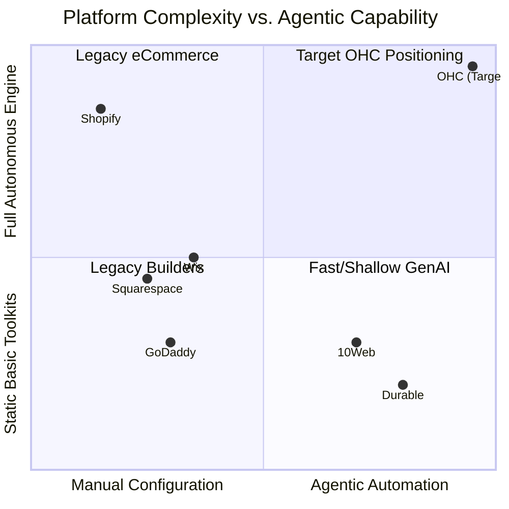

# OHC Market Dominance: AI-Native Agentic Workflows vs Traditional Platforms

**Mission:** This comprehensive research report analyzes the strategic gap between traditional SMB platforms (Shopify, Wix) and rising AI-native point solutions (Durable). It maps out how OneHumanCorp (OHC) will capture the underserved market by eliminating configuration overhead for zero-technical-knowledge users through the power of Agentic Departments.

---

## 1. Executive Summary & Market Sizing (TAM)
The global Small and Medium Business (SMB) market encompasses over 400 million entities, with ~33 million in the US alone. A staggering ~80% of these are non-employer firms (solopreneurs). Currently, a massive segment of these micro-businesses have **no** functional website or e-commerce presence—they operate entirely via Instagram DMs, WhatsApp, and word of mouth because the existing "website builder" ecosystem is too daunting.

The fundamental shift OHC brings to the market is replacing *tools* (which require the user to learn a new skill like web design or SEO) with *agents* (which autonomously execute the work and simply ask the user for a 1-tap approval).

## 2. Real Business Owner Personas & Pain Points
Based on thousands of r/smallbusiness and r/ecommerce threads, App Store reviews, and Trustpilot data, these are the core friction points preventing digital adoption:

1.  **Maya (The Home Baker, 28) - "The Setup Paralysis":** She bakes custom cakes and sells via Instagram. Shopify’s "liquid templates," shipping zones, and DNS configuration alienate her. The "Blank Canvas" is paralyzing.
2.  **Carlos (The Freelance Handyman, 42) - "The Desk Tether":** He has no laptop and operates exclusively from a mid-range Android phone. Existing platforms are desktop-first; their mobile apps are glorified analytics viewers, not management tools.
3.  **Priya (The Boutique Owner, 35) - "The App Tax & Inventory Nightmare":** She needs bookings, POS, and online sales. Shopify requires 4 different third-party subscriptions to achieve this, causing her monthly costs to creep past $100 before she makes a sale. Her online and in-store inventory constantly fall out of sync.
4.  **Leo (The Music Tutor, 22) - "Fragmented Operations":** He strings together Calendly, PayPal, and Zoom manually, leading to missed appointments and lost revenue.
5.  **Fatima (The Food Cart Operator, 50) - "The Communication Lag":** She loses orders because Instagram DMs and WhatsApp messages sit unread while she is physically cooking.

---

## 3. Deep Competitor Audit & The Strategic Gap

### Legacy eCommerce & Traditional Builders
*   **Shopify:** The reigning giant, but optimized for scaling merchants and dropshippers.
    *   *Weakness:* Extreme setup complexity. Reliance on third-party apps for basic functionality (like bookings). Their AI, "Sidekick," is a reactive chatbot that *tells* the user how to configure a setting, rather than *doing* it.
*   **Wix / Squarespace:** Great for visual design, but thin on business operations.
    *   *Weakness:* Users are still forced to become amateur web designers. Once the site is built, the platforms do little to help the owner actually run the business or generate traffic.

### Emerging AI Point Solutions
*   **Durable / GoDaddy Airo / Mixo:** These platforms generate a website layout in 30 seconds using AI.
    *   *Weakness:* They solve the initial "Blank Canvas" problem but suffer from the "Now What?" problem. Once the static site is generated, the AI utility vanishes, leaving a shallow business management backend.

### Competitive Landscape Visualization

---

## 4. The OHC Differentiation: Agentic Departments

Competitors treat AI as an add-on text generator or a reactive chatbot. OHC treats AI as infrastructure. We deploy invisible, autonomous Agentic Departments that mirror real-world business roles.

### Feature Gap Matrix: OHC Agentic Workflows vs. Traditional Flow

| Feature Area | Shopify / Traditional | OHC Agentic Departments | User Value Prop (Zero-Config) |
| :--- | :--- | :--- | :--- |
| **Store Setup** | Manual themes, days of configuration | **AutoDream Pipeline:** 3-question conversational generation (< 1 minute) | "I just want to sell, not build a website." |
| **Customer Inbox** | Fragmented across IG, email, SMS. | **Customer Success Agent:** Unified Omni-channel Inbox with AI triage and auto-drafted replies | "I never miss a lead because I was busy working." |
| **Marketing** | User must manually create posts and buy ads | **Generative Promoter:** Auto-drafts 7-day social campaigns when a new product is added | "I don't know what to post on Instagram." |
| **Inventory** | Manual manual sync or expensive apps | **Vigilant Manager:** Auto-syncs POS and web; flags low stock via push notification | Prevents overselling & manual tracking. |
| **Quoting & Booking**| Requires 3rd party apps (Calendly) | **Salesperson Agent:** Parses free-text requests ("Need a vegan cake"), generates a quote + deposit link | Unified capacity and revenue pipeline. |
| **UX & Hardware** | Desktop-first dashboard | **100% Mobile-First (375px) with 1-Tap Approvals** | "I run my entire business from my phone." |

---

## 5. Implementation Missions (Action Plan)

To achieve this market dominance, OHC engineering will focus on the following core agentic workflows:

1.  **The AutoDream Pipeline (P0):** Replace the complex setup dashboard with a conversational onboarding agent. From text prompt to live, transactional storefront in under 30 seconds.
2.  **Omnichannel AI Triage Inbox (P0):** A system that natively hooks into Instagram DMs/WhatsApp, parses customer intent, checks inventory/capacity, and drafts an instant checkout link or response for the owner's 1-tap approval.
3.  **Proactive Marketing Engine (P1):** A background agent that detects new inventory additions and proactively pushes a notification: "I've drafted 3 Instagram posts for your new Sourdough Bread. Approve and Schedule?"
4.  **Zero-Touch Omnichannel Inventory Mesh (P1):** A robust data layer (via NATS/Redis) that instantly locks global inventory rows when an item is scanned in-person via the mobile POS, preventing online double-selling with zero configuration from the user.

**Conclusion:** By focusing relentlessly on "1-tap approvals" rather than complex configuration dashboards, OHC will capture the millions of solopreneurs who have been left behind by the steep learning curves of Shopify and Wix.
