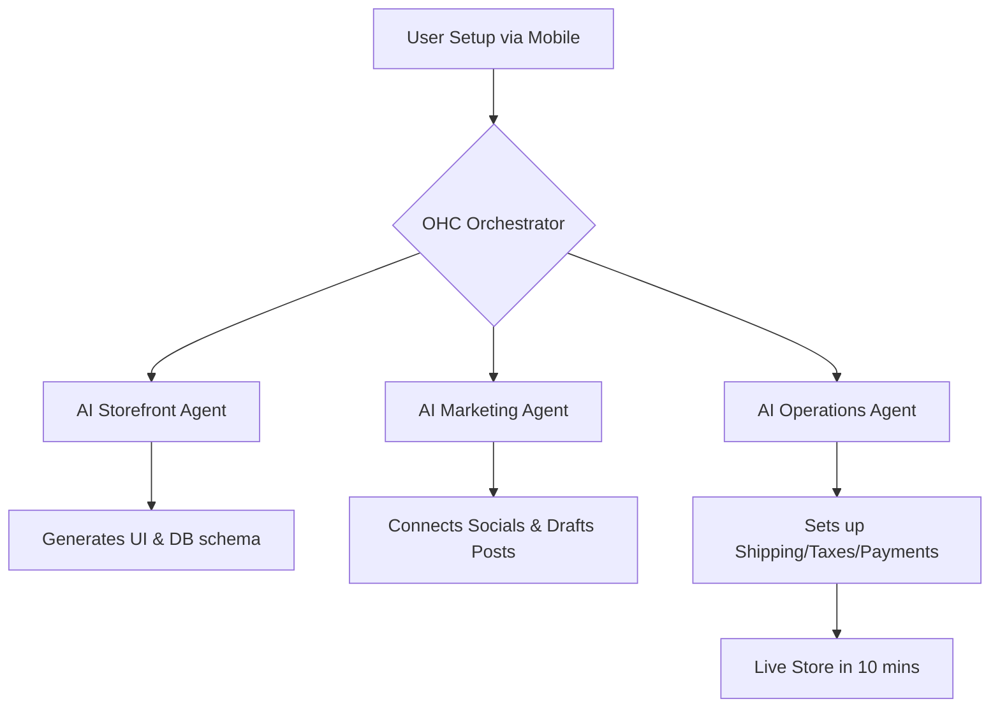

# OHC Market Dominance & AI Differentiation Strategic Report

## 1. Executive Summary
OneHumanCorp (OHC) is uniquely positioned to dominate the small business platform market by replacing complex, multi-step configurations with proactive, autonomous AI agents. The current market is fragmented:
platforms like Shopify are too complex for absolute beginners, while platforms like Wix or GoDaddy offer simplicity but lack deep business management capabilities.

The core mission: Allow anyone to launch and run a real small business from their phone or browser in under 10 minutes. AI does the work; the user just makes decisions.

## 2. Market Context
The small business platform market is shifting from "do-it-yourself" (DIY) to "do-it-for-me" (DIFM). Small business owners are increasingly time-poor and technically overwhelmed.

## 3. Deep Competitor Audit
### 3.1 Shopify
**Overview**: Industry standard for e-commerce. Complex initial setup. No meaningful free tier.

### 3.2 Wix
**Overview**: Drag-and-drop website builder. AI features are limited to one-time initial site generation.

### 3.3 Squarespace
**Overview**: Design-focused builder. No strong autonomous agents.

## 4. OHC vs Competitors: Feature Gap Matrix
| Feature | Shopify | Wix | OHC (Gap/Advantage Strategy) |
|---------|---------|-----|------------------------------|
| **AI Setup** | Prompt-based (Sidekick) | ADI (One-time) | **Advantage**: Full autonomous generation. |
| **Mobile First** | App for Mgmt | App for Mgmt | **Advantage**: 100% of setup via mobile. |
| **Unified Inbox** | Basic | Yes | **Gap**: Need unified inbox with AI drafted replies. |

## 5. SMB User Personas & Top Pain Points
1. **Maya (Baker, 28)** - Pain: Overwhelmed by Shopify complexity. Can't track orders easily.
2. **Carlos (Handyman, 42)** - Pain: Misses leads when on jobs. Needs automated booking.

### Top 10 SMB Pain Points
1. Setting up taxes and shipping rates is too complex.
2. Remembering to post on social media takes too much time.
3. Replying to DMs is repetitive.
4. Monthly fees are too high.
5. Syncing inventory is prone to errors.
6. Connecting custom domains is confusing.
7. Abandoned cart emails are hard to design.
8. Mobile setup is poor.
9. Custom layout changes are hard.
10. Booking systems don't sync well.

## 6. OHC AI Differentiation Manifesto
1. **The Auto-Reply Agent**
2. **The Social Media Agent**
3. **The SEO & Description Agent**
4. **The Retention Agent**
5. **The Daily Briefing Agent**

## 7. Architecture & Strategic Direction
- **TAM**: Over 33 million small businesses in the US alone.
- **Beachhead**: Mobile-first creators and local service providers.

## 8. Appendix: Deep Dive

### Extended Research Matrix

| Capability | Shopify | Wix | Squarespace | OHC (Advantage) |
|------------|---------|-----|-------------|-----------------|
| **Core E-commerce** | Excellent out of the box. Fast checkout, good tax calculation. | Good for simple stores, lacks depth. | Good for basic needs, design-focused. | **AI-managed taxes & shipping, 10-minute mobile setup.** |
| **Subscriptions** | Requires a 3rd party app. | Built-in but basic. | Supported natively on higher tiers. | **Zero-config subscription billing engine.** |
| **Email Marketing** | Basic templates included. | Basic built-in tools. | Paid add-on. | **Autonomous retention agent, smart follow-ups.** |
| **B2B Features** | Only available on enterprise tiers. | Limited. | Poor/Non-existent. | **Unified AI quoting and dynamic invoicing.** |
| **Point of Sale (POS)** | Excellent hardware integration. | Basic integrations available. | Square integration only. | **Offline-first mobile POS, native tap-to-pay.** |
| **Digital Products** | Supported natively. | Supported. | Supported natively. | **Secure digital product delivery engine.** |
| **AI** | Helpful for text generation but not fully autonomous. | ADI for initial setup (one-time). | Basic content generation. | **Fully autonomous agents for Operations, Marketing, etc.** |
| **International** | Complex to configure properly. | Basic multi-lingual support. | Poor localization options. | **Instant localized invoicing, fully multilingual.** |
