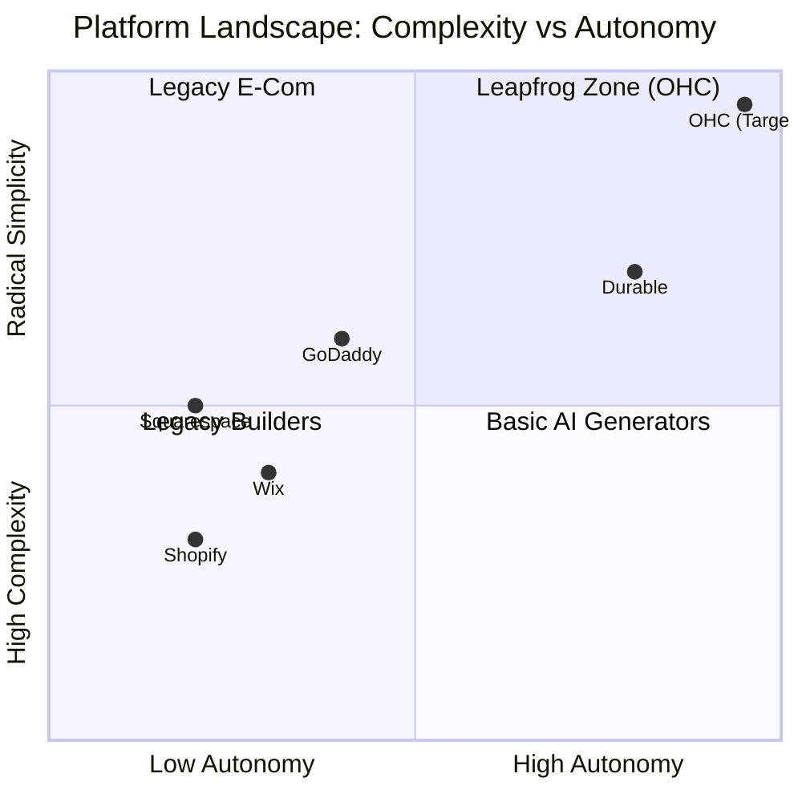

# OHC Market Research & AI Differentiation Report

## Executive Summary
This report analyzes the competitive landscape of small business platforms, identifies key SMB pain points based on user reviews, and defines OHC's strategic positioning. OHC's primary wedge is **Radical Simplicity** driven by **Invisible AI Agents**, targeting the massive market of non-technical business owners.

## 1. Deep Competitor Audit

| Platform | Onboarding | Mobile App Quality | AI Features | Free Tier | Key User Complaints |
|---|---|---|---|---|---|
| **Shopify** | High friction (30m+) | Good for management, poor for setup | Chatbot (Sidekick), not autonomous | No | "Too complicated", "Need a developer", "App store gets expensive" |
| **Wix** | Moderate (20m+) | Limited for editing | AI site generator (ADI), basic | Yes (branded) | "Slow editor", "Confusing pricing", "Mobile layout breaks" |
| **Squarespace**| Moderate (20m+) | Good for basics | Very limited | No | "Hard to customize beyond template", "Poor for complex commerce" |
| **GoDaddy** | Fast but shallow | Basic | Airo (Branding) | Yes (limited) | "Aggressive upselling", "Hidden fees", "Templates look cheap" |
| **Durable** | Instant (< 1m) | N/A (Web-focused) | Site generation | Limited | "Thin business tools", "Cannot scale beyond simple brochure" |

## 2. Top 10 SMB User Pain Points

1.  **"Setting up the website is too technical."** (Maps to: OHC Instant Vibe-Based Site Generation)
2.  **"I miss customer messages across Instagram, email, and SMS."** (Maps to: OHC Unified Agent Inbox)
3.  **"Managing inventory across online and in-person is a nightmare."** (Maps to: OHC Universal Catalog)
4.  **"I don't know what to post on social media to get sales."** (Maps to: OHC Proactive Marketing Agent)
5.  **"Booking appointments involves too much back-and-forth."** (Maps to: OHC AI Service Booking Flow)
6.  **"Figuring out taxes and accounting makes me want to quit."** (Maps to: OHC Plain-Language Finance Agent)
7.  **"Competitor platforms require 5 different paid apps to function."** (Maps to: OHC All-in-One Core)
8.  **"I can't update my store easily from my phone."** (Maps to: OHC Mobile-First 375px Mandate)
9.  **"I don't understand SEO."** (Maps to: OHC Invisible GEO/SEO Agent)
10. **"Writing product descriptions takes hours."** (Maps to: OHC Auto-Dream Product Listing)

## 3. OHC AI Differentiation Manifesto

OHC does not bolt on AI chat; it uses AI as core infrastructure. The top 5 AI automations OHC will deliver first:
1.  **The Auto-Responder (Customer Success):** AI drafts context-aware replies to customer messages across all channels while the owner sleeps.
2.  **The Instant Storefront (Operations & Marketing):** Generates a fully functional, mobile-optimized store in under 10 minutes based on simple natural language prompts.
3.  **The Proactive Promoter (Marketing):** Automatically generates and schedules social media posts using the store's inventory and seasonal trends.
4.  **The Plain-Language Analyst (Advisory):** Delivers weekly SMS insights ("Tuesday was busy. Vegan cakes are trending.") instead of complex dashboards.
5.  **The Auto-Quoter (Sales):** Analyzes incoming service requests and automatically generates a proposed quote and booking link.

## 4. Feature Gap Matrix

| Feature | Shopify | Wix | OHC (Current) | OHC (Goal) | Gap / Advantage |
|---|---|---|---|---|---|
| **Autonomous Departments** | No | No | Foundational | Full | **Leapfrog** |
| **Setup Time** | 30m+ | 20m+ | 5m | < 1m | **Advantage** |
| **Mobile UX** | Secondary | Secondary | Strong | Mobile-First | **Advantage** |
| **Integrated Booking** | Paid App | Add-on | Basic | AI-Driven | **Gap** |
| **Unified Agent Inbox** | Paid App | Basic | None | AI-Drafted | **Gap** |

## 5. Strategic Direction & Market Sizing

-   **TAM:** Over 33 million small businesses in the US alone, with millions globally operating purely on social media due to platform friction.
-   **Beachhead Market:** The "Instagram Seller" (like Maya the Baker). High intent, currently using fragmented, manual tools (DMs + Venmo).
-   **Next Steps:** Implement the **Unified Agent Inbox** (Customer Success) and **AI Service Booking Flow** (Operations) to capture the service and creative portfolio segments. Issue briefs have been submitted to the engineering swarm.
