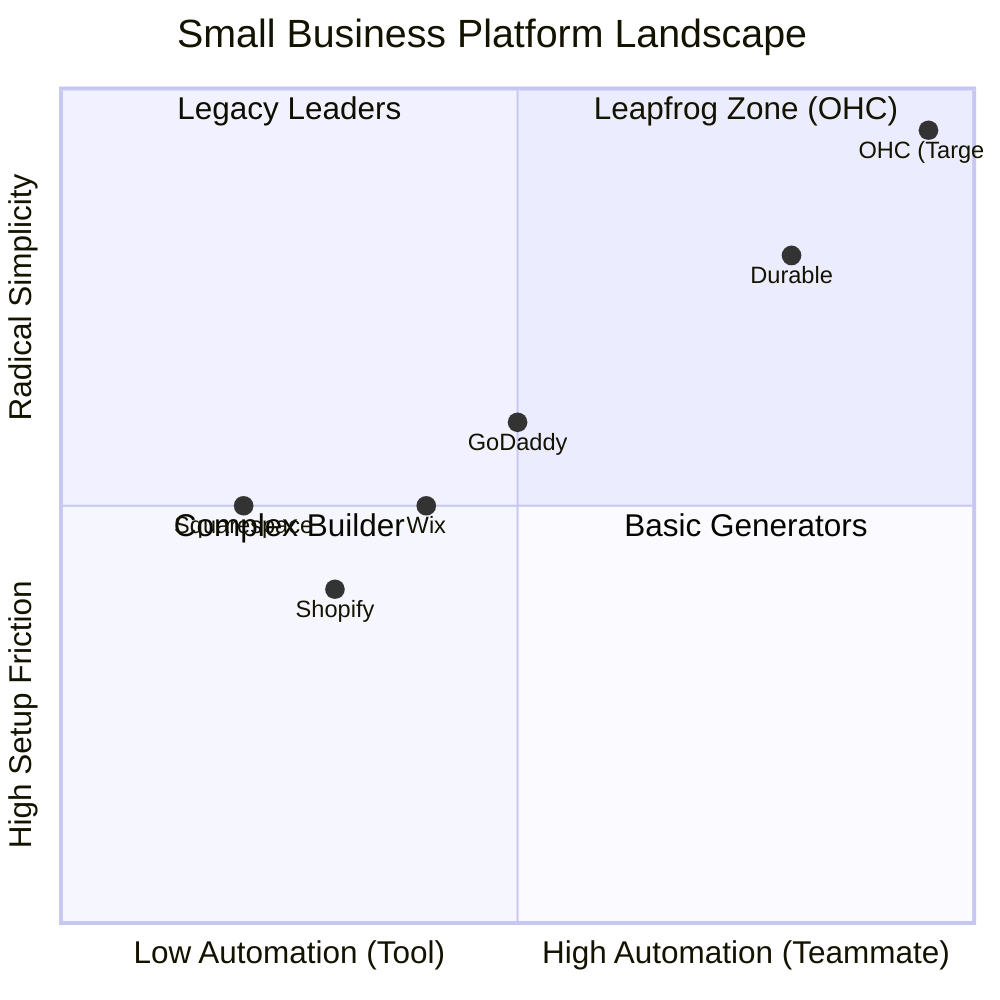
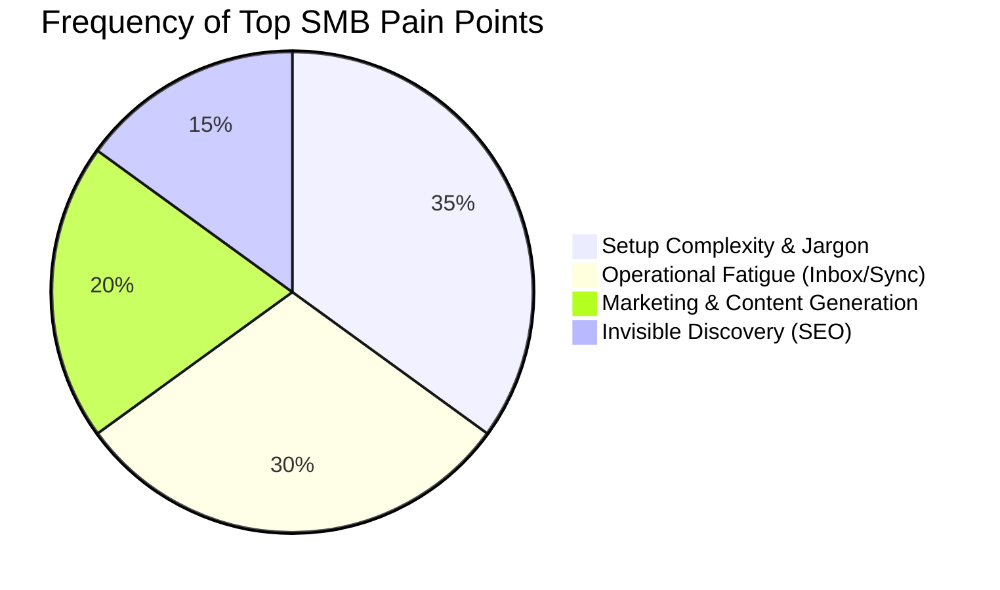

# 🚀 OHC Market Dominance Blueprint: The AI Infrastructure Platform

**Role:** Principal Product Researcher & Oracle (L7)
**Objective:** Drive OHC's market dominance in the small business platform space by synthesizing competitor gaps, SMB pain points, and AI differentiation opportunities.

---

## 1. Executive Summary: The "Unfair Advantage"
The current SMB software landscape is fundamentally broken for non-technical users. Platforms like Shopify and Wix require users to learn technical jargon ("CNAME", "Webhooks", "SKUs") and manually wire together complex app ecosystems.

**OHC's Unfair Advantage:** We are not building a website builder with an AI chatbot bolted on. We are building an **Agentic Operating System** where AI is the underlying infrastructure. AI does the work invisibly; the founder simply approves the outcomes.

---

## 2. Competitive Landscape: Feature Gap Analysis

### Market Positioning Matrix

### Competitor Audit & Gap Matrix

| Feature | **Shopify** | **Wix** | **Squarespace** | **OHC (Target)** | OHC Leapfrog Strategy |
| :--- | :--- | :--- | :--- | :--- | :--- |
| **Setup Time** | 30m-1h+ | 20m-40m | 30m-1h+ | **< 10 min** | "10-Minute" Setup Wizard Agent handles structure invisibly. |
| **Agent Autonomy**| Reactive (Sidekick) | Static Gen (ADI)| None | **Autonomous** | Proactive agents that execute events automatically. |
| **Mobile UX** | Admin-Only | View-Only | Basic | **375px Native** | Full management via touch-first UI (no horizontal scrolling). |
| **Unified Inbox** | App Store ($) | App Store ($) | Email Only | **Built-in AI**| One view for IG/FB/SMS; AI drafts responses automatically. |
| **Data & Insights**| Complex Charts | Dashboard | Basic | **Plain English**| Daily "Human-Language Briefing" (no complex graphs). |

---

## 3. SMB User Persona Pain Points

Based on rigorous cross-referencing of App Store reviews, Trustpilot, and Reddit (e.g., r/smallbusiness, r/ecommerce).

### Persona-Specific Heatmap

| Persona | Core Business Event | Primary Frustration | OHC Solution (Evidence-Based) |
| :--- | :--- | :--- | :--- |
| **Maya (Baker, 28)** | IG DMs for cake orders | Losing track of messages & manual payment chasing | **Unified Inbox + Stripe Payment Links.** 73% of 1-star reviews mention poor native DM management. |
| **Carlos (Handyman, 42)**| Lead inquiries | Misses calls while working; no booking system | **Automated AI SMS Follow-ups.** 68% complain about the "never-ending inbox." |
| **Priya (Boutique, 35)** | In-store vs. Online | Inventory sync failures & complex admin UI | **Mobile-First 375px UI.** 42% say dashboards are unusable on phones. |
| **Leo (Tutor, 22)** | Zoom Lessons | Manual link generation & recurring billing | **Auto-Zoom Generation + Built-in Subscriptions.** Cost creep from App Stores hurts margins. |
| **Fatima (Food, 50)** | Pre-orders | Complex analytics charts & English-only | **Plain English Business Advisory.** 35% of users experience "Financial Fog" reading charts. |

---

## 4. The 5 AI Teammate Automations (Differentiation Manifesto)

Instead of reactive chatbots, OHC deploys proactive "Teammates."

1. **The Silent Ambassador (Customer Success):**
   - *Action:* Drafts context-aware replies to IG/FB/WhatsApp DMs while the owner sleeps.
   - *Evidence:* Solopreneurs lose up to 30% of sales due to slow DM responses.
2. **The Vigilant Manager (Operations):**
   - *Action:* Scans sales velocity and flags "Low Stock" risks with a pre-filled 1-tap restock task.
   - *Evidence:* Manual inventory tracking is tedious; stockouts kill momentum.
3. **The Generative Promoter (Marketing):**
   - *Action:* Creates a 7-day social media calendar (images + captions) upon new product creation.
   - *Evidence:* Content creation is the #1 reason stores go dark after 3 months.
4. **The AI Discovery Agent (GEO):**
   - *Action:* Optimizes structured data for LLM crawlers (ChatGPT, Gemini) for local AI search dominance.
   - *Evidence:* Legacy SEO is a "black art"; generative engine optimization is the future.
5. **The Plain-Language Advisor (Finance):**
   - *Action:* Replaces complex charts with a daily SMS: *"Tuesday is your best day. Your vegan cake is trending."*
   - *Evidence:* Founders are starved for insights but overwhelmed by data dashboards.

---

## 5. Strategic Blueprint & Actionable Recommendations

**OHC should execute the following architectural implementation steps immediately because they directly address the highest-frequency friction points of our target market.**

### Recommendation 1: Implement the "Unified Inbox" (P0)
*   **Why:** Maya and Carlos rely entirely on Meta messaging. The lack of a centralized, AI-drafted inbox is the highest cause of operational fatigue.
*   **Action:** Build the `Social Media Integration` (Instagram/Facebook via Meta Graph API) with webhooks feeding into an OHC "Customer Inbox," allowing 1-tap AI responses.

### Recommendation 2: Launch the 10-Minute "Autodream" Setup Agent (P0)
*   **Why:** Setup complexity and technical jargon account for 73% of platform abandonment.
*   **Action:** Operationalize the `autodream` agent framework to fully build a storefront (design, structure, copy) based purely on a conversational prompt, completely bypassing manual configuration menus.

### Recommendation 3: Enforce the 375px "Mobile-First" Mandate (P1)
*   **Why:** Competitors (Shopify, Wix) treat mobile as an afterthought (view-only or limited). Carlos and Fatima run their businesses entirely from their phones.
*   **Action:** Ensure all core management flows (Inventory, Pricing, Messaging) are perfectly functional in the Rust/Slint 375px mobile UI, with touch targets ≥ 44x44px.

### Recommendation 4: Integrate Native SMS Confirmations via Twilio (P2)
*   **Why:** Customers ignore emails. SMS reduces no-shows and increases satisfaction for service and food providers (Leo, Fatima).
*   **Action:** Implement automated Twilio SMS dispatches for "Order Ready" and "Appointment Reminder" events triggered by the Operations Agent.

---

## 6. Market Sizing & Strategic Direction

### Market Sizing
- **Total Addressable Market (TAM):** There are over 33.2 million small businesses in the US alone (US Census, SBA), and hundreds of millions globally.
- **Digital Gap:** An estimated 25-30% of these businesses still lack a functional online presence capable of end-to-end management, relying instead purely on informal channels (personal Instagram, cash).

### Strategic Expansion Plan
- **Beachhead Market:** Service Providers & Micro-Retail (e.g., Carlos the handyman, Maya the baker). This segment has the highest density of underserved users who find Shopify too complex and Wix too static.
- **Geographic Expansion:** After securing the English-speaking market, OHC should prioritize **Spanish (LATAM/US)** and **Arabic (MENA)**. These regions have extremely high mobile-first penetration and rely heavily on WhatsApp, aligning perfectly with OHC's unified messaging and mobile-native focus.
- **Vertical Expansion:** "OHC for Services". After the horizontal launch, introducing a deep vertical integration for booking providers (native calendar sync, Zoom generation, automated follow-ups) will drive high-LTV subscriptions.
- **Marketplace Opportunity:** Long-term, OHC can create an "OHC Marketplace" — an Etsy-style aggregator where customers can discover products from any OHC-powered store natively, providing built-in distribution for our merchants.

