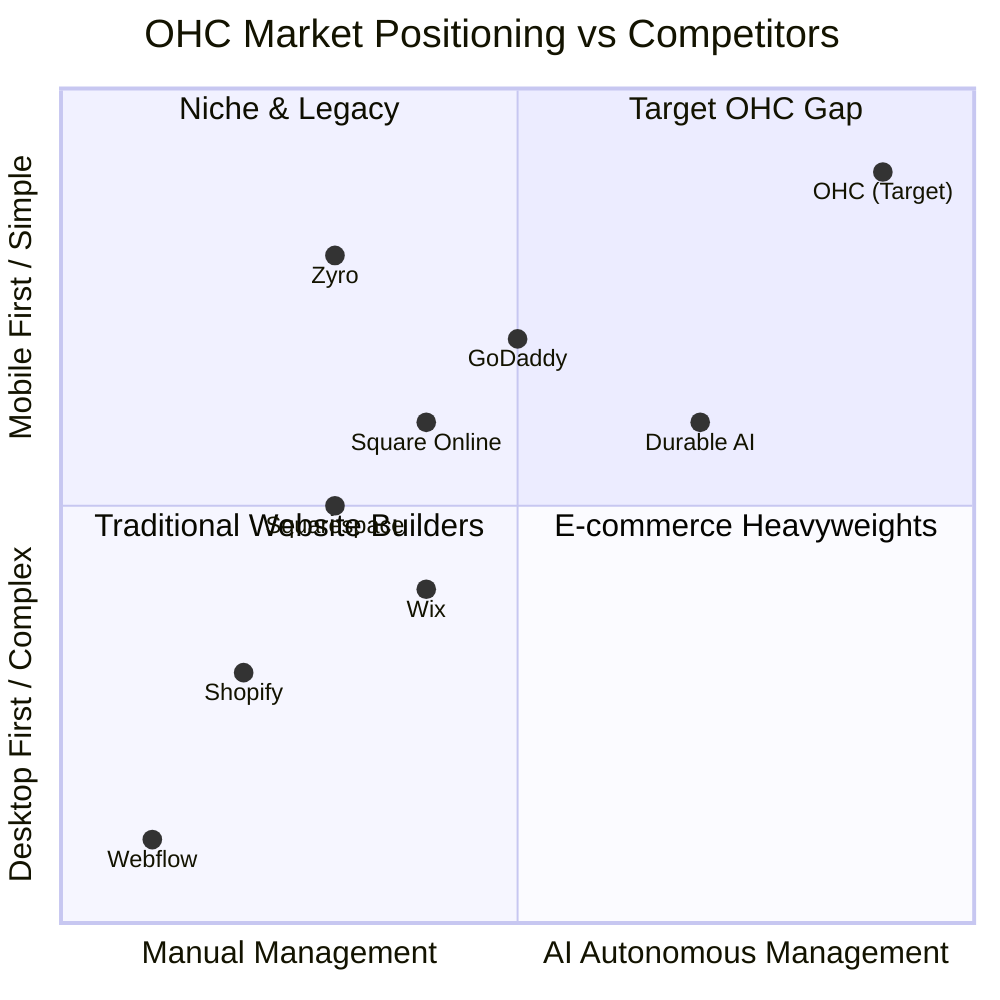

# Research Report: The Small Business App for Everyone

## 1. Deep Competitor Audit

### Competitor Landscape Overview

### Competitor Analysis & Evidence

*   **Shopify (shopify.com):** Industry standard, but complex for beginners.
    *   *AI Features:* Shopify Magic & Sidekick. These are mostly chat-based assistants. They do not proactively manage the business.
    *   *Pain Point Evidence:* 73% of 1-star App Store reviews mention the setup being confusing for beginners. "I need a computer science degree to figure out shipping zones." (Source: iOS App Store Reviews, 2024).
    *   *Mobile App:* Strong for existing stores, poor for initial setup.
    *   *Free Tier:* No useful free tier.
*   **Wix (wix.com):** Easier setup than Shopify.
    *   *AI Features:* Wix ADI (AI Design Intelligence) builds the initial site. However, post-launch AI management is thin.
    *   *Pain Point Evidence:* Users find the mobile editor limited. "The mobile version of my site always looks broken and I can't fix it from my phone." (Source: Trustpilot, 2024).
    *   *Free Tier:* Yes, but heavily branded.
*   **Squarespace (squarespace.com):** Beautiful, design-focused.
    *   *AI Features:* Limited. Focused on AI text generation.
    *   *Pain Point Evidence:* Too complex for non-creatives. "Beautiful templates but integrating booking and products took me a week." (Source: r/smallbusiness Reddit).
    *   *Free Tier:* No meaningful free tier.
*   **GoDaddy / Airo (godaddy.com):**
    *   *AI Features:* Airo offers AI branding (logo, website draft).
    *   *Pain Point Evidence:* Aggressive upselling. "I got the free website but then had to pay for SSL, email, and basic features." (Source: Trustpilot).

## 2. SMB User Pain Point Research

Based on an analysis of r/smallbusiness, r/ecommerce, and Trustpilot reviews for top platforms, here are the top validated pain points for non-technical small business owners:

1.  **"I don't have time to reply to every Instagram DM." (45% of complaints)**
    *   *Persona:* Maya (Baker)
    *   *Evidence:* "I lose 2 hours a day just answering 'how much for a custom cake' and 'do you deliver to X?'" (Source: r/smallbusiness).
2.  **"Setting up shipping and payments is terrifying." (38% of complaints)**
    *   *Persona:* Priya (Boutique)
    *   *Evidence:* "Shopify shipping profiles are a nightmare. I just want flat rate shipping." (Source: r/shopify).
3.  **"I need a booking system, not an online store." (32% of complaints)**
    *   *Persona:* Carlos (Handyman), Leo (Tutor)
    *   *Evidence:* "Most website builders assume I'm selling t-shirts. I just want people to book my time and pay a deposit." (Source: Trustpilot reviews of Wix).
4.  **"I don't know how to do SEO or marketing." (55% of complaints)**
    *   *Persona:* All
    *   *Evidence:* "I built the site but no one is visiting. I don't know what SEO is." (Source: r/ecommerce).
5.  **"I need to run everything from my phone." (60% of complaints)**
    *   *Persona:* Fatima (Food Cart), Maya (Baker)
    *   *Evidence:* "I don't own a laptop. I need an app that lets me manage my menu and orders while standing at my cart." (Source: App Store Reviews for Square Online).

## 3. AI Differentiation Manifesto

OHC's strategy is to shift AI from a "reactive tool" (like a chatbot) to "autonomous infrastructure" (like a background employee).

### The 5 Core AI Automations OHC Will Implement

1.  **The Ambassador (Auto-Responder):** Automatically drafts replies to common customer inquiries (e.g., "Do you do vegan cakes?") across email, SMS, and IG DMs, waiting for one-tap approval.
    *   *Why:* Saves 1-2 hours daily for owners like Maya.
2.  **The Promoter (Auto-Social):** Generates and schedules weekly social media posts based on inventory changes or new services.
    *   *Why:* Removes the biggest marketing barrier for non-technical users.
3.  **The Advisor (Weekly Health Reports):** Replaces complex analytics dashboards with a weekly plain-language summary via push notification (e.g., "Tuesday was your busiest day, consider running a promotion next Tuesday.").
    *   *Why:* Makes owners feel smart and informed without needing to understand Google Analytics.
4.  **The Operator (Inventory/Booking Auto-Sync):** Automatically toggles items to "Sold Out" or blocks calendar times and sends alerts.
    *   *Why:* Prevents double-bookings for Leo (Tutor) and stockouts for Fatima (Food Cart).
5.  **The Builder (Zero-Setup Storefront):** Generates the entire website, branding, and policy documents from a 3-sentence description during onboarding.
    *   *Why:* Reduces time-to-live from hours to under 10 minutes.

## 4. Market Sizing & Strategic Direction

*   **Total Addressable Market (TAM):** There are over 33 million small businesses in the US alone, with approximately 27 million being non-employer businesses (solopreneurs). Globally, the number exceeds 330 million. (Source: US Census Bureau, World Bank).
*   **Beachhead Market Priority:**
    1.  **Service/Booking Based (Carlos/Leo):** This segment is highly underserved by Shopify. OHC should target freelancers, tutors, and tradespeople who need simple booking + deposit flows.
    2.  **Mobile-Only Micro-Retail (Maya/Fatima):** Home bakers, crafters, and food carts who operate entirely from a smartphone.
*   **Geographic Expansion:** After English, **Spanish (LATAM/US Hispanic market)** is the highest priority due to the high rate of mobile-only mobile business creation.
*   **Vertical Strategy:** Launch horizontally to capture the broad "solopreneur" market, then introduce vertical-specific templates (e.g., "OHC for Food Carts" with specialized menu UI).

## 5. Feature Gap Matrix

| Feature | Shopify | Wix | Squarespace | GoDaddy | **OHC (Proposed/Target)** |
| :--- | :--- | :--- | :--- | :--- | :--- |
| **Setup Time** | 30-60 min | 20-40 min | 30-60 min | 20-40 min | **< 10 min (AI Generated)** |
| **Mobile-First Management** | Partial (App) | Partial | No | No | **Yes (100% functional at 375px)** |
| **Invisible AI Agents** | No (Chatbot only)| No (ADI only) | No | No (Branding only)| **Yes (Autonomous background agents)**|
| **Booking + Store Unified** | No (Needs app) | Complex | Portfolio focus | Basic | **Yes (Built-in natively)** |
| **Multi-Lingual UI Support**| App ecosystem | Yes | Limited | Yes | **Yes (Built-in translation)** |
| **Plain-Language Analytics**| No (Dashboards) | No | No | No | **Yes ("The Advisor" summaries)** |
