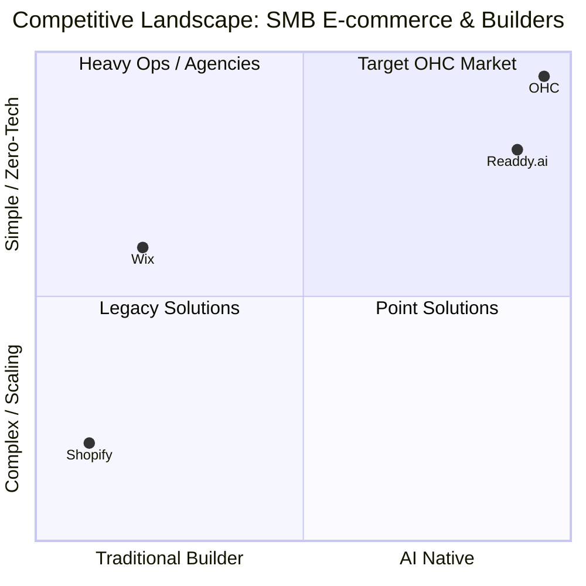

# OHC Small Business Platform Competitive Analysis & Agentic Solutions Report

**Mission:** Drive OHC's market dominance in the small business platform space by analyzing competitors, identifying user pain points, and proposing AI-native solutions.

## 1. Market Mapping & Competitor Discovery (Track 1)

### Top 10 General Competitors (Traditional Builders & E-commerce)
1. **Shopify** (shopify.com): The undisputed market leader in e-commerce. Target: Scaling SMBs and enterprise.
2. **Wix** (wix.com): Visual drag-and-drop builder with commerce features. Target: General SMBs and creatives.
3. **Squarespace** (squarespace.com): Design-led website builder. Target: Creatives, restaurants, and service businesses.
4. **GoDaddy** (godaddy.com): Domain registrar turned basic website builder. Target: Low-tech micro-businesses.
5. **WooCommerce** (woocommerce.com): Open-source WordPress plugin. Target: Tech-savvy SMBs wanting full control.
6. **BigCommerce** (bigcommerce.com): Scalable e-commerce. Target: Mid-market to enterprise.
7. **Weebly** (weebly.com): Simple drag-and-drop builder (owned by Square). Target: Local businesses and beginners.
8. **Webflow** (webflow.com): Advanced visual development platform. Target: Agencies and designers.
9. **Ecwid** (ecwid.com): Embeddable commerce widget. Target: Existing websites wanting to add commerce.
10. **Hostinger Website Builder** (hostinger.com): Budget-friendly hosting and builder. Target: Price-sensitive beginners.

### Top 10 AI-Native Competitors
1. **Readdy.ai** (readdy.ai): No-code AI website generator focused on instant creation. Target: Zero-tech users.
2. **Simular.ai** (simular.ai): AI marketing automation and agent platform. Target: Marketing-focused SMBs.
3. **Warmly.ai** (warmly.ai): Agentic GTM and inbound conversion agents. Target: B2B and service SMBs.
4. **Alhena.ai** (alhena.ai): E-commerce specific AI agents for support and shopping. Target: E-commerce stores.
5. **Snapps.ai** (snapps.ai): AI website builder for small businesses. Target: Local businesses and agencies.
6. **Fin.ai** (fin.ai): AI customer service agents. Target: Support-heavy SMBs.
7. **HelloRep.ai** (hellorep.ai): AI shopping assistants and concierges. Target: E-commerce merchants.
8. **Dropgenius** (dropgenius.com): AI store generator with trending products. Target: Dropshippers.
9. **Logome** (logome.ai): AI branding and logo generator. Target: New business creation.
10. **Intandem** (intandem.vcita.com): AI agents for SMB clients (B2B2B). Target: Agencies serving SMBs.

## 2. Deep-Dive Competitor Audit: Shopify (Track 2)

**Competitor:** Shopify (Traditional Giant transitioning to AI)

### Capabilities
- Comprehensive e-commerce engine (inventory, variants, payments).
- App Store with 8,000+ third-party integrations.
- POS integration for omnichannel retail.
- "Sidekick" (AI assistant) for merchant queries and basic tasks.
- Shop Pay accelerated checkout network.

### Success Factors
- **Ecosystem:** Massive developer network for apps and themes.
- **Reliability:** High uptime and scalable infrastructure.
- **Brand Recognition:** The default choice for "starting an online store."

### User Sentiment Audit (via Reddit, Trustpilot, Reviews)
- **Love:** Scalability, reliability, and the sheer volume of available apps.
- **Hate / Pain Points:**
  - **Setup Complexity:** "Overwhelming for a single-person business." The learning curve is steep for true beginners.
  - **App Fatigue & Costs:** Core features (like subscriptions or advanced booking) require paid third-party apps, driving up monthly costs significantly.
  - **Mobile Management:** The mobile app is good for checking stats, but terrible for *building* or deeply managing the store.
  - **AI is Bolted On:** "Sidekick" is a chatbot, not an autonomous agent. It tells you how to do things rather than doing them for you.

## 3. OHC Gap & Pain Point Identification (Track 3)

### OHC vs. Shopify Feature Matrix

| Feature | Shopify | OHC (Current/Target) |
| :--- | :--- | :--- |
| Core E-commerce | Excellent | Excellent (Target) |
| Bookings/Services | Requires Paid App | **Built-in Native** |
| AI Integration | Chatbot (Sidekick) | **Agentic (Departments)** |
| Mobile Management | Read-mostly | **Full 375px native execution** |
| Setup Time | Days/Weeks | **< 10 minutes** |

```mermaid
gantt
    title User Journey Comparison: Setup to First Sale
    dateFormat X
    axisFormat %s
    section Shopify
    Sign Up & Theme          :a1, 0, 5
    Configure Settings       :a2, after a1, 10
    Add Apps & Products      :a3, after a2, 15
    Launch                   :a4, after a3, 5
    section OHC (AutoDream)
    Conversational Intent    :b1, 0, 2
    Agent Scaffolding        :b2, after b1, 2
    One-Tap Approve          :b3, after b2, 1
    Launch                   :b4, after b3, 1
```

### Unresolved SMB Pain Points (The "Why OHC Wins" Gap)
1. **The "Blank Canvas" Paralysis:** SMB owners (like Maya the baker) freeze when asked to design a site or write copy. Shopify gives them a template; they need an *outcome*.
2. **The "App Tax":** A basic Shopify store costs $39/mo, but adding bookings, subscriptions, and AI support pushes it over $100/mo.
3. **The "Desk Tether":** Fatima (Food Cart) and Carlos (Handyman) don't own laptops. They need to run their entire operation from a cheap Android phone.
4. **The "Action" Gap:** Current AI tools *advise* (e.g., "You should post on Instagram"). OHC agents must *execute* (e.g., "I posted this on Instagram for you").

## 4. Deeper Focused Research & Agentic Solutions (Track 4)

### Pain Point 1: Complex Setup & "Blank Canvas" Paralysis
**Evidence:** Reddit threads (e.g., r/smallbusiness) repeatedly ask "What is the easiest platform?" because users get stuck connecting domains, setting up shipping zones, and writing product descriptions.
**Agentic Solution:** **The "AutoDream" Onboarding Pipeline.**
Instead of a dashboard, the user chats with the Operations Agent. "I bake vegan cakes in Austin." The agent autonomously generates the site structure, creates sample products with AI images/copy, configures local delivery zones, and sets up Stripe. The user just taps "Approve."

### Pain Point 2: Mobile-First Operational Reality
**Evidence:** Service workers (Carlos) and food vendors (Fatima) report missing leads because they are physically working and cannot check a complex web dashboard.
**Agentic Solution:** **Action-Oriented Push Notifications.**
The Sales Agent intercepts a lead. It pushes a notification to Carlos's phone: "New quote request: Leaking pipe. I drafted a $150 quote based on your pricing. Send?" Carlos taps "Send" from his lock screen. No dashboard login required.

## 5. Actionable Feature Missions (Issue Briefs)

### [Feature Mission] Implement AutoDream Conversational Onboarding
- **Problem:** Users abandon setup when faced with complex configuration forms.
- **Design Doc:** Replace the traditional signup form with a conversational UI (Flutter, 375px optimized). The UI streams agent reasoning ("Drafting your menu...", "Configuring local taxes..."). Backend uses Gemini Pro to parse intent and execute standard OHC API calls to scaffold the tenant data.
- **Implementation Prompt:** Create the `AutodreamPipeline` service that takes a natural language description of a business and automatically creates the tenant, populates a basic catalog/menu, generates a hero image via image generation integration, and sets up a default booking/shipping profile. Provide a mobile-first Flutter screen for this flow.
- **Priority:** P0
- **Estimated Scope:** Large

### [Feature Mission] Implement Action-Oriented Lock-Screen Approvals for the Sales Agent
- **Problem:** Deskless workers miss leads because they cannot access web dashboards quickly.
- **Design Doc:** Implement actionable push notifications using Firebase Cloud Messaging (FCM). When the Sales Agent drafts a quote or the Operations Agent suggests an inventory restock, the notification payload includes an `action_token`. The Flutter app intercepts this and shows a native quick-action modal (e.g., "Approve Quote", "Reject").
- **Implementation Prompt:** Build the notification payload structure and the webhook handler that processes `action_token` responses without requiring full app authentication state. Ensure the UX is heavily optimized for single-handed mobile use.
- **Priority:** P1
- **Estimated Scope:** Medium

## Appendix: References & Sources Catalog
1. https://readdy.ai/
2. https://www.sitebuilderreport.com/wix-vs-squarespace
3. https://www.quora.com/What-is-a-good-eCommerce-platform-for-a-small-business
4. https://www.reddit.com/r/ecommerce/
5. https://www.simular.ai/alternatives/top-best-ai-marketing-automation-alternatives-for-smbs
6. https://www.hostinger.com/au/tutorials/webflow-alternatives
7. https://fastspring.com/blog/shopify-alternatives-for-selling-your-digital-goods/
8. https://www.reddit.com/r/ecommerce/comments/1bot3x2/best_platform_for_a_small_single_person_business/
9. https://www.conbersa.ai/learn/best-subreddits-for-ecommerce
10. https://www.reddit.com/r/smallbusiness/comments/1pc0x5q/small_business_owners_what_ecommerce_solutions/
11. https://www.youtube.com/watch?v=4EuZjHWWoag
12. https://www.businessinsider.com/
13. https://fin.ai/learn/best-ai-agents-customer-service
14. https://intandem.vcita.com/blog/partners/top-10-ai-agents-for-your-small-business-clients
15. https://www.websitebuilderexpert.com/website-builders/small-business/
16. https://www.spocket.co/blogs/best-website-builders
17. https://www.youtube.com/watch?v=nHnUfQMGK9A
18. https://www.scrumball.com/blog/cheapest-influencer-marketing-platforms-2024/
19. https://allaboutcookies.org/best-AI-website-builder
20. https://admin-junkies.com/threads/best-ecommerce-platform-for-a-small-business.17910/page-3
21. https://litextension.com/blog/squarespace-vs-godaddy/
22. https://www.bigcommerce.com/blog/shopify-alternatives/
23. https://www.hellorep.ai/blog/best-ai-agents-for-ecommerce
24. https://www.facebook.com/groups/306644989046694/posts/614900261554497/
25. https://www.tomsguide.com/features/wordpress-vs-wix-vs-squarespace
26. https://www.techradar.com/pro/website-building/best-alternative-to-shopify
27. https://asiridev.com/free-ai-website-builders-small-business/
28. https://avada.io/blog/website-builder-reddit/
29. https://buddyxtheme.com/best-ai-website-builders-small-business/
30. https://www.reddit.com/r/OnlineMarketing/comments/1rgx3zu/comparing_ai_customer_service_tools_for_ecommerce/
31. https://smallbusiness.co.uk/best-ai-website-builders-2606437/
32. https://communicateonline.me/news/reddit-expands-shopping-push-with-interactive-product-carousels/
33. https://www.reddit.com/r/ecommerce/comments/1r78meb/what_ecommerce_platform_are_you_using_now_looking/
34. https://community.shopify.com/t/is-shopify-worth-it-for-a-small-business-owner-just-starting-out/390471
35. https://emergent.sh/learn/best-shopify-alternatives-and-competitors
36. https://www.tooltester.com/en/blog/author/inka/
37. https://www.shopify.com/blog/most-popular-social-media-platforms
38. https://www.warmly.ai/p/blog/ai-agents-for-small-businesses
39. https://www.forbes.com/advisor/business/software/wix-vs-squarespace/
40. https://www.facebook.com/groups/2815042615255352/posts/24251933954472908/
41. https://buffer.com/resources/social-media-platforms/
42. https://www.quora.com/What-are-some-modern-alternatives-to-Shopify-or-WordPress-for-building-an-online-store
43. https://www.websitebuilderexpert.com/ecommerce-website-builders/comparisons/wix-vs-shopify/
44. https://www.hiscox.com/blog/reddit-best-ecommerce-platforms-for-small-businesses
45. https://www.linkedin.com/pulse/ai-tools-i-use-e-commerce-real-world-wins-smb-teams-mike-g-girardin-yfllc
46. https://www.snapps.ai/best-ai-website-builders-small-business/
47. https://www.linkedin.com/pulse/why-your-business-should-jump-pinterest-2024-julia-ripo
48. https://www.linkedin.com/posts/bare-metal-dedicated-server-hosting_wordpress-vs-proprietary-site-builders-what-activity-7425050213934972928-M2Fj
49. https://business.meta.com/?locale=en_US
50. https://alhena.ai/blog/best-ai-agents-for-ecommerce/
