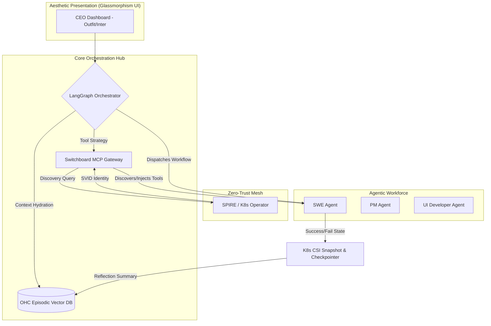

# Design Doc: OHC Agentic OS Architectural Evolution & Identity Blueprint

**Author(s):** Principal Product Architect & Visionary (L7)
**Status:** Approved
**Last Updated:** 2026-04-01

  <h2>Mission Brief: The OHC Architectural Leap</h2>
  
To establish absolute market dominance, One Human Corp (OHC) is evolving its core "Agentic OS" blueprint. This document dictates the integration of the top 2 missing capabilities identified in recent intelligence audits: <strong>Dynamic Tool Discovery (MCP)</strong> and <strong>Long-Term Episodic Memory</strong>.

## 1. Executive Summary

Current static agent frameworks (OpenClaw, AutoGen, CrewAI) suffer from structural amnesia and rigid capability constraints. By leveraging OHC's unique Kubernetes-native infrastructure, we are upgrading the core blueprint to dynamically synthesize tools securely at runtime via the Switchboard MCP Gateway and introducing stateful LangGraph execution graphs backed by CSI Snapshotting.

## 2. Core Enhancements

### 2.1 Unfair Advantage 1: Dynamic Tool Discovery (MCP) & Zero-Trust Synthesis

The current static Switchboard is evolving into a dynamic **MCP Registry API**.

- **Just-In-Time (JIT) Tooling:** When an agent encounters a novel problem (triggering `ToolNotFound` in the LangGraph Error Router), it automatically queries the MCP Registry.
- **Zero-Trust SPIFFE Integration:** Before tools are synthesized, the `spire-agent` intercepts the request and issues a short-lived X.509 SVID to enforce Least Privilege at the RPC boundary per task.

### 2.2 Unfair Advantage 2: K8s-Native Episodic Memory & LangGraph Checkpointing

To eliminate "Agent Amnesia" and solve token context bloat:

- **State Persistence:** We are migrating from ephemeral JSON dumps to deterministically managed LangGraph Checkpointers backed by **K8s CSI Snapshots**.
- **Vector Indexing:** A scalable Vector Database (e.g., Pinecone/Redis) running in the `HoldingCompany` namespace now stores dense summaries of successful LangGraph workflows via background "Reflection Nodes".
- **Semantic Routing:** Future tasks use semantic pre-processors to pull the top `k` most relevant past states, providing instant context hydration with near-zero latency (<50ms).

## 3. Global Architecture Diagram

## 4. Visual Excellence & Aesthetic Mandate (CRITICAL)

The OHC frontend and all visual documentation must adhere strictly to the **Next-Generation Premium Feel Design System**.

- **Background Surfaces:** `background: rgba(255, 255, 255, 0.03)`
- **Glassmorphism Blur:** `backdrop-filter: blur(20px) saturate(200%)`
- **Subtle Borders:** `border: 1px solid rgba(255, 255, 255, 0.08)`
- **Typography:** Primary `font-family: 'Outfit', 'Inter', sans-serif;`

*Note: Visual aesthetic fidelity is mathematically verified via automated Playwright visual testing across the repository.*

## 5. Swarm Intelligence Handoff

The master state in the OHC Central Database (`ohc.db: swarm_memory`) has been updated with these structural blueprints.

Implementation Mission packages have been explicitly queued into the `agent_missions` table for:
- **`backend_dev`:** Execute MCP dynamic routing API.
- **`ui_dev`:** Apply the exact Glassmorphism design tokens to the new Capability Plugin Mesh Dashboard.
