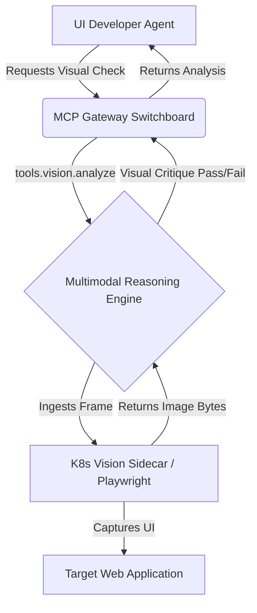

# OHC Research: Native Vision & Multimodal Reasoning

## 1. Executive Summary

As the Agentic OS landscape evolves rapidly (e.g., Claude Code, AutoGen, OpenDevin), one critical bottleneck remains: **Visual Grounding**. Current orchestration frameworks rely heavily on OCR middleware, DOM parsing, or accessibility trees to "see" interfaces. This introduces latency, loss of spatial context, and brittleness when UIs change dynamically.

**The OHC Unfair Advantage:** Direct, token-efficient Multimodal Reasoning. By bypassing OCR and directly ingesting high-fidelity visual streams (screenshots, architecture diagrams) into multimodal-native LLMs (like GPT-4o or Claude 3.5 Sonnet), OHC agents can achieve "human-like" spatial awareness and visual debugging capabilities.

## 2. Market Gap Analysis

<table style="width: 100%; border-collapse: collapse; margin-top: 20px; margin-bottom: 20px;">
  <thead>
    <tr>
      <th style="border: 1px solid rgba(255, 255, 255, 0.1); padding: 12px; text-align: left; background: rgba(255, 255, 255, 0.1);">Framework</th>
      <th style="border: 1px solid rgba(255, 255, 255, 0.1); padding: 12px; text-align: left; background: rgba(255, 255, 255, 0.1);">Visual Strategy</th>
      <th style="border: 1px solid rgba(255, 255, 255, 0.1); padding: 12px; text-align: left; background: rgba(255, 255, 255, 0.1);">Drawbacks</th>
    </tr>
  </thead>
  <tbody>
    <tr>
      <td style="border: 1px solid rgba(255, 255, 255, 0.1); padding: 12px; text-align: left;"><strong>Traditional Automations</strong></td>
      <td style="border: 1px solid rgba(255, 255, 255, 0.1); padding: 12px; text-align: left;">Playwright/Selenium DOM parsing</td>
      <td style="border: 1px solid rgba(255, 255, 255, 0.1); padding: 12px; text-align: left;">Fragile to DOM changes; cannot judge visual aesthetics or regressions.</td>
    </tr>
    <tr>
      <td style="border: 1px solid rgba(255, 255, 255, 0.1); padding: 12px; text-align: left;"><strong>Current OSS Agents</strong></td>
      <td style="border: 1px solid rgba(255, 255, 255, 0.1); padding: 12px; text-align: left;">OCR Middleware (Tesseract, etc.)</td>
      <td style="border: 1px solid rgba(255, 255, 255, 0.1); padding: 12px; text-align: left;">High latency; loses complex spatial relationships; text-heavy focus.</td>
    </tr>
    <tr>
      <td style="border: 1px solid rgba(255, 255, 255, 0.1); padding: 12px; text-align: left;"><strong>One Human Corp (Proposed)</strong></td>
      <td style="border: 1px solid rgba(255, 255, 255, 0.1); padding: 12px; text-align: left;"><strong>Native Frame Ingestion via Multimodal Models</strong></td>
      <td style="border: 1px solid rgba(255, 255, 255, 0.1); padding: 12px; text-align: left;"><strong>Direct spatial reasoning; instant visual validation; true GUI interaction.</strong></td>
    </tr>
  </tbody>
</table>

## 3. The OHC Implementation Strategy (K8s Native)

We propose integrating **Multimodal capabilities directly into the OHC Switchboard (MCP Gateway)**.

1.  **Vision Sidecar Proxies:** Deploy lightweight K8s sidecars alongside execution environments (like our `browser` tool wrappers). These sidecars continuously buffer frames or capture high-resolution screenshots on command.
2.  **Multimodal MCP Tools:** Introduce specialized MCP tools (e.g., `tools.vision.analyze_screen`, `tools.vision.compare_designs`) that accept image bytes directly, bypassing text-only context windows.
3.  **UI Verification Loop:** The UI Developer Agent can autonomously verify Glassmorphism implementations, layout alignment, and visual regressions by passing screenshots directly back into the LLM for a "pass/fail" visual critique.

## 4. Architectural Diagram (Mermaid)

## 5. Strategic Impact

*   **10x Faster UI Iteration:** UI agents can self-correct visual bugs without human intervention.
*   **True E2E Testing:** Agents can verify that a button not only exists in the DOM, but is actually visible, clickable, and correctly styled (e.g., verifying our Glassmorphism CSS tokens).
*   **Design-to-Code Mastery:** Future capability to ingest Figma screenshots directly via MCP to generate pixel-perfect initial implementations.

## 6. Actionable Mission Hand-off

We recommend immediately dispatching a mission to the `backend_dev` to implement the baseline **Multimodal MCP Tool Integration** within our Gateway.

