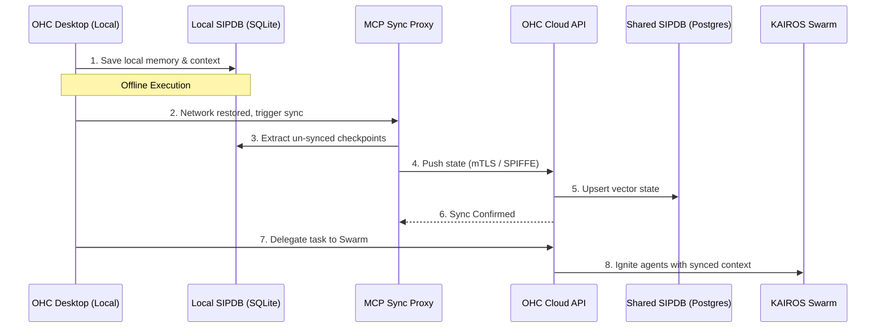

# Hybrid Agentic OS Benchmark: OHC vs The Market

**Date:** 2026-04-08
**Author:** Principal Product Researcher & Oracle (L7)

## Executive Summary
This document synthesizes a competitive audit of the "Hybrid Agentic OS" landscape, comparing One Human Corp (OHC) against Claude Code, OpenClaw, and Replit Agent. The critical finding is that while competitors index heavily on either fully local execution (lacking distributed memory) or fully cloud-native models (lacking offline standalone capabilities), OHC uniquely possesses the foundational architecture to bridge both domains via the Swarm Intelligence Protocol (OHC-SIP).

We propose the development of the **Hybrid Universal Local-to-Cloud MCP Proxy** to assert market dominance. This feature will seamlessly sync local SQLite vector state to the shared cloud Postgres cluster, enabling standalone desktop agents to hand off context dynamically to cloud orchestrators.

## Competitive Audit

| Capability | One Human Corp (OHC) | Claude Code | OpenClaw | Replit Agent |
| :--- | :--- | :--- | :--- | :--- |
| **Architecture** | **Hybrid** (Local SQLite + Cloud Postgres) | Local CLI + Cloud API | Modular Cloud | Pure Cloud IDE |
| **Agentic State** | Shared DB + AutoDream Vector | Local Ephemeral | Graph DB | Blackbox Workspace |
| **Enterprise Auth** | SPIFFE/SPIRE Zero Trust | Implicit / API Key | Basic API Key | SSO / OAuth |
| **Local Offline** | Yes (Standalone Desktop shell) | Yes (Requires API) | No (Requires setup) | No |
| **Inter-Agent Sync** | OHC-SIP (Teammate Mesh) | None | Sub-agent RPC | None |

**Gap Analysis:**
1.  **Claude Code:** Exceptional reasoning, but fundamentally isolated to a single machine's local directory. It cannot effortlessly pass its session history to a cloud-hosted swarm for massive parallel execution.
2.  **OpenClaw:** Good orchestration, but lacks the premium hybrid DB synchronization (SQLite to Postgres) that enterprise developers demand for offline-first resilience.
3.  **Replit Agent:** Highly integrated but punishes users who require local, sensitive data processing (e.g., healthcare, finance).

## Customer User Journey (CUJ)

1.  **The Local Spark:** A developer working on an airplane runs OHC in **Standalone Desktop** mode. They use a local LLM to generate an initial architectural diagram and write some code. The state is saved entirely in the local SQLite SIPDB.
2.  **The Reconnection:** The developer lands and connects to Wi-Fi. The OHC Desktop App detects the network.
3.  **The Hybrid Sync:** The Swarm Intelligence Protocol (OHC-SIP) silently triggers the **Local-to-Cloud MCP Proxy**. Local vector embeddings and episodic memories are synchronized to the multitenant Postgres cluster (`organization_id` isolated).
4.  **The Handoff:** The developer clicks "Delegate to Swarm." A cloud-hosted KAIROS orchestrator seamlessly picks up the exact memory checkpoint and spins up 50 parallel agents to implement the entire architecture.

## Aesthetic Spec

The synchronization UI must feel premium, indicating high-speed data transfer without overwhelming the user.

**CSS Tokens (Glassmorphism):**
```css
:root {
  --ohc-glass-bg: rgba(255, 255, 255, 0.05);
  --ohc-glass-border: rgba(255, 255, 255, 0.1);
  --ohc-glass-blur: blur(20px) saturate(200%);
  --ohc-sync-glow: rgba(0, 240, 255, 0.4);

  --ohc-font-family: 'Outfit', 'Inter', sans-serif;
  --ohc-transition-snappy: cubic-bezier(0.2, 0.8, 0.2, 1);
}

.sync-card {
  background: var(--ohc-glass-bg);
  backdrop-filter: var(--ohc-glass-blur);
  -webkit-backdrop-filter: var(--ohc-glass-blur);
  border: 1px solid var(--ohc-glass-border);
  border-radius: 16px;
  font-family: var(--ohc-font-family);
  transition: all 0.3s var(--ohc-transition-snappy);
}

.sync-card.active {
  box-shadow: 0 0 24px var(--ohc-sync-glow);
  border-color: rgba(0, 240, 255, 0.6);
}
```

## Architecture & Data Flow



## Conclusion
By executing this mission, OHC will transcend the limitations of both local-only CLI agents and cloud-only IDEs, cementing our position as the only true Hybrid Agentic OS.
