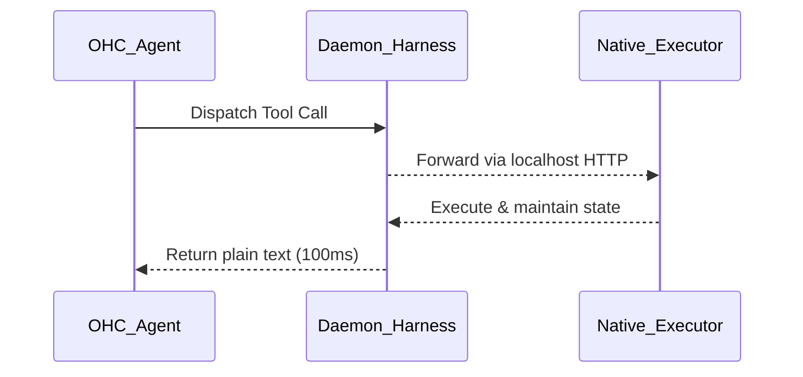

# 🔬 OHC Market Research Report: Agent Harness Architectures (Gstack & OpenClaw)

## 1. Executive Summary
This report analyzes the Agent Harness environments from trending AI agent projects, specifically **Gstack** and **OpenClaw**, to extract architectural insights for OHC's Agentic OS. The analysis focused on how they isolate execution, run terminal commands, manage state, and maintain low latency during agent-environment interactions.

## 2. Core Harness Architecture Findings

### 2.1 Gstack: Persistent Headless Browser Daemon
Gstack optimizes for sub-second latency and persistent state when interacting with web browsers. Instead of cold-starting a browser for every tool call (which takes 3-5 seconds), Gstack runs a long-lived Chromium daemon via a Bun server.
- **Latency**: First call takes ~3s, subsequent calls take ~100-200ms.
- **State Persistence**: Browser cookies, tabs, and login sessions are maintained across tool calls.
- **Key takeaway for OHC**: Local tool harnesses (like browsers or heavy environments) should utilize a daemon pattern rather than ephemeral child processes.

### 2.2 OpenClaw: Native Executor Harness Plugins
OpenClaw uses an "Agent Harness" abstraction as a low-level executor for a single prepared agent turn.
- **Decoupled Execution**: The harness runs the attempt but does not pick providers or switch models.
- **Native Context**: Harness plugins (e.g., Codex) manage model discovery, native thread resumption, and native compaction, allowing the agent to run close to its native app-server execution context.
- **Key takeaway for OHC**: Abstracting the core agent turn execution into isolated harnesses allows specific environments (like coding specific local VMs) to manage their own thread state and compaction without burdening the orchestrator.

### 2.3 Component Interaction (Mermaid)

## 3. Comparative Matrix: OHC vs Market

| Feature Area | Gstack & OpenClaw | OHC Hybrid Architecture | Gap Assessment |
|--------------|-------------------|--------------------------|----------------|
| **Execution** | Persistent Bun Server & Native Harnesses | Containerized / Ephemeral Pods | Implement daemon-based harnesses for low-latency tools in Standalone Mode |
| **State** | Shared Browser Memory & Native Thread Resumption | OHC-SIP Central DB | OHC needs persistent session daemons for local interactions |
| **Latency** | 100-200ms per tool invocation | 1-2s (container spin-up overhead) | Adopt Gstack's daemon pattern to remove cold-start overhead |

## 4. OHC Actionable Missions

Based on this research, we need to introduce the following missions for the OHC swarm.

### 4.1 [backend] Implement Persistent Browser Daemon Harness for Standalone Mode
*   **Problem Statement**: Ephemeral browser instances cause 3-5s cold-start delays and lose session state, degrading agent performance when navigating web UIs in Standalone Desktop Mode.
*   **Design Doc**:
    *   Create a local Bun/Go server that maintains a persistent Chromium headless instance.
    *   The OHC CLI communicates with this daemon over localhost HTTP/WebSocket.
    *   Subsequent tool calls reuse the existing browser session, preserving cookies and tabs.
*   **Implementation Prompt**:
    1. Create a new service under `services/harness-daemon/`.
    2. Implement a daemon that launches and manages a Playwright/Chromium instance.
    3. Expose an HTTP POST `/command` endpoint.
    4. Integrate the daemon with the OHC Agent tool registry so it targets the daemon instead of spawning a new browser process.
    5. Add tests validating that state (e.g., cookies) persists across multiple calls.
*   **Priority**: P1
*   **Estimated Scope**: Medium

### 4.2 [harness] Abstract Agent Executor into Pluggable Harness Interfaces
*   **Problem Statement**: The current agent executor is tightly coupled with the model provider and orchestrator, limiting our ability to support specialized local app-servers or native thread compaction.
*   **Design Doc**:
    *   Abstract the execution of a single agent turn into an `AgentHarness` interface.
    *   The Harness interface will define `runAttempt`, `compact`, and `reset` methods.
    *   Register default harnesses for standard APIs, and allow custom harnesses (like a Docker-based Sandbox harness) to be registered dynamically.
*   **Implementation Prompt**:
    1. In `api/harness/`, define the `AgentHarness` interface.
    2. Refactor existing execution logic in the orchestrator to resolve the correct harness before executing the turn.
    3. The harness must return an `AttemptResult` without modifying global state or changing models.
    4. Write unit tests ensuring the orchestrator delegates correctly to a mock harness.
*   **Priority**: P2
*   **Estimated Scope**: Large

