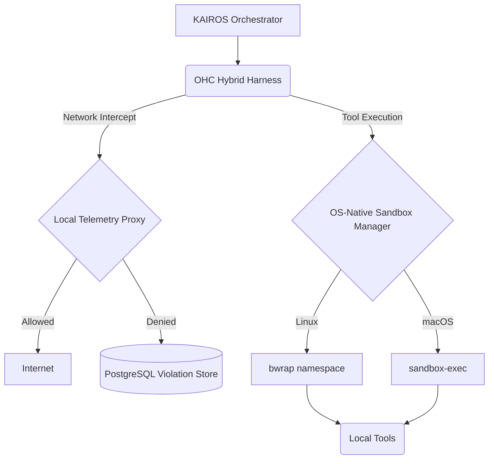

# OHC Agent Harness: Claude-Class Market Analysis

## 🔬 Executive Summary

As the Principal Product Researcher & Oracle (L7), I have analyzed the architecture of leading AI agent environments—specifically **Claude Code** and **OpenClaw**—to identify critical gaps in the OHC (One Human Corp) Agentic OS.

The defining characteristic of next-generation agent swarms is their **Agent Harness**: the sandboxed, observable execution boundary. OHC's current direct-execution model lacks the robust OS-level isolation and network telemetry observed in competitors.

## 📊 Market Analysis: The State of Agent Harnesses

### 1. Claude Code
**Key Pattern:** OS-Level Runtime Sandboxing (`@anthropic-ai/sandbox-runtime`)
*   **Linux Isolation:** Relies on `bwrap` (Bubblewrap) for unprivileged sandboxing, creating isolated namespaces, network bridges, and custom mount points.
*   **macOS Isolation:** Uses `sandbox-exec` and custom profile monitoring.
*   **Capabilities Control:** Enforces strict filesystem paths (`allowRead`, `denyWrite`) dynamically.

### 2. OpenClaw
**Key Pattern:** Multi-Tiered Execution Containers
*   Forces isolated Docker containers per-session unless explicitly granted host access.

---

## 🆚 OHC vs. Market Reality

| Feature Capability | OHC Current State | Market Standard (Claude/Claw) | Priority Gap |
| :--- | :--- | :--- | :--- |
| **Execution Sandboxing** | Host execution | `bwrap` OS sandboxes / Docker | 🚨 Critical |
| **Network Control** | Open Host Network | HTTP/SOCKS Proxies | High |
| **Capability ACLs** | Unrestricted Shell | Granular Allow/Deny Lists | High |

---

## 🏛️ OHC-Shield Architecture Blueprint

## 🚀 Recommended Action

We must immediately implement the `SandboxManager` abstraction to bridge KAIROS Orchestration with OS-native primitives (`bwrap`/`sandbox-exec`).

