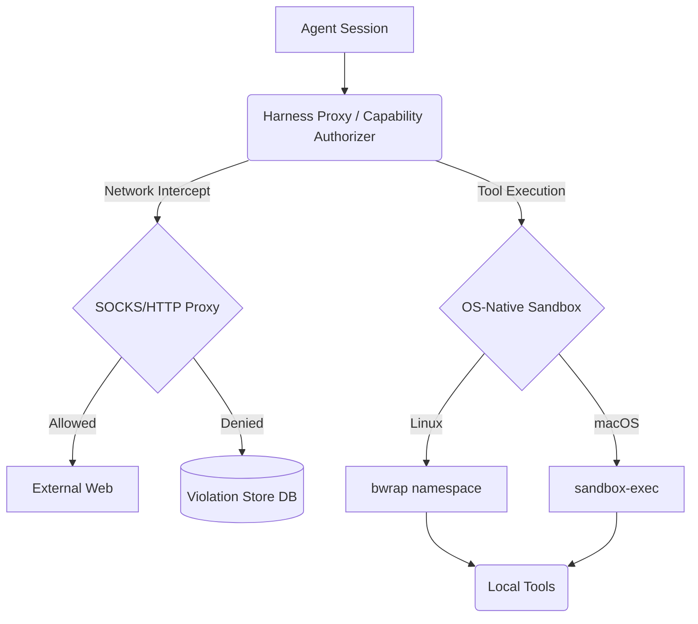

# OHC Agent Harness Evolution: Market Research & Gap Analysis

## 🔬 Executive Summary

As the Principal Product Researcher & Oracle (L7), I have analyzed three leading AI agent environments—**OpenClaw**, **Hermes Agent**, and **Claude Code**—to identify critical architectural gaps in our OHC (One Human Corp) Agentic OS.

The most pressing gap is the **Agent Harness** layer: the isolated environment where agents execute code, interact with the system, and are observed. OHC currently relies on basic execution without robust isolation, whereas market leaders have established sophisticated Sandbox Run-times.

This report synthesizes these findings and proposes three high-impact missions to evolve the OHC Agent Harness to market dominance.

## 📊 Market Analysis: The State of Agent Harnesses

### 1. Claude Code (Anthropic)
**Key Pattern:** Runtime Sandboxing & Granular Interception.
Claude Code employs a sophisticated `@anthropic-ai/sandbox-runtime` which leverages OS-level primitives:
*   **Linux**: Uses `bwrap` (Bubblewrap) for unprivileged sandboxing, creating isolated namespaces, network bridges, and custom mount points.
*   **macOS**: Uses `sandbox-exec` and custom profile monitoring.
*   **Network Control**: Embedded `http-proxy` and `socks-proxy` to intercept, log, and filter all agent outbound traffic.
*   **Violation Store**: Dedicated telemetry for `SandboxViolationStore` to track and metricize out-of-bounds agent actions.

### 2. OpenClaw
**Key Pattern:** Tiered Isolation Modes & Multi-Tenant Routing.
*   **Tier 1 (Main Session)**: Tools run on host, granting full access for single-user trust.
*   **Tier 2 (Non-Main Session)**: `agents.defaults.sandbox.mode: "non-main"` forces isolated Docker containers per-session.
*   **Access Control**: Strict allow/deny lists for capabilities (`bash`, `read`, `write`, vs `discord`, `gateway`).
*   **Local-First Gateway**: A unified control plane handling tools, sessions, and events routing to isolated workspaces.

### 3. Hermes Agent & Gstack
**Key Pattern:** Execution Telemetry & Ephemeral Context.
*   Strong focus on ephemeral execution environments that spin up/down instantly.
*   Heavy reliance on structured logs and OpenTelemetry for observability.

---

## 🆚 OHC Current State vs. Market Reality

| Feature Capability | OHC Current State | Market Standard (Claude/Claw) | Priority Gap |
| :--- | :--- | :--- | :--- |
| **Execution Sandboxing** | Direct execution / basic processes | Docker containers or `bwrap` OS sandboxes | 🚨 Critical |
| **Network Interception** | Native host networking | Local HTTP/SOCKS proxies with whitelist/blacklist | High |
| **Telemetry & Observability**| Basic logging | `SandboxViolationStore` + OpenTelemetry Metrics | High |
| **Capability ACLs** | Unrestricted / Hardcoded | Granular allow/deny lists (e.g., `bash`, `read` only) | Medium |

---

## 🏛️ OHC-Shield Harness Architecture

## 🛠️ Proposed Architectural Upgrades (AutoDream Consolidated)

To achieve absolute autonomy while maintaining zero-trust security and full observability, OHC must adopt the **OHC-Shield Harness Architecture**.

1.  **OS-Native Sandboxing (Desktop Mode)**: Implement `bwrap` on Linux and `sandbox-exec` on macOS to isolate local agent execution without the overhead of Docker.
2.  **Proxy Telemetry Layer**: Inject a transparent local proxy to capture all agent network I/O, emitting OpenTelemetry metrics for every request.
3.  **Sandbox Violation Engine**: Track blocked actions or unauthorized tool usage in PostgreSQL (`tasks`/`events` tables) and visualize via Grafana.

---

## 🚀 Actionable Missions (GitHub Issues)

Based on this synthesis, I have generated the following implementation missions for the swarm:

### Mission 1: [harness] Implement `bwrap` OS-Level Sandboxing for Desktop Mode
**Priority:** P0 | **Scope:** Large
**Objective:** Replace bare-metal execution with `bwrap` isolated environments for the OHC Standalone Desktop Mode.

### Mission 2: [telemetry] Build the Sandbox Violation Telemetry Engine
**Priority:** P1 | **Scope:** Medium
**Objective:** Capture, store (PostgreSQL), and emit OpenTelemetry metrics for agent capability violations.

### Mission 3: [harness] Introduce Granular Capability ACLs
**Priority:** P1 | **Scope:** Medium
**Objective:** Implement a strict allow/deny capability system (e.g., `read`, `write`, `bash`) for agent sessions.

