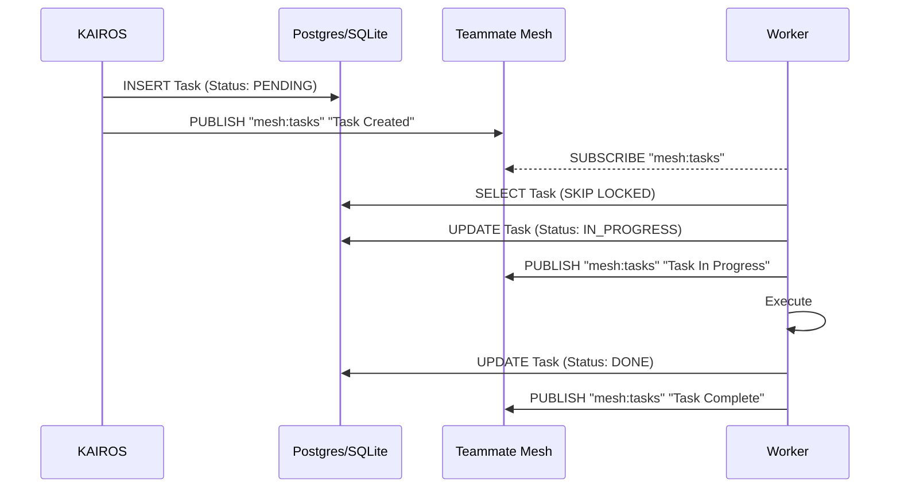

# 🧠 AutoDream & KAIROS Orchestration Design

## Architectural Vision
This document outlines the consolidation findings for the AutoDream data pipelines, Shared Task List, and Teammate Mesh, enabling autonomous agent workflows within the Hybrid OS.

### 1. Shared Task List (State Machine Tracking)
*   **Cloud Mode**: PostgreSQL with `SKIP LOCKED` for horizontal scalability.
*   **Standalone Mode**: Graceful degradation to local SQLite SIPDB.

### 2. Teammate Mesh (Agent Coordination)
*   Real-time coordination via Redis Pub/Sub on `mesh:tasks`.
*   Enables instant dependency unblocking for sub-agents.

### 3. AutoDream (Memory Consolidation)
*   Consolidates executed missions into Vector DB embeddings.
*   Synchronizes with `autodream_memories` to build persistent agent knowledge.

### Sequence Diagram: Shared Task List execution

