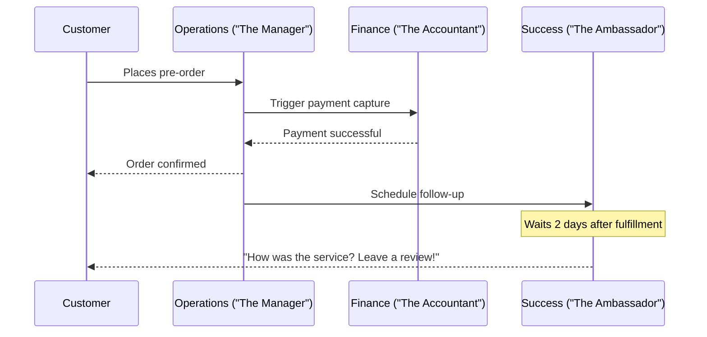
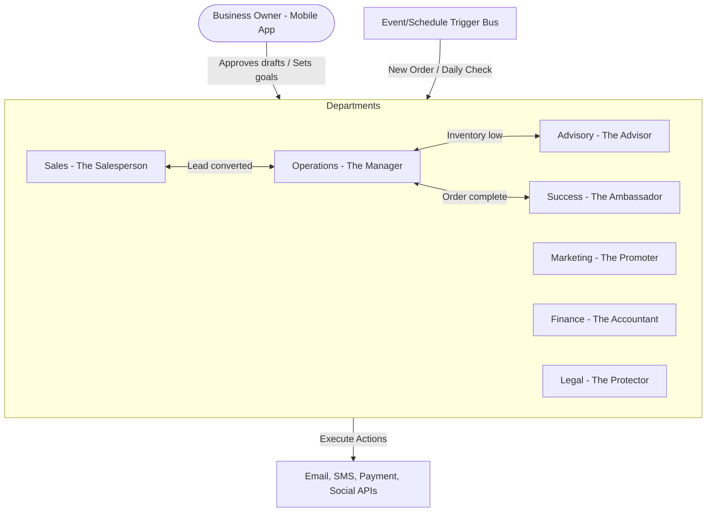

# [Architecture] AI Agent Department Architecture

## Problem Statement
For a small business owner like Maya (a baker) or Carlos (a handyman), running a business isn't just about providing a product or service; it's about managing operations, marketing, customer service, and finances simultaneously. Most small business owners cannot afford to hire staff for these roles, leaving them overwhelmed. Traditional platforms (Shopify, Wix) provide tools to help with these tasks, but require the owner to actively manage them—creating campaigns, answering emails, and tracking inventory manually. The gap is that business owners need a system that *does the work for them* invisibly, organized in a way they naturally understand: as a team of employees.

## Research Report

### Small Business Owner Lens
From the perspective of a non-technical founder, software should feel like a reliable employee. Maya doesn't want to configure an "automated email trigger on order state change"; she wants "The Ambassador" (Customer Success) to send a polite thank-you message and ask for a review two days after the cake is delivered. By organizing AI agents into familiar departments, we reduce cognitive load and build trust.

### Comparative Analysis
| Feature | OneHumanCorp (OHC) | Shopify | Wix | Squarespace | GoDaddy |
|---|---|---|---|---|---|
| **Role-Based AI** | Fully integrated AI "Employees" (Departments) | Fragmented "Magic" buttons | Setup wizards, basic chat | AI text generators | Basic onboarding AI |
| **Proactive Action** | AI drafts marketing, replies to DMs, suggests pricing | Reactive (needs user click) | Reactive | Reactive | Reactive |
| **Cross-Discipline** | Departments coordinate (Operations → Success) | Siloed apps | App market | Limited native integrations | Monolithic |
| **Mobile-First UX** | 100% manageable via 375px viewport | Good, but complex desktop admin | Desktop-heavy | Desktop-heavy | Mobile responsive |

### Personas Pain Point Summaries
- **Maya (Baker, 28)**: Cannot keep up with Instagram DMs while baking. Needs a "Customer Success" agent to handle FAQs and a "Manager" to track custom order deposits.
- **Carlos (Handyman, 42)**: Forgets to send invoices after a job. Needs an "Accountant" to auto-draft invoices and a "Salesperson" to follow up on open quotes.

### Agent Coordination Flow (Mermaid.js)

## Design Doc

### Architecture Diagram

### Mobile UX Flow (375px Viewport First)
1. **Home Screen (The Dashboard)**: A simple feed of cards. "The Advisor suggests raising cake prices by 5%." "The Promoter drafted an Instagram post."
2. **Review & Approve**: The owner taps a card. A glassmorphism modal slides up (entrance motion ≤ 300ms). It shows the drafted action (e.g., an email reply to a customer).
3. **One-Tap Execution**: Large, easily tappable buttons (≥ 44x44px) to "Approve", "Edit", or "Decline".
4. **Department Hub**: A screen listing the 7 departments. Each shows a status bubble (e.g., "The Manager is handling 3 active orders").

### AI Agent Integration Points
- **On Event**: E.g., when a Stripe webhook fires for a failed payment, "The Accountant" triggers a polite follow-up.
- **On Schedule**: E.g., every Friday afternoon, "The Advisor" generates a weekly health report.
- **On Demand**: E.g., Carlos taps "Draft Quote" and "The Salesperson" generates one based on a photo of the worksite.
- **Context/Memory**: Agents store summaries of interactions in the tenant's dedicated data vault, ensuring "The Ambassador" knows a customer was previously upset about a late delivery before asking for a review.
- **Approval Flow**: High-risk actions (spending ad money, sending mass emails) default to "draft-for-review". Low-risk actions (tagging an order as "needs review") auto-execute.
- **Throttling**: AI usage is governed by the tenant's tier limits.

### Key Design Decisions
- **Familiar Metaphors over Tech Jargon**: We use "The Manager" instead of "Operations Sub-Agent" to pass the Grandmother Test.
- **Draft-First Execution**: To build trust, agents will initially draft actions for the owner to approve with one tap. Once the owner trusts the agent, they can toggle it to auto-execute.
- **Unified Event Bus**: Departments must communicate through a unified event system so that "The Promoter" doesn't send a discount code to a customer who just had a bad experience handled by "The Ambassador".

## Implementation Prompt

**Customer Use Journey (CUJ)**
Implement the core Department orchestration engine and the mobile-first UI for reviewing and approving AI actions.
1. The user logs into the app (mobile web/native) and lands on the Home feed.
2. The system triggers a background event simulating a new customer inquiry.
3. "The Ambassador" (Customer Success) intercepts the event and drafts a polite response.
4. The user sees a notification card on their Home feed: "The Ambassador drafted a reply to Sarah."
5. The user taps the card, reviews the draft in a modal, and taps "Approve."
6. The system dispatches the approved action to the simulated external integration.

**Acceptance Criteria**
- The UI must adhere to the Visual Excellence Mandate (Glassmorphism, Outfit/Inter typography, >44px touch targets).
- The end-to-end flow from event generation to user approval to final execution must be fully functional and tested via Playwright.
- The state of the draft action must correctly transition (Pending -> Approved -> Executed).
- Do not use hardcoded mock data in the frontend; fetch and update state via backend endpoints.
- Ensure the feature passes the "Grandmother Test"—no complex configuration screens required.

## Priority
P0

## Estimated Scope
Large
