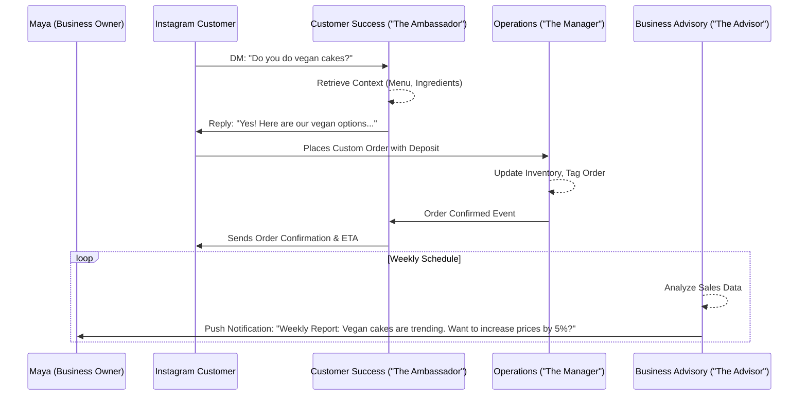

# AI Agent Department Architecture: Designing Invisible Teams for Small Businesses

## Priority
P0

## Estimated Scope
Large

## Problem Statement
Small business owners—whether they're running a food cart, a tutoring service, or a boutique—often feel overwhelmed by the complexity of managing a business. They are great at their core trade but struggle with the sheer volume of "invisible work": responding to Instagram DMs, generating invoices, updating social media, ensuring legal compliance, and tracking inventory. Currently, existing software requires them to stitch together tools like Mailchimp, QuickBooks, and Shopify, which demands technical skills and constant manual oversight. They need an automated, "done-for-you" system that runs these back-office operations seamlessly.

## Research Report
**Market Gap:** Traditional platforms (Shopify, Wix, Squarespace) offer "AI assistants" that are essentially chatbots or passive text generators. They require the user to actively prompt them (e.g., "Write a product description"). True automation requires *autonomous agents* that operate in the background and mirror a real human staff.

**Competitive Analysis:**
- *Shopify:* Magic text generation, but no autonomous order processing or proactive customer follow-up.
- *Wix:* AI site builder, but lacks ongoing operational agents that handle marketing or legal automatically.
- *Squarespace:* Similar to Wix, focused on initial setup rather than ongoing "employee-like" tasks.

**User Needs (from Personas):**
- **Maya (Baker):** Needs agents to reply to Instagram DMs while she sleeps.
- **Carlos (Handyman):** Needs quote generation and lead follow-up.
- **Fatima (Food Cart):** Needs notifications when items sell out.

**Findings:** By conceptualizing AI as "Departments" with familiar titles ("The Manager", "The Accountant"), the mental model becomes accessible to non-technical users. They aren't configuring webhooks; they are "hiring" a Salesperson.

## Design Doc

### AI Agent Integration Points & Departments
The system is divided into seven intuitive departments:
1. **Operations ("The Manager"):** Triggered by new orders/bookings. Handles order processing, inventory tracking, fulfillment status, and refunds.
2. **Marketing & Advertising ("The Promoter"):** Triggered on a schedule (e.g., weekly) or by new products. Creates social media posts, promotional content, and SEO updates.
3. **Sales & Acquisition ("The Salesperson"):** Triggered on-demand or by lead events. Generates quotes, follows up on leads, and tracks referrals.
4. **Customer Success ("The Ambassador"):** Triggered by customer messages or order completion. Replies to DMs, requests reviews, and runs re-engagement campaigns.
5. **Finance & Payments ("The Accountant"):** Triggered by payments or on a monthly schedule. Reconciles payments, generates tax summaries, and manages subscription billing.
6. **Legal & Compliance ("The Protector"):** Triggered by new features or geographical sales. Generates terms/policies, tracks GDPR compliance, and flags liability disclaimers.
7. **Business Advisory ("The Advisor"):** Triggered weekly. Provides health reports, actionable suggestions, and pricing recommendations based on seasonal trends.

### Architecture Diagram (Mermaid.js)

### Key Design Decisions
- **Familiar Mental Models:** Organize agents into real-world business roles rather than technical classifications.
- **Approval Workflows (Auto-execute vs. Draft-for-review):** High-risk actions (refunds, legal policy updates) default to "Draft-for-review", requiring explicit user approval. Low-risk actions (inventory tracking, standard DM replies based on FAQs) are "Auto-execute".
- **Trigger Mechanisms:** Agents react to events (e.g., webhook from Instagram), schedules (weekly summaries), or direct user demands (generate quote).
- **Inter-Department Coordination:** Departments communicate via internal events. For example, when Operations completes an order, it emits an event that Customer Success consumes to trigger a review request.
- **Context & Memory:** Agents maintain a shared memory space scoped strictly to the tenant. If "The Ambassador" learns a customer's preference, "The Salesperson" can use that data for future upsells.
- **Usage Throttling & Budgeting:** Usage is calculated based on the tenant's tier. Instead of showing "tokens used", the UI shows "Agent Actions". When the limit is approached, the system gracefully degrades (pausing non-critical marketing actions first) and prompts for a tier upgrade.

### Mobile UX Flow (375px First)
1. **Screen 1 (Dashboard Overview):** A clean card showing "Your Team is Working". Avatars for active agents (e.g., an icon for "The Manager") pulse subtly when performing an action.
2. **Screen 2 (Agent Activity Log):** Tapping "The Ambassador" reveals a timeline of recent autonomous actions (e.g., "Replied to 3 Instagram DMs", "Sent 1 Review Request").
3. **Screen 3 (Approval Inbox):** A dedicated tab for actions requiring approval. A card reads: "The Salesperson drafted a quote for Carlos. Approve and Send?" with simple `[Approve]` and `[Edit]` buttons.
4. **Screen 4 (Department Settings):** Simple toggles for each agent. "Simple Mode" allows the user to just turn the agent ON/OFF. "Advanced Mode" (sticky toggle) reveals the specific triggers and approval rules (e.g., "Always auto-approve quotes under $500").

## Implementation Prompt
**Role:** Implementer / Canvas (L7)
**Context:** We are building the "AI Agent Departments" feature for OneHumanCorp. This feature groups AI capabilities into intuitive "employee" roles (The Manager, The Promoter, etc.) that operate automatically in the background.
**Task:**
- Implement the "Approval Inbox" UI and the "Agent Activity Log" screen tailored for mobile (375px width).
- Ensure the UI adheres to OHC Premium Design Standards: use Glassmorphism effects (e.g., backdrop-filter: blur(20px)), Outfit font for headings, Inter for body text, and ensure it passes the Grandmother Test (clear plain-language labels, no technical jargon).
- Provide an integrated view where a user can toggle agent permissions between "Auto-execute" and "Draft-for-review".
- Integrate a mock event system on the frontend to demonstrate how "The Manager" updating an order triggers an activity card in the timeline.
**Acceptance Criteria:**
- 100% responsive design (mobile-first).
- Clear visual distinction between automated actions and actions requiring manual approval.
- Zero technical jargon in the UI (e.g., use "Actions remaining" instead of "API tokens").
- 100% Playwright E2E coverage for the approval flow.
