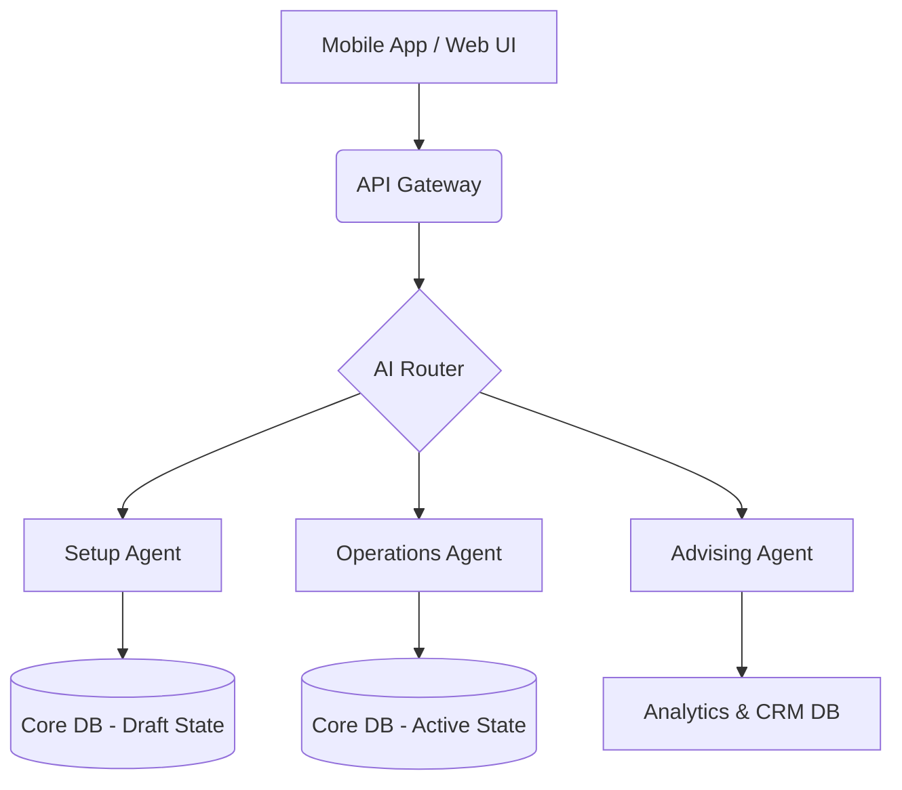

# Title: Revamp Business Journey Architecture for Frictionless 10-Minute Onboarding

## Problem Statement
Small business owners (bakers, handymen, food cart operators) currently experience significant friction when setting up their OHC storefronts. The onboarding flow feels like configuring B2B SaaS software rather than quickly getting a business online. Non-technical users drop off when asked to configure complex settings (taxes, shipping, domains) before they can even see what their store looks like. They need a mobile-first, AI-guided flow that takes them from idea to a live, beautiful storefront in under 10 minutes.

## Research Report
Our competitive analysis and user journey mapping reveal that competitors like Shopify and Squarespace are still heavily desktop-oriented and complex. OHC's unique value is its AI agents and mobile-first approach.

Key findings:
- Users want to see immediate value (the "Aha" moment of a generated storefront) before committing to complex configuration.
- Different business types (Services vs. Physical Products) require completely different onboarding paths. A handyman doesn't need shipping zones.
- Empty states are the primary cause of activation failure.

*For full research details, persona mappings, and sequence diagrams, refer to `.agent-task/report/task_output.md`.*

## Design Doc

### Architecture Diagram

### UI Wireframes / Screen Flow (375px Mobile First)
1. **Screen 1 (Welcome):** Full-screen gradient, Outfit heading. "What are you building today?" + Large tap targets for Categories (Food, Services, Products).
2. **Screen 2 (Upload):** "Show us your best work." Simple camera/gallery upload button.
3. **Screen 3 (Magic Loading):** Glassmorphism loader while AI generates the draft.
4. **Screen 4 (Draft Storefront):** A fully rendered, interactive preview of the mobile storefront.
5. **Screen 5 (Publish):** A prominent "Go Live" button to activate the public link, bypassing complex setups for later.

### AI Agent Integration Points
- **The Setup Agent:** Hooked into Screen 3 to generate copy and layout based on image recognition and category context.
- **The Advisor:** Hooked into the post-publish dashboard to proactively suggest the next logical steps (e.g., "Add a price to your service", "Set your availability").

### Key Design Decisions
- **Mobile-First Exclusively:** The entire wizard must be designed for 375px screens. Desktop is secondary.
- **Zero-Manual Data Entry First:** We prioritize AI generation over manual forms to minimize cognitive load.
- **Grandmother Test:** No technical jargon (e.g., "DNS", "Tax Nexus"). Use plain language ("Web Address", "Where do you sell?").

## Implementation Prompt
**To the Implementer:**
Your task is to build the new "10-Minute Onboarding Wizard" reflecting the Business Journey Architecture.
- Implement a dynamic, multi-step UI flow for mobile (375px width).
- Integrate an AI service call that takes an image and category to generate draft storefront content.
- Update the necessary UI components to display a beautiful draft preview before finalizing.
- Ensure all components use our Glassmorphism design tokens and Outfit/Inter typography.
- **Acceptance Criteria:** A user can tap through the wizard, upload an image, view a generated draft, and "Publish" to get a live link within 5 screens. The flow must be fully functional on a simulated mobile device.

## Priority
P0 (Critical)

## Estimated Scope
Large
