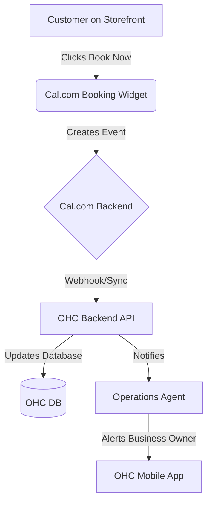

# [Calendar & Scheduling] Booking Sync with Cal.com

## Title
Booking Sync with Cal.com

## Problem Statement
Service providers like Leo (Music Tutor) and Carlos (Handyman) need a way for customers to book time without double-booking over personal events. Managing multiple calendars manually is error-prone.

## Research Report
*   **Tool Evaluated:** Cal.com
*   **Why:** Open-source, API-first alternative to Calendly. Developer-friendly and highly customizable.
*   **Ease of Use:** Extremely high for the end-user if integrated seamlessly.
*   **Pricing:** Free for individuals. OHC could use their Platform API for seamless white-labeling.
*   **Cloud/Standalone Capability:** Perfect for both. Open-source nature means it can be self-hosted in Standalone mode or integrated via API in Cloud mode.
*   **Competitors:** Calendly (less developer friendly, rigid UI), SavvyCal.

### Comparative Table
| Feature | Cal.com | Calendly | SavvyCal |
| :--- | :--- | :--- | :--- |
| **Developer API** | Excellent | Limited | Good |
| **Open Source** | Yes | No | No |
| **White-labeling** | Yes (Platform API) | Partial | Partial |
| **Pricing** | Free for individuals | $10/mo | $12/mo |

### Persona-Specific Pain Point Summary (Leo, Music Tutor)
- **Pain Point:** Frequently double-books students over personal calendar events.
- **Pain Point:** Cannot afford expensive scheduling software just for a few students.
- **Pain Point:** Needs a simple link to send to students that looks professional.

### Actionable Recommendations
1. Provision a Cal.com sub-account for each tenant automatically via OHC backend.
2. Abstract the Cal.com UI completely. Use their APIs to sync bookings directly into OHC calendar view.
3. Deploy Cal.com as a sidecar container in Standalone mode to preserve offline/private capability.

### Architecture Chart

## Design Doc
*   **Integration:** OHC provisions a Cal.com sub-account for each tenant.
*   **Workflow:** "Operations" agent manages booking types. User connects Google/Apple calendar via OHC.
*   **User View:** A "Bookings" tab in OHC where the user sets their availability hours. The storefront gets a "Book Now" widget that respects this availability.

### UI Wireframes / Screen Flow (375px First)
1.  **Bookings Settings Screen (375px viewport):**
    - Header: "Availability"
    - Form: Day of week toggles (Mon-Fri) with start/end time inputs (9 AM - 5 PM).
    - Section: "Connected Calendars" with "Connect Google Calendar" button.
2.  **Storefront View (375px viewport):**
    - Service Card: "1-Hour Guitar Lesson" - "Book Now" button.
    - Tapping button opens a bottom sheet with a date picker.
    - Selecting a date reveals available time slots.
3.  **Booking Confirmation (375px viewport):**
    - Success checkmark. "Your lesson with Leo is booked for Oct 12 at 2 PM."

## Implementation Prompt
Create a booking management module where a user can define their available hours (e.g., Mon-Fri 9-5) and connect an external calendar (mocked for this implementation). Create a booking widget for the storefront that displays available slots and allows a customer to select a time.

## Priority
P0

## Estimated Scope
Medium
