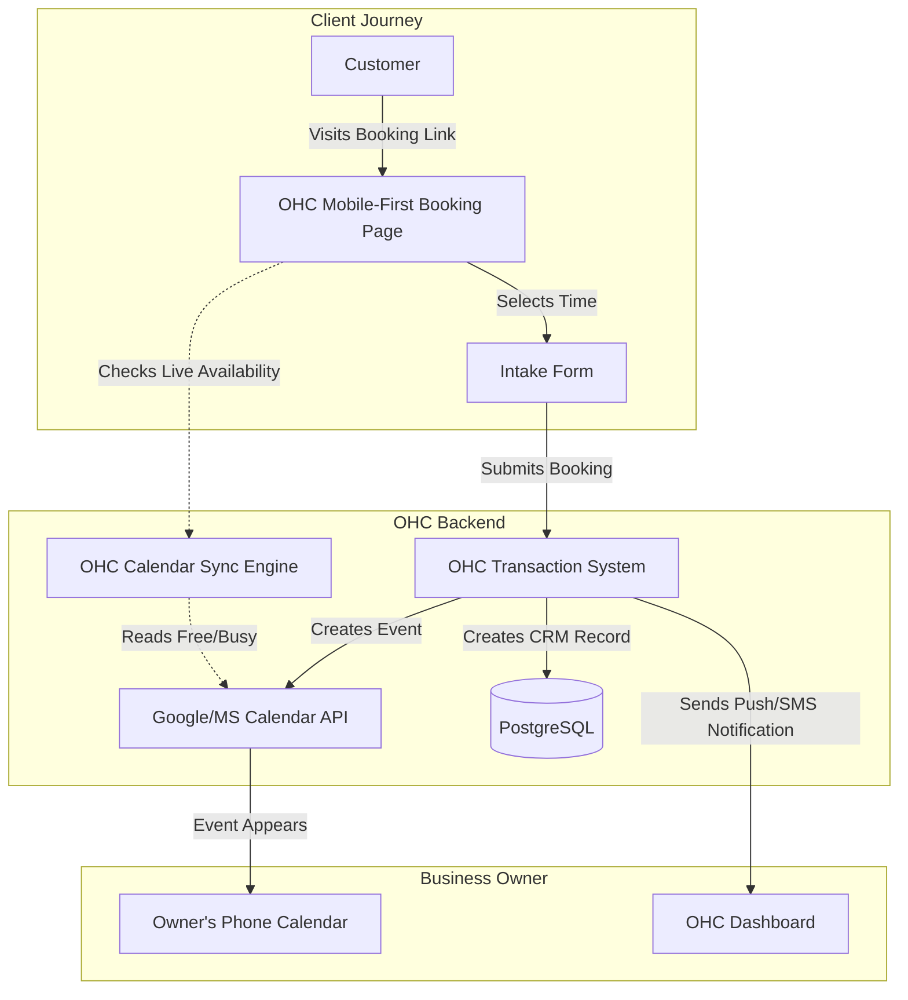

**Title**: Smart Calendar & Scheduling Sync Engine

**Problem Statement**:
Small business owners waste disproportionate amounts of time playing "email tag" trying to schedule appointments, consultations, or service calls. This manual negotiation is inefficient and frustrating for both the owner and the client. They need a seamless way to share a dynamic link where clients can book time slots that automatically sync with their existing personal or business Google Calendar/Outlook, strictly enforcing availability to prevent double-booking. The absence of this feature drives users to expensive third-party tools that fragment their workflow.

**Research Report**:
*   **Target Persona 1**: Sarah, an independent consultant or tutor who needs clients to book weekly sessions easily without manual confirmation.
*   **Target Persona 2**: David, a mobile dog groomer who needs a public booking page that factors in travel time between appointments.
*   **Key Findings**:
    *   Calendly is the market leader, but it represents yet another subscription fee and another siloed tool to manage.
    *   Integrating calendar sync directly into the OHC platform provides immense lock-in value and operational efficiency.
    *   The core technical challenge is handling timezones correctly and managing recurring availability blocks versus hard calendar conflicts.
*   **Ease of Use Imperative**: The integration must feature a one-click Google/Microsoft OAuth sign-in. The public-facing "Booking Page" must be auto-generated instantly based on default business hours, requiring zero configuration to achieve a baseline working state.
*   **Competitive Matrix**:

| Tool | Core Strength | Major Weakness | Ideal Customer |
| :--- | :--- | :--- | :--- |
| **Calendly** | Market leader, highly reliable, familiar UI. | Extra cost ($10-$15/mo), detached from primary CRM. | Generic professionals. |
| **Acuity / Squarespace** | Great for complex scheduling and taking payments. | Overkill for simple needs, steep learning curve. | Salons, complex service businesses. |
| **Cal.com** | Open source, flexible. | Requires some technical setup if self-hosting. | Tech-savvy users. |
| **OHC Native Sync** | Free for OHC users, deep agent integration. | Requires building a robust sync engine from scratch. | OHC platform users. |

*   **Pricing Estimate**: Calendly costs $10-$15/mo per user. An OHC native integration saves this cost entirely, serving as a powerful acquisition feature.
*   **Cloud vs. Standalone Architecture Considerations**:
    *   *Cloud*: Utilizes standard OAuth 2.0 flows. OHC backend acts as a persistent sync engine, periodically polling or receiving webhooks for calendar changes.
    *   *Standalone*: Requires a local OAuth proxy setup or relying entirely on local calendar API access (e.g., Apple Calendar EventKit on macOS), which is complex but ensures absolute privacy. A hybrid approach utilizing an OHC cloud relay for the public booking page is likely necessary.

### Persona Value Proposition

| Persona | Current Workflow | Proposed OHC Workflow | Value Created |
| :--- | :--- | :--- | :--- |
| **Sarah (Tutor)** | 4-5 emails back and forth per client to find a time. | Shares `ohc.to/book/sarah`. Client picks time. Done. | Saves 2 hours/week. |
| **David (Groomer)** | Manually checks phone calendar while driving, writes down appt. | Client books online. OHC agent adds buffer time automatically. | Zero double-bookings. |

**Design Doc**:
*   **Trigger Mechanism**: User connects Google Calendar/Outlook via the Integrations panel.
*   **System Action**: OHC securely syncs free/busy times. The OHC agent automatically generates a public booking link (`ohc.to/book/[slug]`).
*   **User Interface View**: The internal user sees a unified calendar view in OHC. External clients see a highly optimized, mobile-first booking page that loads instantly.

**Implementation Prompt**:
Architect and implement a robust calendar integration module supporting Google Calendar via OAuth.
1. Build a sync engine that accurately reads free/busy times, respecting complex timezone rules.
2. Develop a public-facing, highly responsive booking page that dynamically renders available slots.
3. Ensure that when a client books an appointment, the event is atomically created on the user's Google Calendar and a corresponding record is created in the OHC database.
4. Integrate notifications so the business owner is immediately alerted to new bookings via the dashboard.

**Priority**: P0
**Estimated Scope**: Large
