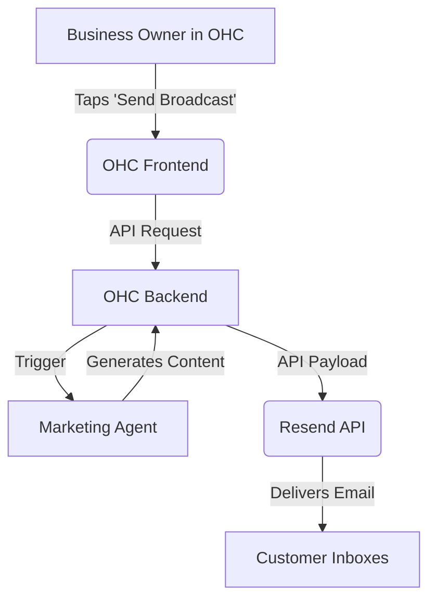

# [Email Marketing] Automated Campaigns with Resend

## Title
Automated Campaigns with Resend

## Problem Statement
Boutique owners like Priya need to send beautiful emails to their customer base when new stock arrives, but platforms like Mailchimp are too complex and expensive for simple announcements.

## Research Report
*   **Tool Evaluated:** Resend
*   **Why:** Developer-focused, incredibly fast, and creates beautiful emails using React Email (can be adapted/pre-rendered).
*   **Ease of Use:** Invisible to the user. OHC's AI generates the email, Resend delivers it.
*   **Pricing:** Free for up to 3,000 emails/month. Excellent for small businesses.
*   **Cloud/Standalone Capability:** Cloud. Standalone users would need their own API key.
*   **Competitors:** SendGrid (legacy, bad UX), Mailgun.

### Comparative Table
| Feature | Resend | SendGrid | Mailchimp |
| :--- | :--- | :--- | :--- |
| **Developer API** | Modern, Fast | Legacy | Complex |
| **Email Builder** | React Email | Drag & Drop | Drag & Drop |
| **Free Tier** | 3,000/mo | 100/day | 1,000/mo |
| **Ease of OHC Integration**| Extremely High | Medium | Low |

### Persona-Specific Pain Point Summary (Priya, Boutique Owner)
- **Pain Point:** Mailchimp is too confusing to navigate just to send a "New Arrivals" blast.
- **Pain Point:** Doesn't have time to design HTML emails.
- **Pain Point:** Doesn't want to pay $15+/month for marketing tools when she only has 500 subscribers.

### Actionable Recommendations
1. Integrate Resend via API for sending all transactional and marketing emails.
2. Use the "Marketing Agent" to generate both the subject line and HTML body content dynamically.
3. Provide a one-click "Broadcast" UI that hides all email template complexities.

### Architecture Chart

## Design Doc
*   **Integration:** OHC backend uses Resend SDK to send transactional and marketing emails.
*   **Workflow:** "Marketing" agent identifies a segment (e.g., past buyers) and drafts an email. User approves it with one tap.
*   **User View:** A simple "Broadcast" button in the Customers tab. The AI drafts the message, the user taps "Send to 50 customers".

### UI Wireframes / Screen Flow (375px First)
1.  **Customers Tab (375px viewport):**
    - Floating Action Button (FAB): "New Broadcast" (megaphone icon).
2.  **Broadcast Composer (375px viewport):**
    - Dropdown: "To: All Customers (50)"
    - Text Area: "What's the update?" (Placeholder: e.g., "New fall collection arrived!")
    - Button: "Generate Email with AI"
3.  **Preview Screen (375px viewport):**
    - Subject Line preview (editable).
    - Email Body preview (rendered HTML).
    - Big primary button: "Send to 50 Customers".

## Implementation Prompt
Build an email broadcast feature. In the UI, the user selects an audience (e.g., 'All Customers') and inputs a prompt. The AI generates a subject line and email body. Include a 'Send' button that dispatches the emails via a backend service (mock the actual email sending via a log statement).

## Priority
P1

## Estimated Scope
Medium
