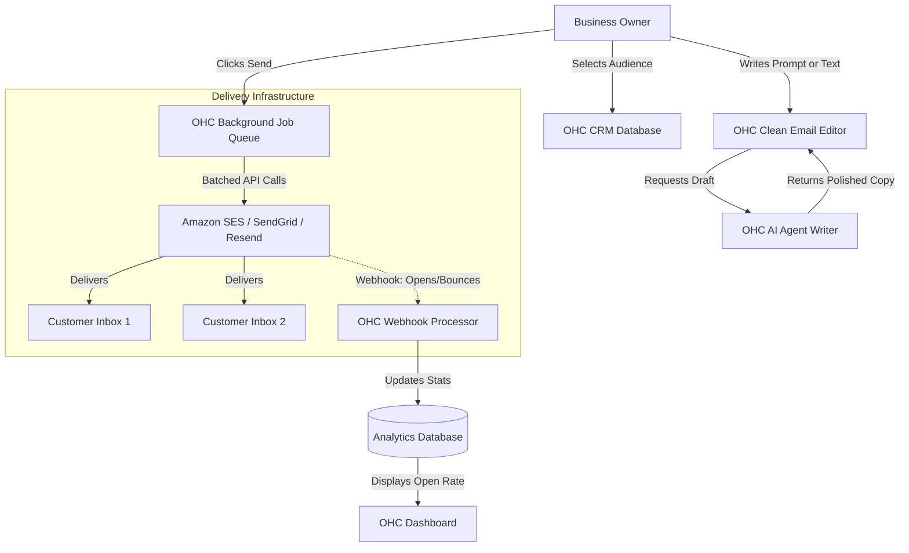

**Title**: Zero-Friction Audience Email Marketing

**Problem Statement**:
Small businesses desperately want to send newsletters, promotions, or updates to their customer list to drive repeat business. However, industry-standard tools like Mailchimp or HubSpot are far too complicated, feature-heavy, and expensive for their needs. They need a highly simplified workflow: draft a basic email (with AI assistance), select their customer list directly within OHC, and hit send without ever worrying about HTML templates, complex segmentation logic, or deliverability nuances.

**Research Report**:
*   **Target Persona 1**: Elena, a local bakery owner wanting to announce a new weekend pastry to her loyal customers. She has no design skills.
*   **Target Persona 2**: Marcus, a gym owner needing to send a quick update about holiday hours to active members.
*   **Key Findings**:
    *   Existing tools are built for dedicated marketing professionals, not busy bakers or gym owners.
    *   OHC possesses a significant structural advantage: it already holds the core customer data (CRM). By integrating a "dumbed-down" email sender natively, OHC eliminates the need to export/import CSVs, a major friction point.
    *   Deliverability is the primary technical risk. OHC must abstract this away completely.
*   **Email Tool Complexity Matrix**:

| Tool | Target Audience | Feature Density | Complexity | Cost |
| :--- | :--- | :--- | :--- | :--- |
| **Mailchimp** | Marketers / Agencies | Extremely High | Very High | High (scales rapidly with list size) |
| **Substack** | Writers / Creators | Low | Low | Revenue Share (bad for physical goods) |
| **ActiveCampaign**| Automation Experts | High | High | Very High |
| **OHC Email** | Small Biz Owners | Minimal (Text + Image) | Very Low | Included / Pay-per-send |

*   **Pricing Estimate**: Mailchimp gets expensive quickly as lists grow beyond 500 contacts. Integrating with a robust transactional provider (like SendGrid, AWS SES, or Resend) behind the scenes costs pennies per thousand emails. This allows OHC to offer basic marketing for free, or at a massive discount compared to standalone SaaS.
*   **Cloud vs. Standalone Architecture Considerations**:
    *   *Cloud*: Leverages OHC's shared SMTP/SES infrastructure. Easy to manage reputation and bounce handling centrally.
    *   *Standalone*: Highly problematic. Requires the user to either input their own raw SMTP credentials (too advanced) or attempt to use a system-level mail client (unreliable for bulk sends). Standalone mode will likely require routing through an OHC cloud relay for actual delivery to maintain sender reputation.

### Feature Requirements vs. User Desires

| Typical Marketing Tool Feature | What the SMB *Actually* Wants | OHC Approach |
| :--- | :--- | :--- |
| Drag-and-drop HTML builder | "I just want it to look like a normal email from me." | Rich text editor (Notion-style) with AI drafting. |
| Complex behavioral segmentation | "Send it to everyone who bought something last month." | Natural language list selection via AI Agent. |
| Multivariate A/B Testing | "Did people open it?" | Simple open/click metrics only. |

**Design Doc**:
*   **Trigger Mechanism**: User navigates to the Audience tab and clicks a prominent "New Campaign" button.
*   **System Action**: The OHC AI Agent proactively offers to help draft the email based on a brief prompt (e.g., "Write an email about our 20% off Friday sale"). Upon approval, OHC queues the emails via a background worker connected to a transactional email API.
*   **User Interface View**: A distraction-free, clean text editor (similar to drafting a regular Gmail message) combined with a simple list selector and a satisfying "Send to All Customers" button.

**Implementation Prompt**:
Build a lightweight, highly intuitive email campaign tool deeply integrated with the OHC CRM.
1. Create a clean WYSIWYG editor (Notion-style block editor preferred) for composing messages.
2. Integrate the OHC AI agent to seamlessly assist with copywriting directly within the editor.
3. Develop a robust background queuing mechanism to dispatch emails to selected contact lists using an external API service (e.g., Resend or AWS SES), ensuring the main server thread is never blocked.
4. Implement basic tracking for open rates via pixel tracking and handle bounce webhooks to maintain list hygiene.

**Priority**: P1
**Estimated Scope**: Medium
