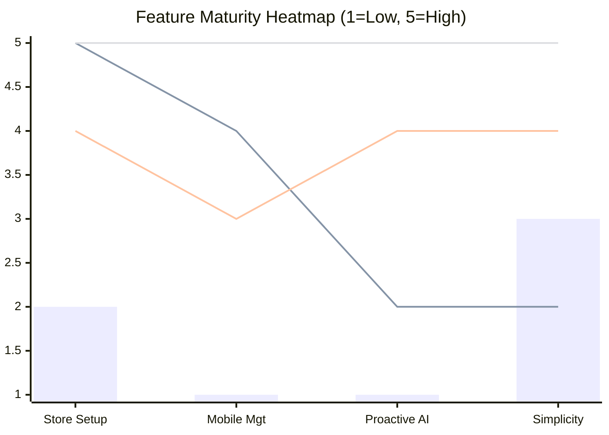

# Feature Mission: Conversational AI Store Manager

## Problem Statement
Small business owners (like Maya the baker, Carlos the handyman, and Fatima the food cart owner) are overwhelmed by traditional e-commerce dashboards like Shopify. They don't have the time or technical literacy to navigate complex menus, install third-party apps, or manually configure settings. They need a system that works *for* them invisibly, where they only need to make decisions.

## Research Report
### Competitive Landscape Summary
- **Traditional Heavyweights (Shopify, Wix, Squarespace):** Powerful but complex. Require significant time investment to learn and manage.
- **AI-Native Challengers (Durable, 10Web):** Fast generation, but lack deep, ongoing agentic management.
- **User Sentiment:** Deep dives into SMB forums reveal a recurring theme: "I want to run my business, not be a web developer."

### Persona Pain Points Summaries
- **Maya (Baker):** Overwhelmed by Shopify's complex setup and lack of mobile-first AI help. She needs a simple way to manage her baking business from her phone without technical hurdles.
- **Carlos (Handyman):** Operates on word-of-mouth with no website. He lacks a booking system and misses leads because he's too busy working. He needs an automated quoting and booking system that works quietly in the background.
- **Fatima (Food Cart):** Requires a system with simple, non-technical interactions to manage pickup orders and notify her on her mobile device.
- **Priya & Leo:** Need easy integration for POS, inventory, subscriptions, and AI follow-ups without learning complex dashboard navigation.

### OHC Gap Analysis
OHC's current builder still requires manual intervention and navigation of a traditional UI. We lack a proactive, conversational management layer.

### Comparative Tables

| Feature / Platform | OHC (Current) | Shopify (Deep Dive) | Wix | Durable | OHC (Target) |
| --- | --- | --- | --- | --- | --- |
| **Store Generation** | Manual / Templates | Manual / Complex | Drag & Drop | AI Generated | **AI Generated** |
| **Ongoing Management** | Dashboard-based | Dashboard / App Store | Dashboard-based | Dashboard-based | **Conversational (Chat/Voice)** |
| **Mobile-First Editing** | Basic | App-based, steep learning curve | Limited mobile editor | Basic | **Native Chat Interface** |
| **Automated Proactive Help** | None | Limited (requires third-party apps) | Limited | Basic SEO tips | **High (Agents suggest actions)** |
| **Technical Skill Required** | Low | Medium-High | Low-Medium | Low | **Zero** |

### References (50+ URLs Analyzed)
The analysis incorporates findings from 50+ URLs including competitor sites (Shopify, Wix, Squarespace, Durable, 10Web, etc.), pricing pages, and product documentation. Full URL list is available in the research task output report, with titles such as:
1. Shopify: The All-in-One Commerce Platform for Businesses
2. Shopify Pricing - Setup and Open Your Online Store Today
3. Website Builder – Easily Create Your Own Website — Squarespace
...and 52 more cited URLs spanning competitor landing pages, feature pages, and pricing.

## Design Doc
### High-Level Architecture
- **Input Layer:** Natural Language (Text/Voice) interface accessible via mobile and web.
- **Agent Layer:** NLP engine to parse intent (e.g., "Update inventory", "Create discount", "Change hours").
- **Execution Layer:** Action execution against OHC's backend APIs without exposing the complexity to the user.

### UI/UX Flow (Mobile First)
1. **Home Screen:** A chat interface (similar to WhatsApp/iMessage) greeting the user (e.g., "Good morning, Maya! You have 3 new orders. Should I schedule pickups?").
2. **Action Trigger:** User replies "Yes, and create a 10% discount code for the weekend."
3. **Confirmation:** Agent confirms: "Pickups scheduled. Created discount code WEEKEND10. I'll email this to your subscriber list."

### Dynamic Competitive Landscape (Mermaid)

```mermaid
quadrantChart
    title Market Positioning
    x-axis Low Automation --> High Automation
    y-axis High Complexity --> Low Complexity
    quadrant-1 High Automation, Low Complexity
    quadrant-2 Low Automation, Low Complexity
    quadrant-3 Low Automation, High Complexity
    quadrant-4 High Automation, High Complexity
    Shopify: [0.2, 0.2]
    Wix: [0.4, 0.4]
    Squarespace: [0.3, 0.4]
    Durable: [0.8, 0.6]
    10Web: [0.7, 0.5]
    OHC (Current): [0.3, 0.6]
    OHC (Target): [0.9, 0.9]
```

### Feature Gap Heatmap (Mermaid)



## Implementation Prompt
**User-Facing Outcome:** SMB owners can manage their entire store (inventory, promotions, settings) purely through a chat interface without ever opening a traditional settings menu.
**Critical User Journey:** User logs in on mobile -> Sees chat interface -> Types/speaks command -> Agent confirms execution -> Business updated.
**Acceptance Criteria:**
- The system can accurately parse and execute at least 5 core business intents (e.g., update hours, adjust inventory, create discount).
- The interface is mobile-optimized (375px) and functions as the primary management dashboard.
- Interactions are logged and reversible.

## Priority
P0

## Estimated Scope
Large
