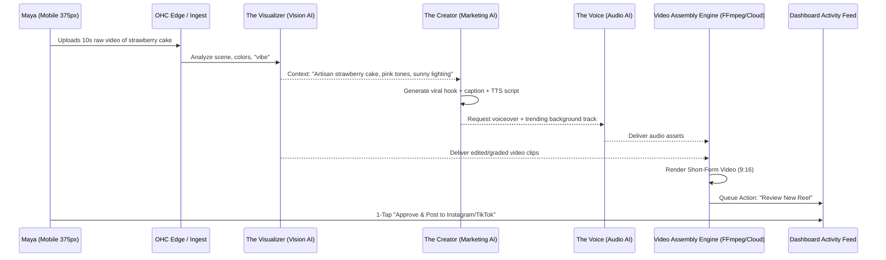
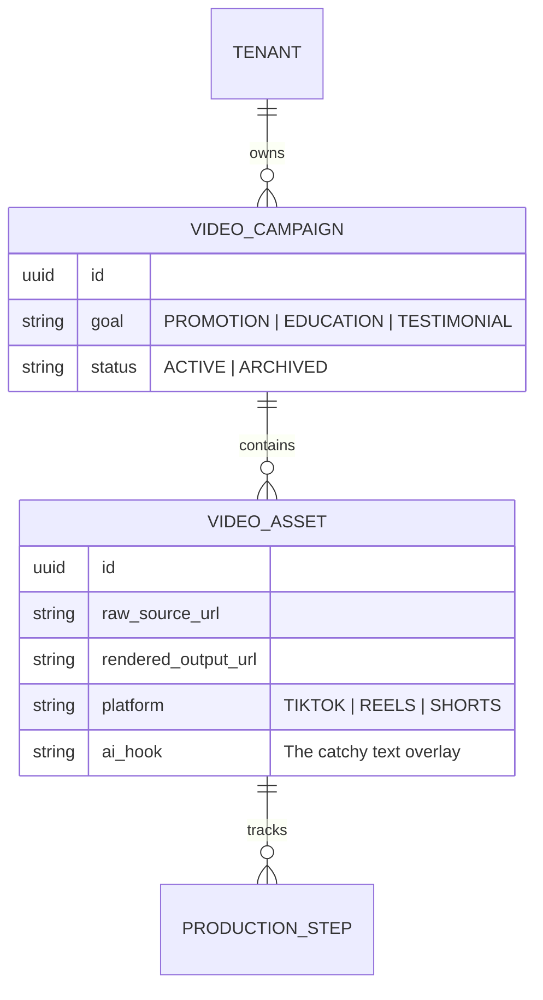

# [Marketing] Autonomous AI-Powered Short-Form Video Production Engine

## Title
The Creator: Autonomous AI-Powered Short-Form Video Production Engine

## Problem Statement
Small business owners like Maya (baker) and Leo (music tutor) know that short-form video (TikTok, Instagram Reels, YouTube Shorts) is the #1 driver of organic growth in 2025. However, producing these videos is a massive hurdle. It requires:
1.  **Creative Vision**: What should the video be about?
2.  **Scripting**: Writing catchy hooks and captions.
3.  **Editing**: Trimming clips, adding transitions, syncing to music.
4.  **Audio**: Voiceovers or trending music selection.
5.  **Consistency**: Doing this 3-5 times a week.

Maya is busy baking; she can take a 10-second video of a finished cake, but she doesn't have the 45 minutes required to turn it into a viral Reel. Leo is teaching; he can record a snippet of a guitar lesson, but he can't edit it into a "Tip of the Day" series. They need an invisible "Creator Department" that takes their raw footage and autonomously produces high-quality, brand-aligned short-form content.

## Research Report
*   **Market Analysis**:
    *   **Canva/CapCut**: Provide excellent tools but require manual effort and "creative energy."
    *   **InVideo/Lumen5**: AI-assisted, but usually focused on stock footage and desktop-first workflows.
    *   **Social Media Native Tools**: Highly manual.
*   **The OHC Advantage**: OHC "Creator" is the only engine that understands the *business context*. Because it has access to the product catalog, customer reviews, and brand "vibe," it doesn't just make a "pretty video"—it makes a *selling* video. It uses the "Promoter" (Marketing) and "Ambassador" (CS) agents to pull testimonials or product features into the script.

## Design Doc

### Architecture Diagram

### Data Model & Invariants

### UI Wireframes & Mobile UX Flow (375px)
1.  **The "Creation" Trigger**: On the dashboard, a simple card: `[ 🎥 Create Viral Post from Video ]`.
2.  **Processing State**: A translucent glass card with a progress shimmer: *"The Creator is scripting and editing your masterpiece..."*
3.  **The 1-Tap Approval**:
    *   **Top**: Auto-played silent preview of the video.
    *   **Center**: The proposed caption and hashtag set.
    *   **Bottom**: Primary button `[ Approve & Post ]`, Secondary `[ Edit Script ]`.
4.  **Grandmother Test**: No "Timeline," no "Keyframes," no "Layers." Just a video preview and a post button.

### AI Agent Integration Points
*   **The Visualizer (Operations)**: Trims the raw footage to the most "exciting" parts using scene detection.
*   **The Creator (Marketing)**: The primary orchestrator. Writes the script and overlays.
*   **The Voice (New Sub-Agent)**: Handles Text-to-Speech (TTS) using a brand-aligned voice.

## Implementation Prompt
Implement the "Creator Department" video production pipeline.
1.  Create the backend event listener for `video_uploaded` events.
2.  Implement the multi-agent handoff: `VisionAgent` (analysis) -> `ScriptAgent` (copy/script) -> `AudioAgent` (TTS/Music) -> `AssemblyEngine`.
3.  Build a lightweight Video Assembly Service (utilizing FFmpeg or a cloud video API) that combines the graded clips, audio, and text overlays into a 9:16 MP4.
4.  Surface the draft in the `Action Feed` for a 1-tap approval on a 375px mobile view.
5.  Strictly maintain `tenant_id` isolation for all assets and metadata.

## Priority
P1

## Estimated Scope
Large
