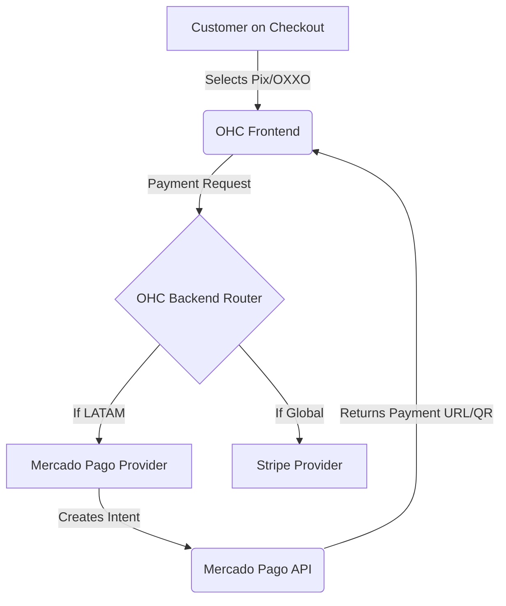

# [Payment Processing] Localized Payments with Mercado Pago

## Title
Localized Payments with Mercado Pago

## Problem Statement
While Stripe is great globally, small businesses in LATAM need local payment methods (like Pix in Brazil or OXXO in Mexico) with fast settlements and lower fees tailored to their region.

## Research Report
*   **Tool Evaluated:** Mercado Pago
*   **Why:** Dominant payment processor in LATAM. High trust, supports all local payment methods out-of-the-box.
*   **Ease of Use:** Familiar to LATAM users.
*   **Pricing:** Varies by country, generally competitive for the region.
*   **Cloud/Standalone Capability:** Both. Open APIs allow integration in both hosted cloud scenarios and standalone local setups.
*   **Competitors:** dLocal (more enterprise), EBANX.

### Comparative Table
| Feature | Mercado Pago | Stripe | dLocal |
| :--- | :--- | :--- | :--- |
| **LATAM Dominance** | Extremely High | Medium | High (Enterprise) |
| **Local Methods (Pix, OXXO)** | Native | Partial | Yes |
| **Target Audience** | SMB / Individuals | Global Businesses | Global Enterprise |
| **Ease of Setup for SMB** | Very Easy | Medium | Difficult |

### Persona-Specific Pain Point Summary (Carlos, Handyman in Mexico)
- **Pain Point:** Stripe doesn't support OXXO cash payments easily.
- **Pain Point:** Customers abandon checkout if they don't see familiar payment brands.
- **Pain Point:** Needs faster payout settlements to local banks.

### Actionable Recommendations
1. Abstract the payment gateway interface in the OHC Go backend so multiple providers can be slotted in.
2. If a tenant is provisioned in a LATAM region, default the offered gateway to Mercado Pago.
3. Show localized payment UI (e.g., Pix QR codes) during the storefront checkout.

### Architecture Chart

## Design Doc
*   **Integration:** Alternate payment gateway implemented alongside Stripe in the backend.
*   **Workflow:** During OHC onboarding, if the user's country is in LATAM, Mercado Pago is offered as the default or alternative to Stripe.
*   **User View:** A "Connect Mercado Pago" button in settings. Customers see local payment options at checkout.

### UI Wireframes / Screen Flow (375px First)
1.  **Settings > Payments (375px viewport):**
    - Section: "Payment Providers"
    - Card: "Stripe" (Connected)
    - Card: "Mercado Pago" (Button: Connect) -> Appears only if region is LATAM.
2.  **Storefront Checkout (375px viewport):**
    - Cart summary.
    - Payment Method Selector: Radio buttons for "Credit Card", "Pix" (if Brazil), "OXXO" (if Mexico).
    - If Pix is selected: Generate and display a QR code for scanning.

## Implementation Prompt
Extend the existing payment provider interface in the Go backend to support multiple gateways. Implement a dummy `MercadoPagoProvider` that fulfills this interface. Update the checkout UI to display Mercado Pago as a payment option if the tenant is configured for a LATAM region.

## Priority
P1

## Estimated Scope
Medium
