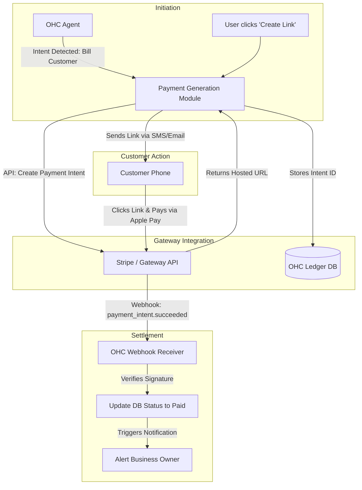

**Title**: Universal Global Payment Links Integration

**Problem Statement**:
Small businesses need to get paid quickly and reliably to survive. Traditional invoicing processes are slow, manual, and often result in delayed payments. They need the ability to instantly generate a simple, secure "Pay Now" link via text message or email that supports their customers' preferred local payment methods (e.g., Stripe in the US, Mercado Pago in LATAM, UPI in India). The friction of payment collection must be reduced to near-zero.

**Research Report**:
*   **Target Persona 1**: A freelance graphic designer who needs to collect a 50% deposit before starting work.
*   **Target Persona 2**: A local handyman who finishes a job and wants to text the homeowner a payment link before leaving the driveway.
*   **Key Findings**:
    *   While Stripe is the gold standard for developer experience and coverage in the US/EU, true global coverage requires supporting regional champions.
    *   Payment links are vastly superior to PDF invoices for mobile-first consumers.
    *   The integration must handle the complex lifecycle of a payment intent (pending, succeeded, failed, disputed) and map it accurately back to the OHC accounting ledger.
*   **Gateway Regional Dominance Matrix**:

| Gateway | Primary Region Focus | Integration Ease | Supported Methods | OHC Priority |
| :--- | :--- | :--- | :--- | :--- |
| **Stripe** | US / Canada / EU | Excellent (Stripe Connect) | Cards, Apple Pay, ACH | Primary MVP target |
| **Mercado Pago** | LATAM (Brazil, Mexico, Argentina) | Moderate | Pix, Boletos, local cards | Secondary target (Q3) |
| **Razorpay / Paytm** | India | Good | UPI, Netbanking | Secondary target (Q3) |
| **Square** | US (In-person) | Good | Cards | Tertiary target |

*   **Pricing Estimate**: Payment gateways typically charge ~2.9% + $0.30 per successful transaction. OHC should adopt a transparent pass-through model initially (no markup) to drive adoption, with the potential to introduce a fractional platform fee (e.g., 0.5%) via Stripe Connect in the future for monetization.
*   **Cloud vs. Standalone Architecture Considerations**:
    *   *Cloud*: Ideal environment. Webhooks for payment confirmation (the critical path for marking an invoice "Paid") are easily received by the public cloud server.
    *   *Standalone*: Highly challenging. Webhooks cannot reach a local machine. Standalone clients must either aggressively poll the payment gateway API (inefficient) or rely on a centralized OHC webhook relay service that maintains a WebSocket connection to the local instance to push the `payment_succeeded` event.

### The Frictionless Payment Flow

| Step | Traditional Way | OHC Way |
| :--- | :--- | :--- |
| 1 | Open Word/Excel, create invoice. | Type "Charge John $50 for the repair" to Agent. |
| 2 | Export to PDF. | Agent generates secure `ohc.to/pay/xyz` link instantly. |
| 3 | Draft email, attach PDF, send. | Link is auto-sent via SMS to John. |
| 4 | Wait days. Check bank manually. | John taps link, uses Apple Pay. OHC dings "Paid!". |

**Design Doc**:
*   **Trigger Mechanism**: User explicitly creates an invoice OR the OHC Agent detects intent to bill during a conversation ("Send an invoice to John for $50").
*   **System Action**: OHC securely communicates with the connected gateway's API to create a `PaymentIntent` or equivalent. It receives a hosted checkout URL.
*   **User Interface View**: A prominent "Generate Payment Link" button in the chat interface or customer profile. A clean ledger view showing status (Pending, Paid). External customers see a highly polished, trustworthy checkout page.

**Implementation Prompt**:
Implement a unified, robust payment link generation service, starting with Stripe as the MVP provider.
1. Build an onboarding flow allowing users to connect their existing Stripe accounts using Stripe Connect standard standard integration.
2. Develop a UI where the user (or the underlying OHC agent acting on their behalf) can input an amount and description to instantly receive a short URL.
3. Implement a highly secure, idempotent webhook handler to process Stripe events (specifically `checkout.session.completed` or `payment_intent.succeeded`) to automatically update the internal invoice status to "Paid".

**Priority**: P0
**Estimated Scope**: Large
