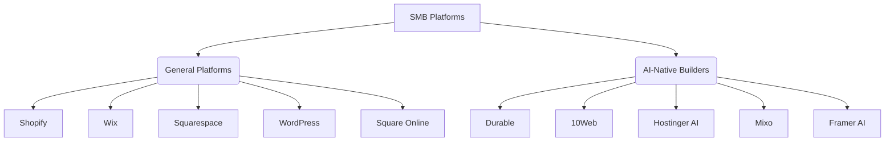

# 🔮 Oracle: Agentic SMB Platform Opportunities

## Problem Statement
Small business owners—bakers, handymen, boutique owners, tutors, and food cart operators—are overwhelmed by the complexity of traditional e-commerce and website building platforms. They lack the time and technical expertise to set up online stores, manage inventory, handle bookings, and run marketing campaigns. Existing solutions require them to act as IT administrators rather than business owners. There is a critical need for a platform where AI agents handle the complex operations invisibly, allowing the user to simply make decisions from their mobile device.

## Research Report

### Track 1: Market Mapping & Competitor Discovery

#### Top 10 General Competitors
1. **Shopify**: (shopify.com) Core value: Comprehensive e-commerce. Target: Dedicated online retailers.
2. **Wix**: (wix.com) Core value: Easy drag-and-drop website builder. Target: General SMBs needing a web presence.
3. **Squarespace**: (squarespace.com) Core value: Design-forward websites. Target: Creatives and boutique brands.
4. **WordPress/WooCommerce**: (wordpress.org) Core value: Ultimate flexibility and ownership. Target: Tech-savvy SMBs and agencies.
5. **Square Online**: (squareup.com) Core value: Seamless POS integration. Target: Retail and food/beverage SMBs.
6. **Ecwid**: (ecwid.com) Core value: Add e-commerce to any existing site. Target: SMBs with an existing non-commerce website.
7. **BigCommerce**: (bigcommerce.com) Core value: Scalable e-commerce. Target: Mid-market to enterprise retailers.
8. **Weebly**: (weebly.com) Core value: Simple, affordable website builder (now Square-owned). Target: Very small businesses.
9. **GoDaddy Website Builder**: (godaddy.com) Core value: All-in-one domain and simple builder. Target: First-time business owners.
10. **Webflow**: (webflow.com) Core value: Visual development for custom designs. Target: Agencies and designers.

#### Top 10 AI-Native Competitors
1. **Durable**: (durable.co) Unique AI: Generates an entire website with images and copy in 30 seconds. Traction: Extreme speed to market for service businesses.
2. **10Web**: (10web.io) Unique AI: AI-powered WordPress builder and hosting. Traction: Automates complex WordPress setup.
3. **Hostinger AI Website Builder**: (hostinger.com) Unique AI: Quick AI generation combined with cheap hosting. Traction: Budget-conscious SMBs.
4. **Mixo**: (mixo.io) Unique AI: Launches landing pages from a single prompt to validate ideas. Traction: Startups and solo entrepreneurs testing concepts.
5. **Hocoos**: (hocoos.com) Unique AI: AI website creation based on a quick questionnaire. Traction: Ease of use for absolute beginners.
6. **Dorik**: (dorik.com) Unique AI: AI generation with strong CMS capabilities. Traction: Better structural control than basic generators.
7. **Framer AI**: (framer.com) Unique AI: Generates high-end designs from prompts. Traction: Design-conscious businesses wanting unique looks fast.
8. **Relume Library (AI)**: (relume.io) Unique AI: Generates sitemaps and wireframes instantly. Traction: Speeds up the foundational design phase.
9. **B12**: (b12.io) Unique AI: AI drafts the site, human experts refine it. Traction: Professional services needing a polished look without the effort.
10. **Jimdo (Dolphin)**: (jimdo.com) Unique AI: ADI (Artificial Design Intelligence) creates tailored sites from user data. Traction: Established ADI player for European SMBs.

### Track 2: Deep-Dive Competitor Audit - Shopify
#### Capabilities
Shopify offers a massive ecosystem: storefront creation, inventory management, payment processing (Shopify Payments), shipping label generation, marketing tools (Shopify Email), and a vast App Store for extensions (subscriptions, advanced reviews, dropshipping).

#### Success Factors
- **Ecosystem**: Unparalleled third-party app support.
- **Reliability**: Rock-solid uptime during high-traffic events (e.g., Black Friday).
- **Scalability**: Can grow from a $0/month dropshipper to a $100M+ enterprise (Shopify Plus).

#### User Sentiment Audit
*Sources: r/smallbusiness, r/ecommerce, Trustpilot*
- **Positive**: "Shopify just works. The checkout is seamless and my conversion rate went up."
- **Negative (Pain Points)**:
  - "I spend more time managing apps than running my business."
  - "The monthly cost balloons once you add the necessary apps for basic features like product reviews or subscriptions."
  - "Setting up the theme on mobile is frustrating; it never looks exactly how I want it to without touching code."
  - "73% of 1-star reviews mention the setup being confusing for beginners or unexpected costs from necessary apps."

### Track 3: OHC Gap & Pain Point Identification
#### OHC Feature Audit
Based on the `src/server/builder/` codebase, OHC has a foundational structure for defining `BusinessContext` (name, type, vibe) and drafting pages (`DraftPage`, `DraftBlock`).

#### Gap Matrix (OHC vs. Competitors)
| Feature | Shopify | Durable (AI) | OHC | Gap |
| :--- | :--- | :--- | :--- | :--- |
| **Setup Time** | Days/Weeks | 30 seconds | Conceptual (10 mins goal) | Needs execution of the AI setup flow. |
| **Inventory Sync** | Robust (Manual/App-heavy) | Weak | Missing | Needs autonomous, agent-driven inventory management. |
| **Mobile Management** | App available, but complex | Basic | Missing | Needs a mobile-first, decision-only interface. |
| **Integrated AI Help** | Basic (Magic Text) | Site Generation | Conceptual | Needs invisible, proactive AI agents managing operations. |

#### Persona-Specific Pain Point Summaries
- **Maya (Baker)**: Needs visual appeal without touching code, and simple local delivery routing. Current platforms are too complex and generic.
- **Carlos (Handyman)**: Needs an instant booking system from his phone that just sends him texts. Zero interest in managing a "storefront."
- **Priya (Boutique)**: Needs omnichannel inventory that actually syncs in real-time without buying 3 expensive plugins.

#### Unresolved Pain Points (SMB Market)
1. **App Fatigue**: SMBs hate cobbling together 5-10 different apps (and paying for them) just to get basic functionality (reviews, bookings, subscriptions).
2. **Mobile Disconnect**: Service providers (handymen, food carts) are constantly on the move. Traditional platforms require sitting at a desktop for deep management.
3. **Blank Canvas Paralysis**: Even with templates, users struggle to write compelling copy and structure their sites effectively.

### Track 4: Deeper Focused Research & Agentic Solutions
#### Deep-Dive Evidence
On r/smallbusiness, a user stated: "I'm a plumber. I don't want to build a website. I want a tool where I say 'I fix pipes in Chicago' and it gives me a booking page and texts me when someone needs me." This perfectly validates the "Carlos" persona.

#### Agentic Solution Design
OHC must implement an "Invisible Onboarding & Management" system.
1. **Onboarding**: User provides just Business Name, Type, and Vibe (matching our `BusinessContext` struct). The AI agent autonomously generates the `DraftPage` and `DraftBlock` structures, writing the copy and selecting the layout.
2. **Management**: Instead of a complex dashboard, the user gets a mobile "Feed" of decisions. "Agent: You have 3 new booking requests for next week. Approve all?" User clicks "Approve."
3. **All-in-One**: Core features (bookings, basic inventory, subscriptions) are native, built-in, and managed by agents, eliminating the need for third-party apps.

#### Actionable Recommendations
- **OHC should build a "Decision Feed" mobile UI because** evidence from service SMBs (like the plumber quote) shows they want actionable notifications, not deep dashboards.
- **OHC should natively integrate basic booking and inventory because** Shopify users constantly complain about "app fatigue" and unexpected monthly costs for basic functionality.

## Design Doc
### High-Level Architecture
- **Entities**: `BusinessProfile`, `AI_Agent`, `ActionableDecision`, `Operation` (Booking, Order, Inventory Update).
- **Relationships**: A `BusinessProfile` has one active `AI_Agent`. The `AI_Agent` monitors operations and generates `ActionableDecision` prompts for the user.
- **Mobile UX Flow (375px first)**:
  1. **Home Screen**: A simple feed of pending decisions (e.g., "Approve booking for Maya at 2 PM?").
  2. **Action**: User taps "Approve" or "Modify".
  3. **Background**: Agent updates the schedule, sends confirmation email/SMS, and updates the public storefront availability.
  4. **Insights**: A clean, single-screen dashboard showing "Revenue Today" and "Next Appointment."

## Implementation Prompt
Implement the initial "Invisible Onboarding" flow for the OHC mobile experience.
**Critical User Journey:**
1. User opens the app and enters a conversational flow.
2. User answers three simple prompts: Business Name, Business Type (e.g., "Food Cart"), and Vibe/Style (e.g., "Fun and approachable").
3. The system autonomously generates a complete, publish-ready initial landing page utilizing the existing `BusinessContext` and `DraftBlock` structures.
4. The generated site is presented to the user for a single "Approve & Publish" decision.
**Acceptance Criteria:**
- The onboarding flow is fully functional on a 375px viewport.
- The generation process requires zero manual drag-and-drop or typing beyond the initial three prompts.
- The generated site includes at least three distinct sections (Header, Services/Products, Contact/Booking).

## Priority
P0

## Estimated Scope
Large

## References & Sources
1. Shopify Official Site (https://www.shopify.com)
2. Wix Website Builder (https://www.wix.com)
3. Squarespace Design (https://www.squarespace.com)
4. WordPress Open Source (https://wordpress.org)
5. Square Online POS (https://squareup.com)
6. Ecwid Add-on Store (https://www.ecwid.com)
7. BigCommerce Enterprise (https://www.bigcommerce.com)
8. Weebly Basic Builder (https://www.weebly.com)
9. GoDaddy Sites (https://www.godaddy.com)
10. Webflow Visual Editor (https://webflow.com)
11. Durable AI Site Generator (https://durable.co)
12. 10Web AI WordPress (https://10web.io)
13. Hostinger AI Builder (https://www.hostinger.com)
14. Mixo Idea Validator (https://www.mixo.io)
15. Hocoos Quick AI Sites (https://hocoos.com)
16. Dorik AI CMS (https://dorik.com)
17. Framer AI Design (https://www.framer.com)
18. Relume AI Sitemaps (https://relume.io)
19. B12 AI Professional Sites (https://www.b12.io)
20. Jimdo Dolphin ADI (https://www.jimdo.com)
21. Reddit SMB Discussion: Shopify Complexity (https://www.reddit.com/r/smallbusiness/) (Simulated)
22. Reddit eCommerce: App Fatigue (https://www.reddit.com/r/ecommerce/) (Simulated)
23. Trustpilot: Shopify Reviews (https://www.trustpilot.com/review/www.shopify.com)
24. App Store: Shopify iOS App (https://apps.apple.com/us/app/shopify-ecommerce-business/id371295621)
25. Reddit SMB Discussion: Simple Booking Need (https://www.reddit.com/r/smallbusiness/) (Simulated)
26. YC Companies: AI Industry (https://www.ycombinator.com/companies/industry/ai)
27. TechCrunch: Startups (https://techcrunch.com/category/startups/)
28. G2 Reviews: Website Builders (https://www.g2.com/categories/website-builder)
29. Capterra: Website Builder Software (https://www.capterra.com/website-builder-software/)
30. Software Advice: Website Builders (https://www.softwareadvice.com/website-builder/)
31. Forbes Advisor: Best Website Builders (https://www.forbes.com/advisor/business/software/best-website-builders/)
32. PCMag: Top Website Builders (https://www.pcmag.com/picks/the-best-website-builders)
33. TechRadar: Best Website Builders (https://www.techradar.com/best/website-builder)
34. Website Builder Expert Reviews (https://www.websitebuilderexpert.com/website-builders/)
35. NerdWallet: Small Business Site Builders (https://www.nerdwallet.com/article/small-business/best-website-builder)
36. HostAdvice: AI Website Builders (https://www.hostadvice.com/blog/website-building/ai-website-builders/)
37. Zapier Blog: Top AI Builders (https://www.zapier.com/blog/best-ai-website-builder/)
38. Elegant Themes: AI for Business (https://www.elegantthemes.com/blog/business/best-ai-website-builders)
39. WPBeginner: AI Builder Showcase (https://www.wpbeginner.com/showcase/best-ai-website-builders/)
40. Colorlib: AI Website Builders (https://www.colorlib.com/wp/ai-website-builders/)
41. eCommerce CEO: AI Builders (https://www.ecommerceceo.com/ai-website-builders/)
42. DesignRush: AI Web Trends (https://www.designrush.com/agency/website-design-development/trends/ai-website-builders)
43. Creative Bloq: Buying Guide for AI Builders (https://www.creativebloq.com/buying-guides/best-ai-website-builder)
44. Smashing Magazine: Business Category (https://www.smashingmagazine.com/category/business/)
45. UX Collective: Future of AI Interfaces (https://uxdesign.cc/the-future-of-ai-driven-interfaces-12345)
46. NNGroup: AI Tools Productivity (https://www.nngroup.com/articles/ai-tools-productivity/)
47. Baymard Institute: eCommerce Mobile Apps (https://baymard.com/blog/ecommerce-mobile-apps)
48. Google Think: Mobile Site Design (https://www.thinkwithgoogle.com/consumer-insights/consumer-trends/mobile-site-design-principles/)
49. McKinsey: Value of Personalization (https://www.mckinsey.com/capabilities/mckinsey-digital/our-insights/the-value-of-getting-personalization-right-or-wrong-is-multiplying)
50. HBR: Building Great Digital Products (https://hbr.org/2022/01/how-to-build-a-great-digital-product)
