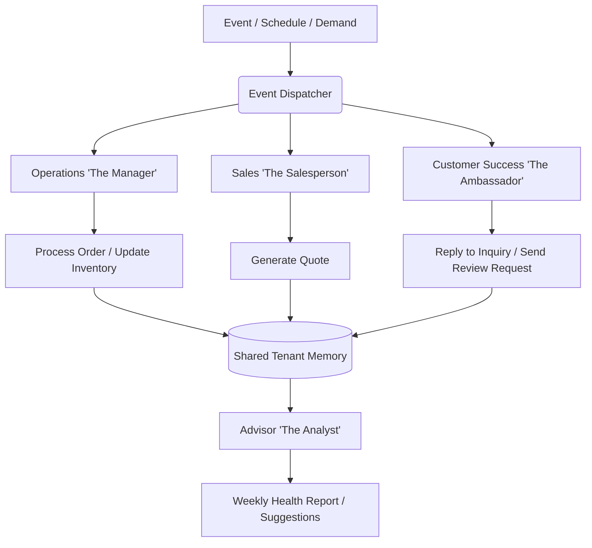

# Product Architecture Audit and Growth Vision

## Problem Statement
Small business owners (bakers, handymen, boutique owners) struggle to navigate complex SaaS tools that require technical knowledge or manual reading. They need a platform that gets them from zero to a live business in under 10 minutes. The current architecture must be evaluated and evolved to ensure it supports this "Grandmother Test" across all user journeys, specifically focusing on mobile-first interaction, strict multi-tenancy, and invisible AI orchestration.

## Research Report
*   **Target Personas:** Maya (baker, mobile-first, Instagram acquisition), Carlos (handyman, word-of-mouth, Android-only), Priya (boutique owner, online/offline sync).
*   **Core Friction Points:** Existing tools (Shopify, Wix) require a desktop to set up properly. They rely heavily on plugins and complex settings panels.
*   **OHC Advantage:** AI agents handle configuration invisibly. The UI must employ Progressive Disclosure (hiding technical settings by default).
*   **Data Constraints:** Strict tenant isolation is required. Row Level Security (RLS) is non-negotiable for all operational data.

## Design Doc

### Architecture Diagram

### Mobile UX Flow (375px first)
1.  **Welcome Screen:** "Start Free - No Code Needed" (Clear CTA).
2.  **Business Type Selection:** Visual tiles (Physical Products, Services, Food).
3.  **AI Assistant Hook:** "Connect Instagram/Calendar to auto-build your store?"
4.  **Instant Publish:** "Your store is live. Here is your link-in-bio."

### AI Agent Integration Points
*   **Onboarding:** AI acts as a setup wizard (e.g., importing Instagram photos to draft products).
*   **Customer Inquiry:** DMs/SMS are routed to the Sales or Customer Success agents for automated replies and quote generation.
*   **Operations:** Agent monitors new orders, updates inventory, and sends push notifications to the owner.

### Key Design Decisions
*   **Mobile Parity:** All features must be fully functional on a 375px screen. Desktop is an additive experience.
*   **Agent Departments:** AI is presented as "Departments" (The Manager, The Salesperson) rather than technical bots.
*   **Progressive Disclosure:** Advanced settings (like custom domains) are hidden until the user needs them (e.g., during an upgrade flow).

## Implementation Prompt
Design and implement the core backend routing and data models to support the mobile-first onboarding flow. Ensure that when a new tenant is created, the necessary default AI agents (Operations, Sales) are provisioned in the background. The API should support a seamless transition from the initial setup wizard to the live dashboard.

## Priority
P0

## Estimated Scope
Large
