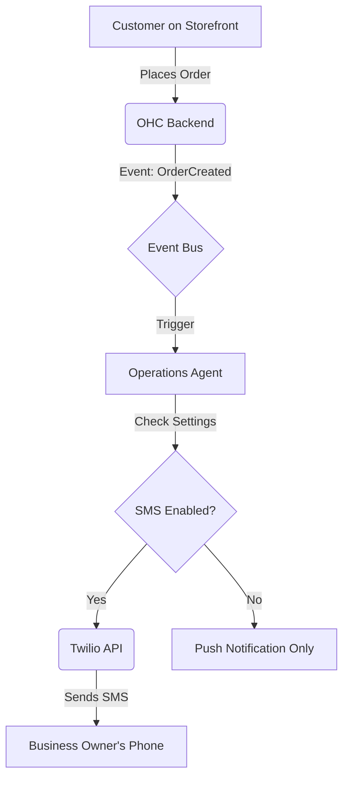

# [SMS & Notifications] Global Messaging with Twilio

## Title
Global Messaging with Twilio

## Problem Statement
Users like Fatima (Food Cart) need instant, reliable notifications on their phone when an order arrives, regardless of app connectivity. Customers also need SMS updates for order readiness.

## Research Report
*   **Tool Evaluated:** Twilio
*   **Why:** The gold standard for global SMS delivery. Extremely reliable.
*   **Ease of Use:** Invisible to the user.
*   **Pricing:** Pay per message. OHC would likely need to pass this cost or bundle it in premium tiers.
*   **Cloud/Standalone Capability:** Cloud. Standalone requires BYO API key.
*   **Competitors:** MessageBird, Plivo.

### Comparative Table
| Feature | Twilio | MessageBird | Plivo |
| :--- | :--- | :--- | :--- |
| **Global Reach** | Excellent | Very Good | Good |
| **API Maturity** | High | High | Medium |
| **Pricing** | Premium (Pay per SMS) | Moderate | Low |
| **Reliability** | Industry Standard | High | Good |

### Persona-Specific Pain Point Summary (Fatima, Food Cart Owner)
- **Pain Point:** Working in a noisy truck, misses push notifications from the OHC app.
- **Pain Point:** Customers wander off and she needs a fast way to text them "Order is ready".
- **Pain Point:** Doesn't want to use her personal phone number to text customers.

### Actionable Recommendations
1. Integrate Twilio Programmable SMS into the OHC event bus.
2. Allow business owners to toggle SMS alerts for critical events (e.g., "New Order").
3. Use Twilio to text customers from a masked/business number when orders are ready.

### Architecture Chart

## Design Doc
*   **Integration:** OHC backend uses Twilio SDK.
*   **Workflow:** "Customer Success" agent sends order status updates via SMS. "Operations" agent alerts the owner of new orders.
*   **User View:** A toggle in settings: "Send me an SMS for every new order". Customers receive texts like "Your order from Fatima's Cart is ready for pickup!"

### UI Wireframes / Screen Flow (375px First)
1.  **Settings > Notifications (375px viewport):**
    - Section: "Business Alerts"
    - Toggle: "SMS for new orders"
    - Subtext: "Receive a text message immediately when a customer pays."
2.  **Order Detail View (for Business Owner):**
    - After preparing food, user taps: "Mark as Ready".
    - Toast notification: "Customer notified via SMS."
3.  **Customer Experience (Mobile Phone):**
    - Native iOS/Android Messages app receives: "Hi! Your order (#104) from Fatima's Cart is ready for pickup."

## Implementation Prompt
Implement a notification preferences UI where a business owner can toggle 'Receive SMS for new orders'. On the backend, create a notification service that intercepts 'OrderCreated' events and, if the setting is enabled, triggers an SMS sending function (mock the Twilio API call).

## Priority
P2

## Estimated Scope
Small
