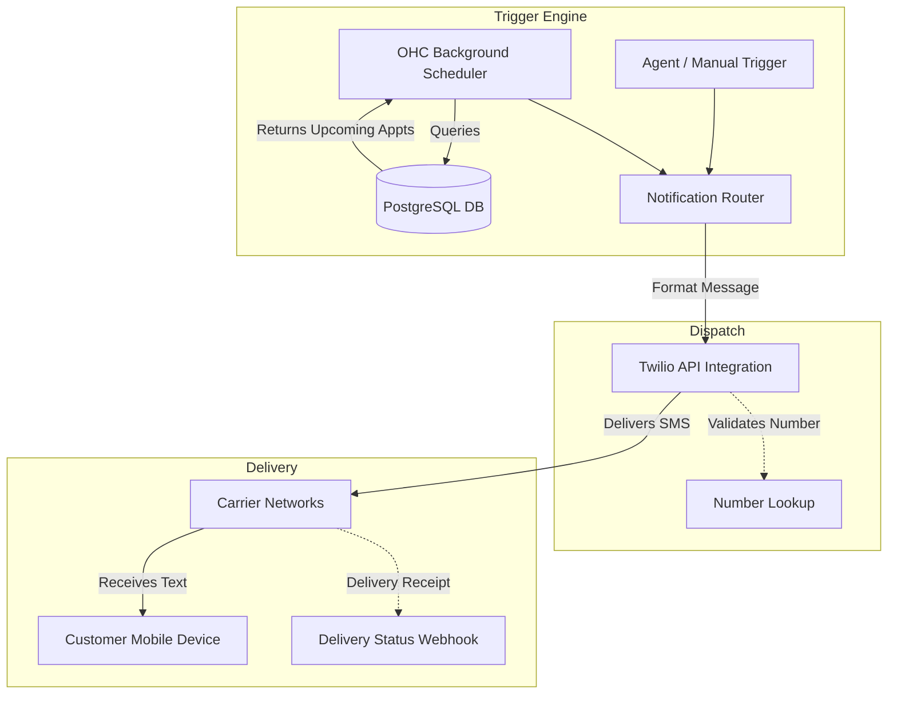

**Title**: High-Reliability SMS Notifications & Reminders

**Problem Statement**:
Email open rates are declining, and important transactional messages often end up in spam folders. For local service businesses (like a hair salon, mechanic, or dentist), critical communications like appointment reminders, "Your car is ready" notifications, or last-minute schedule changes must be sent via SMS to ensure they are seen immediately. Missed appointments (no-shows) are a direct, significant loss of revenue.

**Research Report**:
*   **Target Persona 1**: A local auto mechanic who needs to quickly tell customers their car is ready for pickup to clear lot space.
*   **Target Persona 2**: A salon owner whose profit margins are destroyed by clients forgetting appointments.
*   **Key Findings**:
    *   Twilio is the undisputed industry standard for API-driven SMS, offering unmatched reliability and global reach.
    *   **Major Blocking Issue**: The telecommunications industry recently implemented strict A2P 10DLC (Application-to-Person 10-Digit Long Code) registration requirements in the US. This registration process is a bureaucratic nightmare for small businesses, requiring EINs and weeks of approval time.
    *   OHC must either abstract this complexity completely (by acting as the registered sender) or provide a highly guided wizard for users to register their own brands.
*   **SMS Provider Ecosystem**:

| Provider | Reliability | API DX | Setup Complexity (US) | Pricing Model |
| :--- | :--- | :--- | :--- | :--- |
| **Twilio** | Industry Best | Excellent | High (A2P 10DLC limits) | Pay-per-message (~$0.0079) |
| **Plivo** | High | Good | High (A2P 10DLC limits) | Slightly cheaper than Twilio |
| **Amazon SNS** | Medium | Poor | Medium | Cheap, but harder to manage 2-way |

*   **Pricing Estimate**: Outbound SMS via Twilio costs roughly $0.0079 per message. OHC could absorb this cost for a premium tier (e.g., 500 messages/mo included) or require power users to bring their own Twilio API keys to bypass centralized limits and billing.
*   **Cloud vs. Standalone Architecture Considerations**:
    *   *Cloud*: Easier to manage a shared pool of numbers and handle inbound webhooks (if 2-way SMS is eventually supported).
    *   *Standalone*: Highly practical to simply allow the user to input their own Twilio `Account SID` and `Auth Token`. The standalone instance makes direct API calls to Twilio, completely avoiding OHC server infrastructure and liability for message content.

### The No-Show Problem

| Communication Method | Average Open Rate | Time to Open | No-Show Reduction Impact |
| :--- | :--- | :--- | :--- |
| Email Reminder | 20-30% | Hours/Days | Low |
| **SMS Reminder** | **98%** | **Minutes** | **High (up to 40% reduction)** |

**Design Doc**:
*   **Trigger Mechanism**: A scheduled background job detects an event (e.g., Appointment tomorrow at 10 AM) OR an agent triggers a manual notification.
*   **System Action**: OHC formats a concise text message and dispatches it via the Twilio REST API.
*   **User Interface View**: A simple toggle in the Settings -> Notifications panel: "Enable SMS reminders for customers 24 hours before appointments".

**Implementation Prompt**:
Build a robust, asynchronous SMS notification service integration using Twilio.
1. Create a settings interface where users can easily enable/disable automated SMS notifications for specific lifecycle events (e.g., 24-hour appointment reminders, order shipped notifications).
2. Implement a queuing mechanism to ensure messages are dispatched reliably and handle rate-limiting.
3. For the MVP, prioritize the "Bring Your Own Key" (BYOK) model: allow users to securely input their own Twilio Account SID and Auth Token to completely sidestep centralized A2P compliance management.

**Priority**: P1 (High value for service businesses)
**Estimated Scope**: Small
