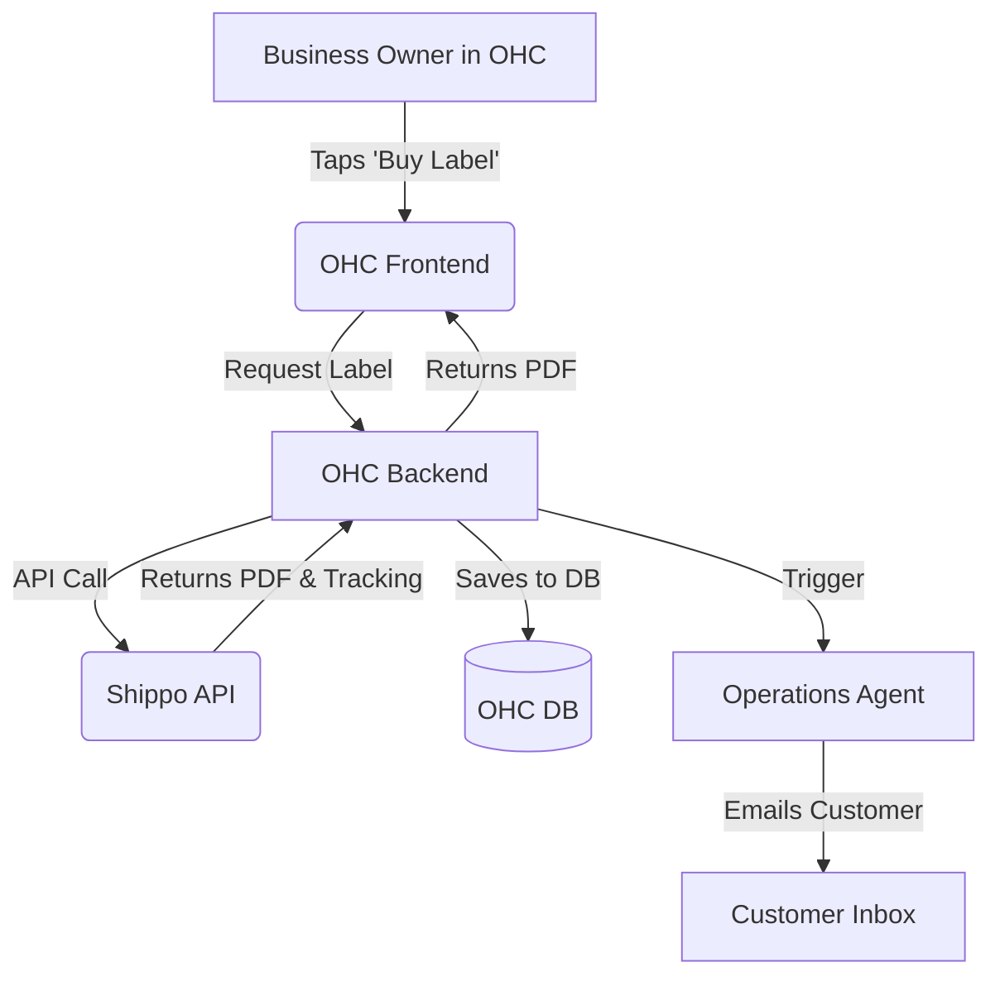

# [Shipping & Logistics] Label Generation with Shippo

## Title
Label Generation with Shippo

## Problem Statement
Selling physical products requires shipping. Navigating carrier sites (USPS, UPS, FedEx) manually to buy labels is a huge time sink for creators and boutique owners.

## Research Report
*   **Tool Evaluated:** Shippo
*   **Why:** Excellent API for multi-carrier shipping label generation and tracking.
*   **Ease of Use:** Completely abstracted by OHC.
*   **Pricing:** Pay-as-you-go per label, often with discounted carrier rates.
*   **Cloud/Standalone Capability:** Cloud-first. Standalone would require API key management or proxying through OHC's cloud infrastructure.
*   **Competitors:** EasyPost (similar, slightly more complex API), ShipStation (UI-heavy, less API-centric).

### Comparative Table
| Feature | Shippo | EasyPost | ShipStation |
| :--- | :--- | :--- | :--- |
| **API Usability** | Excellent | Very Good | Poor (UI Focused) |
| **Discounted Rates** | Yes (USPS, etc.) | Yes | Yes |
| **Pricing Model** | 5¢ per label | 1¢ per label | $9.99+/mo |
| **OHC Fit** | High (Headless) | High | Low (Redundant UI) |

### Persona-Specific Pain Point Summary (Maya, Boutique Owner)
- **Pain Point:** Spends 2 hours every evening copying addresses from her store into USPS.com.
- **Pain Point:** Has to manually email tracking numbers to customers.
- **Pain Point:** Needs a simple way to see which orders are "Pending Shipment".

### Actionable Recommendations
1. Integrate Shippo's API to calculate flat rates during checkout.
2. Build a one-tap "Purchase Label" button in the OHC order management UI.
3. Use the "Operations Agent" to automatically email the tracking link to the customer once the label is generated.

### Architecture Chart

## Design Doc
*   **Integration:** OHC backend connects to Shippo API.
*   **Workflow:** When an order is paid, OHC calculates shipping. When the user taps "Fulfill", OHC generates and charges for the label via Shippo.
*   **User View:** An "Orders" screen. User taps an order, taps "Buy Label ($4.50)", and a PDF label pops up to print.

### UI Wireframes / Screen Flow (375px First)
1.  **Orders List (375px viewport):**
    - Filter pills: "Unfulfilled", "Shipped".
    - Order Card: "Order #102 - Pending - $45.00".
2.  **Order Detail (375px viewport):**
    - Customer Info & Shipping Address.
    - Items purchased.
    - Big primary button: "Purchase Label ($4.50)"
3.  **Fulfillment Success (375px viewport):**
    - Confetti animation.
    - Button: "Print Label (PDF)".
    - Text: "Customer has been notified with tracking info."

## Implementation Prompt
Create an order fulfillment flow in the app. When viewing a pending order, the user should see an option to 'Purchase Shipping Label'. Clicking this should call a backend endpoint that calculates a flat rate, generates a mock tracking number, and updates the order status to 'Fulfilled'.

## Priority
P2

## Estimated Scope
Large
