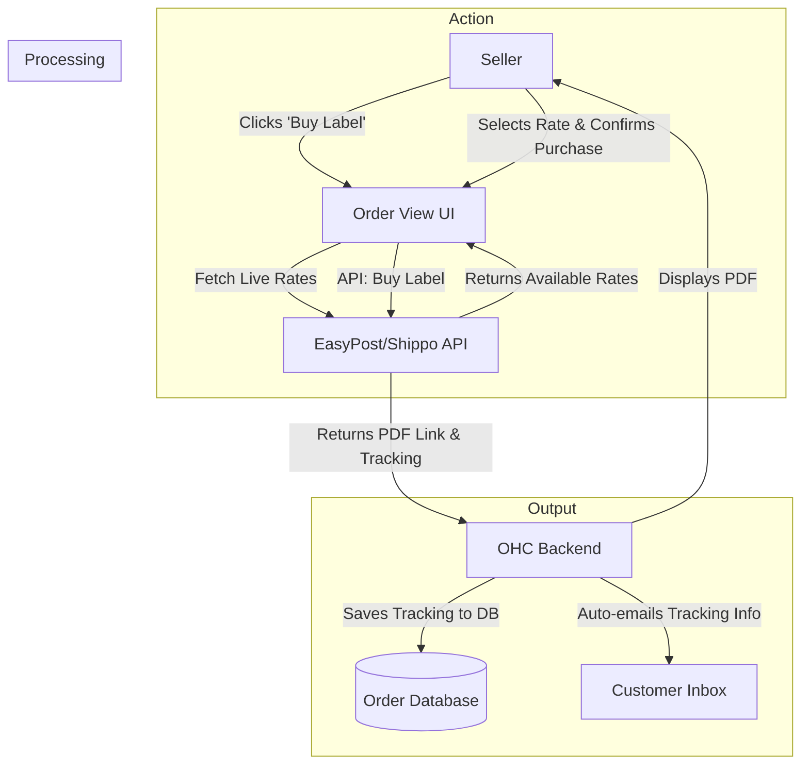

**Title**: Streamlined Automated Shipping Label Generation

**Problem Statement**:
E-commerce and physical product small businesses spend an inordinate amount of time on logistics. Calculating shipping rates, manually entering customer addresses on carrier websites, purchasing labels, printing them, and copy-pasting tracking numbers back to customers is a soul-crushing, error-prone workflow. They need this entire process automated directly within their centralized order dashboard.

**Research Report**:
*   **Target Persona 1**: Chloe, an Etsy-style artisan seller migrating to her own independent storefront, fulfilling 20-30 orders a week from her garage.
*   **Target Persona 2**: A local auto parts store that occasionally ships specialty parts across the state.
*   **Key Findings**:
    *   Direct integration with individual carriers (USPS, UPS, FedEx) is notoriously complex and requires dealing with legacy SOAP APIs.
    *   Aggregator APIs like Shippo, EasyPost, or ShipEngine abstract this complexity perfectly, providing a unified REST interface for rating and label generation across dozens of carriers.
    *   The key value proposition is time saved: reducing the label generation process from 5 minutes per order to 5 seconds.
*   **Logistics API Aggregator Comparison**:

| Provider | Core Strength | Potential Weakness | Best For |
| :--- | :--- | :--- | :--- |
| **EasyPost** | Exceptionally developer-friendly, very reliable REST API. | Can be slightly more expensive at high volumes. | Rapid MVP development. |
| **Shippo** | Excellent international support and carrier network. | Dashboard can be clunky, though we bypass it. | Global shippers. |
| **ShipEngine** | Powering Station, very robust. | Overkill for simple setups. | High-volume merchants. |

*   **Pricing Estimate**: Aggregator APIs typically charge pennies (e.g., $0.01 - $0.05) per label generated, while passing through the negotiated carrier rates (often heavily discounted USPS Commercial rates, which is a huge benefit to the user).
*   **Cloud vs. Standalone Architecture Considerations**:
    *   *Cloud*: Works perfectly as it's purely an API-driven integration. Label PDFs can be served via temporary signed URLs.
    *   *Standalone*: Highly advantageous for local hardware interaction. A Tauri-based standalone app can interface directly with local label printers (e.g., Dymo, Zebra via ZPL or raw CUPS printing) bypassing the need to download and manually print PDFs.

### The Logistics Bottleneck

| Task | Manual Time | OHC Automated Time | Error Rate Reduction |
| :--- | :--- | :--- | :--- |
| Address Entry | 2 mins | 0 mins (Auto-mapped) | 100% |
| Rate Shopping | 3 mins | 2 seconds (API Call) | - |
| Tracking Update | 1 min | 0 mins (Auto-emailed) | 100% |

**Design Doc**:
*   **Trigger Mechanism**: User marks an order as "Ready to Ship" or clicks "Buy Label".
*   **System Action**: OHC calls the EasyPost/Shippo API with the destination address and stored package dimensions to fetch live rates. Upon user selection, it buys the label and generates a PDF or ZPL file.
*   **User Interface View**: A sleek "Fulfillment" card next to an order. The user clicks, sees a list of the 3 cheapest rates, selects one, and the label PDF immediately opens for printing.

**Implementation Prompt**:
Integrate a modern shipping aggregator API (recommend EasyPost for MVP).
1. When an order object exists in OHC, provide a streamlined UI flow to generate a shipping label.
2. The system must fetch package dimensions/weight (falling back to configurable defaults), query the API for live rates, present them to the user, and execute the label purchase.
3. The successful response must provide the user with a printable PDF label, automatically save the returned tracking number to the order record, and trigger a notification to the customer containing the tracking link.

**Priority**: P2 (Crucial for e-commerce, irrelevant for service businesses)
**Estimated Scope**: Medium
