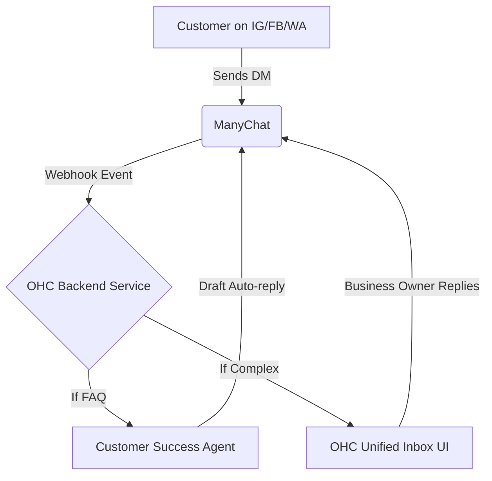

# [Social Media Integration] Unified Inbox with ManyChat

## Title
Unified Inbox with ManyChat

## Problem Statement
Business owners like Maya get DMs across Instagram, Facebook, and WhatsApp. Tracking these manually leads to missed messages, lost sales, and poor customer service. They need a single place to see and reply to all messages, and an AI to handle basic questions.

## Research Report
*   **Tool Evaluated:** ManyChat
*   **Why:** ManyChat is the industry leader for Instagram/Facebook DM automation and has robust APIs for WhatsApp.
*   **Ease of Use:** High. OHC can abstract away the workflow builder and use ManyChat as a headless messaging router.
*   **Pricing:** $15/mo for Pro (required for some API features), but free tier covers basic Instagram automation which is perfect for OHC's free tier.
*   **Cloud/Standalone Capability:** Cloud-first. Standalone would require the user to bring their own ManyChat API key.
*   **Competitors:** Chatfuel (too complex), Twilio Flex (too enterprise).

### Comparative Table
| Feature | ManyChat | Chatfuel | Twilio Flex |
| :--- | :--- | :--- | :--- |
| **Ease of Integration** | High | Medium | Low (Too Complex) |
| **Pricing** | $15/mo (Free Tier Available) | $14.99/mo | High/Custom |
| **WhatsApp Support** | Yes (Robust API) | Yes | Yes |
| **Target Audience** | SMB / Creators | Agencies | Enterprise |

### Persona-Specific Pain Point Summary (Maya, Boutique Owner)
- **Pain Point:** Frequently misses DMs from potential customers across 3 different apps.
- **Pain Point:** Has to manually copy-paste FAQs about store hours and return policy.
- **Pain Point:** Loses context of past conversations when switching devices.

### Actionable Recommendations
1. Integrate ManyChat as a headless backend for the unified inbox via OAuth.
2. Provide a default "Customer Success" agent flow that responds to common FAQs.
3. Keep the user entirely within the OHC UI to abstract away ManyChat's complexity.

### Architecture Chart

## Design Doc
*   **Integration:** OHC connects to ManyChat via OAuth.
*   **Workflow:** Incoming DMs are webhooked to OHC's "Customer Success" AI agent. The agent drafts a reply or auto-responds based on business context.
*   **User View:** The business owner sees a unified "Inbox" in the OHC app. They don't know ManyChat exists; it's just plumbing.

### UI Wireframes / Screen Flow (375px First)
1.  **Home Screen Dashboard:**
    - Bottom tab bar with an "Inbox" icon (showing unread count badge).
2.  **Inbox List Screen (375px viewport):**
    - Header: "Unified Inbox"
    - List view of conversations. Each list item shows:
        - Customer Avatar
        - Name & Platform Icon (IG/FB/WA)
        - Preview of last message
        - Timestamp & Unread indicator dot
3.  **Conversation View (375px viewport):**
    - Header: Back button, Customer Name, Platform Icon.
    - Message history with standard chat bubble layout (Customer on left, Business on right).
    - AI Suggestion Chip: "Draft reply about store hours" above the text input.
    - Bottom Input: Text field for manual reply, attachment icon, Send button.

## Implementation Prompt
Implement a unified Inbox interface in the OHC Flutter app and a Go backend service that receives webhooks from messaging platforms (simulated for now). The UI must show a list of conversations and allow the user to read and reply. The "Customer Success" agent must be able to draft replies automatically.

## Priority
P0

## Estimated Scope
Large
