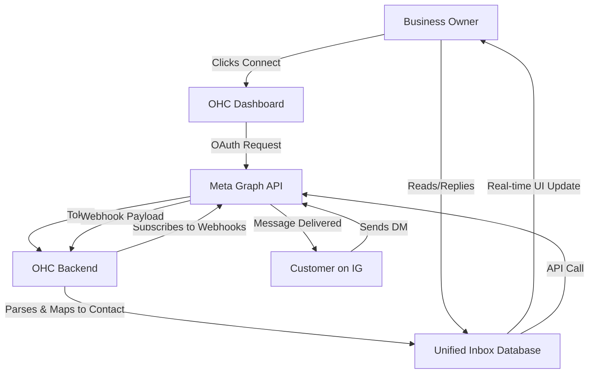

**Title**: Unified Social Media Inbox Integration & Omni-Channel Strategy

**Problem Statement**:
Small business owners, especially those active on platforms like Instagram and Facebook, often struggle to keep up with customer messages spread across multiple apps. They miss DMs, lose track of conversations, fail to convert leads, and experience high stress because they don't have a single, unified view of their social media interactions. They need a simple, centralized way to see and respond to all messages in one place without constantly context-switching and logging into 4 different apps throughout the day. The current fragmented landscape forces owners to act as human routers rather than focusing on their core business value.

**Research Report**:
*   **Target Persona 1**: Fatima, the non-technical boutique owner who relies heavily on Instagram for visual sales but struggles with the volume of DMs. She currently misses 15% of inquiries due to notification fatigue.
*   **Target Persona 2**: Carlos, the local plumber who receives emergency call-outs via Facebook Messenger but cannot safely check his phone while under a sink. He needs an intelligent agent to pre-qualify leads and aggregate them into a single high-priority queue.
*   **Key Findings**:
    *   Tools like ManyChat or a custom Meta Graph API integration provide the necessary webhook hooks.
    *   However, for a small business owner, the setup must be zero-friction. They vehemently reject configuring webhooks or setting up developer accounts. They require a simple "Connect with Instagram" OAuth flow.
    *   WhatsApp Business API is increasingly critical for international markets (LATAM, India) but introduces significant pricing complexity (conversation-based pricing).
*   **Competitive Landscape Matrix**:

| Competitor | Target Market | Complexity | Price Point | OHC Advantage |
| :--- | :--- | :--- | :--- | :--- |
| **Zendesk/Intercom** | Enterprise / Mid-market | Very High | $100+/mo | Too expensive and complex for SMBs. OHC is natively integrated. |
| **Buffer/Hootsuite** | Social Media Managers | Medium | $20-$50/mo | Focused on outbound posting, weak CRM-style DM management. |
| **ManyChat** | Marketers | High | $15+/mo | Requires building complex visual flows. |
| **OHC Unified Inbox** | Non-technical SMBs | Zero-Friction | Included | Bridges the gap, bringing DMs directly into the OHC agent's purview. |

*   **Pricing Estimate**: The Meta Graph API is generally free for basic usage limits, but third-party aggregators charge $15-$50/month. A direct OAuth integration managed by OHC would be the most cost-effective solution, potentially saving users $600/year. WhatsApp requires passing on Meta's conversation costs.
*   **Cloud vs. Standalone Architecture Considerations**:
    *   *Cloud*: Works seamlessly via standard OAuth callbacks and centralized webhooks.
    *   *Standalone*: Requires careful handling of local redirect URIs or an OHC cloud-proxy for the OAuth flow. Webhooks cannot easily reach a standalone instance behind a NAT, necessitating a polling mechanism or a persistent WebSocket connection to an OHC relay server.

### Deep-Dive Pain Points

| Persona | Pain Point | Business Impact | Emotional Impact |
| :--- | :--- | :--- | :--- |
| **Fatima (Boutique)** | Missing Instagram DMs from potential buyers asking for sizes. | Lost revenue directly tied to missed intent. | Anxiety, feeling overwhelmed. |
| **Carlos (Plumber)** | Ignoring Facebook messages while on a job. | Lost leads to competitors who reply faster. | Frustration with technology. |
| **Elena (Bakery)** | Managing separate WhatsApp and IG threads for the same customer. | Order confusion (e.g., custom cake details). | Embarrassment, damaged reputation. |

**Design Doc**:
*   **Trigger Mechanism**: User navigates to Settings -> Integrations and clicks a prominent "Connect Instagram/Facebook" button.
*   **System Action**: Standard OAuth 2.0 flow via Meta. OHC securely receives and stores a long-lived page token. OHC subscribes to necessary webhook topics (`messages`, `messaging_postbacks`).
*   **User Interface View**: A new "Social Inbox" tab appears. Messages from IG/FB/WhatsApp appear as unified chat threads mapped to a single CRM contact. The OHC agent can optionally draft replies or auto-respond to FAQs based on the business's knowledge base.

**Implementation Prompt**:
Implement an end-to-end OAuth integration flow for Meta (Instagram/Facebook Messenger). The primary objective is zero-friction onboarding: the user should be able to authenticate their business accounts with a single click.
Once authenticated, configure the backend to receive webhook payloads. Incoming messages must be intelligently routed to a unified "Inbox" view in the OHC dashboard. The UI must allow the user to reply directly from there, seamlessly mapping the reply back to the originating platform. Crucially, the OHC conversational agent must be granted read access to these messages to provide context, draft suggested replies, and track customer intent.

**Priority**: P0
**Estimated Scope**: Large
