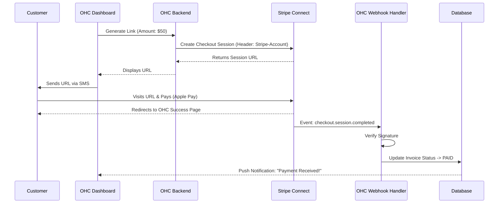
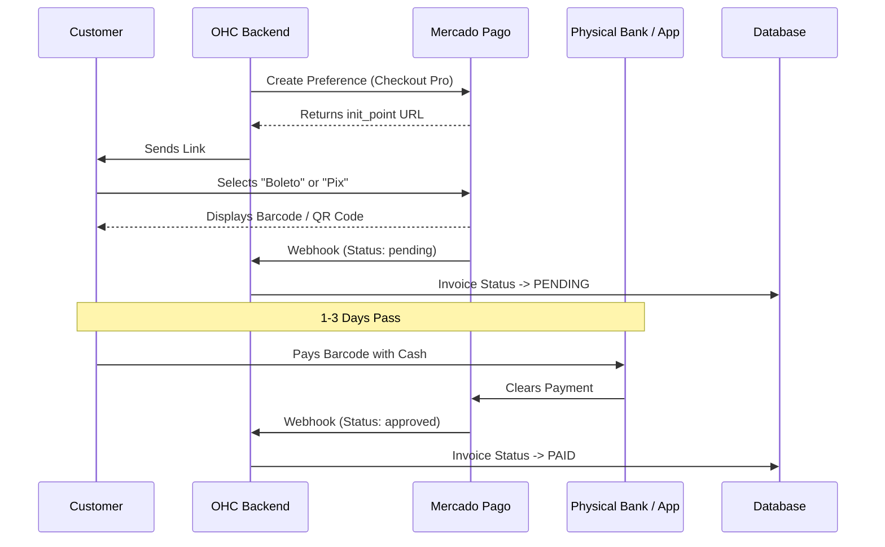

# Deep Dive: Global Payment Processing for SMBs (Stripe vs Mercado Pago)

## Executive Summary
This document provides a highly detailed, technical, and strategic breakdown of integrating payment processing solutions within the One Human Corp (OHC) ecosystem. It specifically contrasts Stripe Connect (the industry standard for US/EU) with Mercado Pago (the dominant force in LATAM). The goal is to provide a comprehensive guide for the engineering team to build a unified abstraction layer that seamlessly handles both.

## The Problem Space
Small business owners globally struggle with cash flow. Friction in the payment collection process directly correlates to late payments and defaults.
1.  **Manual Invoicing:** Generating PDFs and sending them via email is slow.
2.  **Fragmented Workflows:** Invoices exist in one system (Word/Excel), communication in another (Email/WhatsApp), and the bank account in a third.
3.  **Lack of Local Options:** Customers want to pay with the methods they trust (e.g., Apple Pay in the US, Pix in Brazil). Forcing them to use a generic credit card form reduces conversion.

## Stripe Connect (US / EU / Core Markets)

### Strategic Overview
Stripe is the undeniable leader in developer experience. For OHC, `Stripe Connect` (specifically the 'Standard' or 'Express' integrations) is the optimal path. It allows OHC to act as the platform, facilitating payments between our users (the small businesses) and their customers, without OHC taking on the massive compliance burden of holding funds.

### Technical Architecture Requirements
*   **OAuth Onboarding:** The OHC user clicks "Connect Stripe". They are redirected to Stripe's hosted onboarding flow. Upon completion, OHC receives a `stripe_account_id` (e.g., `acct_12345`).
*   **Payment Intents:** When generating a payment link, OHC must create a `PaymentIntent` via the Stripe API. Crucially, we must pass the `stripe_account_id` in the `Stripe-Account` header. This ensures the funds route directly to the user's account.
*   **Hosted Checkout vs Custom Elements:** For MVP, OHC should rely entirely on `Stripe Checkout`. We generate a `checkout.session` URL and redirect the customer there. It's secure, handles 3D Secure automatically, and supports Apple/Google Pay out of the box.

### Webhook Handling (The Hard Part)
Webhooks are the absolute source of truth for payment status. OHC cannot rely on the user returning to a success page.
1.  OHC must expose a public endpoint (e.g., `https://api.onehumancorp.com/webhooks/stripe`).
2.  This endpoint must verify the Stripe signature using the endpoint secret.
3.  It must listen for `checkout.session.completed` and `payment_intent.succeeded`.
4.  **Idempotency is critical.** Stripe may send the same webhook multiple times. The database operation (marking invoice as paid) must be safe to run concurrently.

### Mermaid Diagram: Stripe Connect Flow



## Mercado Pago (LATAM Expansion)

### Strategic Overview
Stripe's presence in LATAM is growing but still limited. Mercado Pago (owned by Mercado Libre) is an absolute necessity for businesses operating in Brazil, Mexico, Argentina, and Colombia. Crucially, it supports local asynchronous payment methods like Pix (Brazil) and Boletos, which are vastly more popular than credit cards in these regions.

### Technical Architecture Requirements
*   **OAuth Onboarding:** Similar to Stripe, Mercado Pago offers an OAuth flow to connect user accounts and obtain access tokens.
*   **Preference API:** Instead of `PaymentIntents`, Mercado Pago uses the concept of a `Preference` (Checkout Pro). Creating a Preference generates an `init_point` URL where the customer completes the payment.
*   **Asynchronous Payments (The Core Difference):**
    *   With Stripe, a card payment is synchronous (mostly). It succeeds or fails immediately.
    *   With Mercado Pago, a customer might choose to pay via `Boleto` (a printable barcode). The state becomes `pending`. The customer has 3 days to go to a physical store and pay the Boleto with cash.
    *   Therefore, the OHC UI must elegantly handle the `pending` state and educate the business owner that the funds are not yet secured.

### Webhook Handling for Asynchronous Methods
1.  Mercado Pago sends an `IPN` (Instant Payment Notification) or a Webhook.
2.  When a Boleto is generated, a webhook fires (status: `pending`).
3.  Days later, when the cash is deposited at a bank, another webhook fires (status: `approved`).
4.  The OHC system must maintain a long-running state machine for these invoices.

### Mermaid Diagram: Asynchronous Payment Flow (Pix/Boleto)



## The Unified Abstraction Layer (Engineering Directive)

The engineering team MUST NOT leak Stripe or Mercado Pago specific concepts into the core OHC business logic. We must build an internal `PaymentGatewayService` interface.

### The `PaymentGatewayService` Interface (Conceptual)
```rust
// Conceptual Rust trait for the abstraction
pub trait PaymentGatewayService {
    // Generates the hosted checkout link
    async fn create_payment_link(&self, request: PaymentLinkRequest) -> Result<String, Error>;

    // Parses and validates incoming webhooks from the provider
    async fn handle_webhook(&self, payload: Bytes, signature: &str) -> Result<WebhookEvent, Error>;

    // Fetches the current live status of a payment
    async fn check_payment_status(&self, provider_id: &str) -> Result<PaymentStatus, Error>;
}
```

### Database Schema Requirements
The `invoices` table must be flexible.
*   `status`: ENUM (`DRAFT`, `SENT`, `PENDING`, `PAID`, `FAILED`, `REFUNDED`)
*   `gateway_provider`: VARCHAR (e.g., `stripe`, `mercado_pago`)
*   `gateway_transaction_id`: VARCHAR (Stores the Stripe `pi_xyz` or MP ID)
*   `gateway_metadata`: JSONB (Stores raw provider responses for debugging)

## Small Business Owner Lens (Why this matters)
For Fatima (the boutique owner), she doesn't know what a Webhook or a PaymentIntent is. She just knows that when she texts a link to a customer on WhatsApp, and they pay, her OHC dashboard goes "Ding!" and the money appears in her bank account two days later. The entire technical architecture described above exists solely to make that "Ding!" happen reliably, 100% of the time, regardless of whether she's selling in New York or São Paulo.

## Conclusion and Recommendations
1.  **Phase 1 (Immediate):** Implement Stripe Connect. It covers the highest value markets and has the best developer documentation.
2.  **Phase 2 (Fast Follow):** Design the database schema and abstraction layer from Day 1 to support asynchronous payments. Do not hardcode synchronous assumptions.
3.  **Phase 3 (Expansion):** Implement Mercado Pago using the established abstraction layer to unlock LATAM markets.
