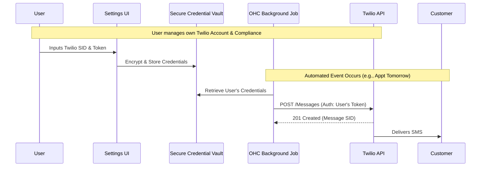

# Deep Dive: High-Reliability SMS Infrastructure (Twilio vs. Plivo)

## Executive Summary
This document provides an exhaustive analysis of SMS infrastructure providers for the One Human Corp (OHC) platform. It examines the technical, regulatory, and financial aspects of integrating Twilio versus Plivo to provide automated SMS notifications (e.g., appointment reminders, delivery updates) for small businesses. The primary challenge is navigating strict US A2P 10DLC regulations while maintaining a zero-friction user experience.

## The Problem Space
Email is increasingly unreliable for time-sensitive operational communications. Small businesses rely on SMS for critical touchpoints:
1.  **Appointment Reminders:** Reducing no-shows directly impacts the bottom line for salons, therapists, and mechanics.
2.  **Order Readiness:** "Your car is ready for pickup" or "Your food is ready."
3.  **Urgent Updates:** "The plumber is arriving in 15 minutes."

Consumers expect these notifications via SMS. However, building a reliable SMS infrastructure is fraught with regulatory hurdles.

## The A2P 10DLC Regulatory Nightmare
In the United States, carriers (AT&T, Verizon, T-Mobile) have implemented strict rules for Application-to-Person (A2P) messaging using 10-Digit Long Codes (10DLC - standard local phone numbers).
*   **The Rule:** Every business sending SMS must register their Brand (who they are) and their Campaign (what they are sending).
*   **The Process:** Requires an EIN (Employer Identification Number), physical address verification, and manual approval from a vetting entity (The Campaign Registry).
*   **The Impact on OHC:** We cannot simply buy a pool of phone numbers and let our users send messages from them. If Fatima (boutique owner) sends promotional texts from a number registered to OHC, carriers will flag it as spam, block the number, and heavily fine OHC.

## Provider Analysis

### Twilio
Twilio is the industry titan. Unmatched API documentation, highest deliverability rates, and global reach.
*   **API Quality:** Exceptional. The REST API is intuitive, and client libraries exist for every language.
*   **Reliability:** 99.99% uptime SLA. Intelligent routing minimizes dropped messages.
*   **Compliance Handling:** Twilio provides APIs to automate A2P 10DLC registration (ISV onboarding). However, this requires OHC to build complex UIs to collect EINs, addresses, and campaign descriptions from our users, and then poll Twilio for approval status (which can take days/weeks).
*   **Cost:** ~$0.0079 per outbound message (US).

### Plivo
Plivo is the primary challenger to Twilio. Very similar feature set, often slightly cheaper, but with less brand recognition.
*   **API Quality:** Very good, heavily inspired by Twilio's design.
*   **Reliability:** High, comparable to Twilio in core markets.
*   **Compliance Handling:** Similar to Twilio, requires ISV onboarding and A2P registration flows.
*   **Cost:** Slightly lower than Twilio (~$0.0055 per outbound message).

### Provider Comparison Matrix

| Feature | Twilio | Plivo | Impact on OHC |
| :--- | :--- | :--- | :--- |
| Global Deliverability | Industry Best | Excellent | Critical for international users |
| Developer Experience | 10/10 | 8/10 | Faster implementation with Twilio |
| Cost (US Outbound) | ~$0.0079 | ~$0.0055 | Marginal difference for low-volume SMBs |
| A2P Compliance API | Yes (Complex) | Yes (Complex) | The main blocker for both |
| "Bring Your Own Key" Support | Excellent | Excellent | Crucial for MVP strategy |

## Strategic Implementation Plan (The "BYOK" MVP)

Because building the UI and state machines for A2P 10DLC registration is a massive undertaking (easily a 2-month engineering project), OHC must adopt a phased approach.

### Phase 1: Bring Your Own Key (BYOK) - The MVP
To deliver value immediately without taking on compliance liability, the MVP will require users to provide their own API keys.
1.  **Target Audience:** Power users and slightly tech-savvy business owners.
2.  **Workflow:**
    *   User creates their own Twilio account.
    *   User completes their own A2P 10DLC registration directly in the Twilio console.
    *   User generates an `Account SID` and `Auth Token` and buys a phone number.
    *   User pastes these credentials into the OHC Integrations panel.
3.  **Technical Implementation:**
    *   OHC stores the credentials securely (encrypted at rest).
    *   When the background worker needs to send an SMS, it retrieves the user's specific credentials and makes the API call directly to Twilio.
    *   *Liability:* Zero. The user owns the relationship with Twilio and the carriers. If they send spam, their Twilio account is suspended, not OHC's.

### Mermaid Diagram: Phase 1 (BYOK) Architecture

### Phase 2: Native OHC SMS (The Long-Term Vision)
Once OHC reaches sufficient scale, we must build the native integration to achieve the "zero-friction" mandate for non-technical users like Fatima.
1.  **Workflow:** User clicks "Enable SMS". They are presented with a simplified form asking for their Business Name, EIN, and Address.
2.  **Technical Implementation:**
    *   OHC uses Twilio's ISV Trusthub APIs.
    *   OHC acts as the Sole Proprietor or Secondary ISV.
    *   We submit the registration via API and handle the asynchronous webhooks when the registration is approved/rejected by The Campaign Registry.
    *   Once approved, OHC automatically provisions a local phone number via the API and assigns it to the user.
    *   *Billing:* OHC absorbs the cost or bundles it into a premium subscription tier.

## Standalone Mode Considerations
The BYOK model (Phase 1) is absolutely perfect for Standalone mode. A desktop application running locally can securely store the Twilio credentials in the local SQLite database and make direct outbound HTTP requests to the Twilio API. It requires zero cloud infrastructure from OHC to operate, aligning perfectly with the local-first philosophy.

## Small Business Owner Lens
Fatima does not want to know what an EIN or an A2P 10DLC campaign is. She just wants her customers to get a text message so they show up to their appointments. While Phase 1 (BYOK) forces her to deal with some complexity, it is a necessary stepping stone to validate the feature. Phase 2 must completely abstract this away. The success of this feature hinges entirely on burying the telecom bureaucracy beneath a beautiful, simple UI.

## Conclusion and Recommendations
1.  **Adopt Twilio as the primary provider.** The superior developer experience and documentation outweigh the minor cost savings of Plivo.
2.  **Strictly enforce Phase 1 (BYOK) for the MVP.** Do not attempt to build the A2P compliance flows internally until the core feature is validated and user demand is proven.
3.  **Design the Notification Router to be provider-agnostic.** The internal code that generates the message content ("Your appt is tomorrow at 2 PM") must be decoupled from the code that dispatches it via Twilio. This allows for easy swapping to Plivo or AWS SNS in the future if pricing changes.
