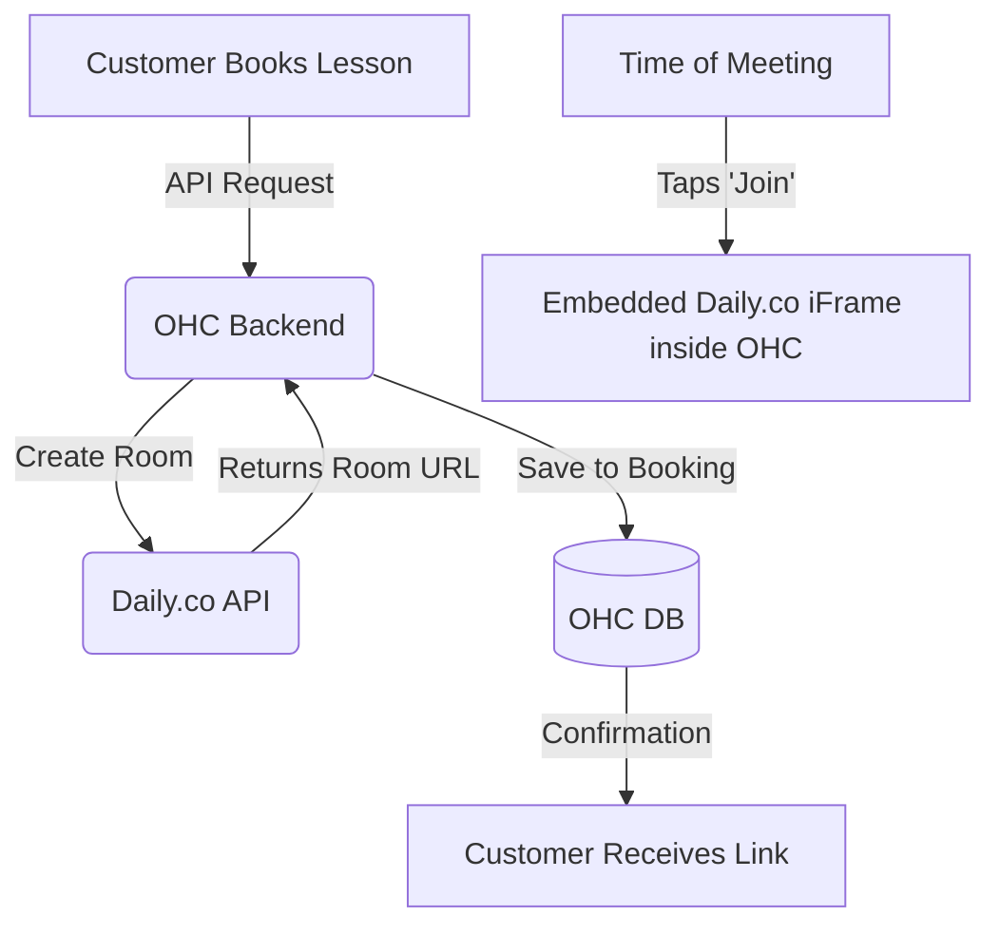

# [Video Conferencing] Auto-Meeting Links with Daily.co

## Title
Auto-Meeting Links with Daily.co

## Problem Statement
Online tutors like Leo need a video link generated automatically for every booked lesson, without having to manually copy-paste Zoom links into calendar invites.

## Research Report
*   **Tool Evaluated:** Daily.co
*   **Why:** Developer-first video APIs. Allows embedding the video call directly into the OHC web app, keeping the user in the ecosystem instead of kicking them out to Zoom.
*   **Ease of Use:** Seamless. The meeting happens inside OHC.
*   **Pricing:** Generous free tier (10,000 participant minutes/mo).
*   **Cloud/Standalone Capability:** Cloud. Standalone requires internet connectivity for the WebRTC streams.
*   **Competitors:** Zoom API (clunky, requires external app), Google Meet API (hard to embed).

### Comparative Table
| Feature | Daily.co | Zoom | Google Meet |
| :--- | :--- | :--- | :--- |
| **Embeddability** | Excellent (Native UI) | Poor (Kicks to App) | Poor |
| **API Quality** | High | Low/Legacy | Medium |
| **Free Tier** | 10,000 mins/mo | 40 min limit/call | 1 hr limit/call |
| **White-labeling** | Yes | No | No |

### Persona-Specific Pain Point Summary (Leo, Online Tutor)
- **Pain Point:** Has to create a new Zoom meeting manually for every new booking.
- **Pain Point:** Students often email asking "where is the link?" because they lost the calendar invite.
- **Pain Point:** Hates when students have to download the Zoom app just to join a 30-minute lesson.

### Actionable Recommendations
1. Integrate Daily.co to dynamically create meeting rooms via API.
2. Embed the Daily.co pre-built UI widget directly into the OHC web storefront and native apps.
3. Automatically append the generated room link to the booking confirmation and calendar invites.

### Architecture Chart

## Design Doc
*   **Integration:** OHC creates a Daily.co room dynamically when a booking is confirmed.
*   **Workflow:** "Operations" agent detects a virtual booking, generates a Daily.co link, and adds it to the calendar invite.
*   **User View:** The tutor and the student just see a "Join Meeting" button in the OHC app that opens a video call directly in the browser.

### UI Wireframes / Screen Flow (375px First)
1.  **Booking Detail View (375px viewport):**
    - "Guitar Lesson with Leo"
    - Date/Time: Oct 12, 2:00 PM.
    - Big primary button: "Join Meeting" (Becomes active 5 mins before start).
2.  **In-App Video Call (375px viewport):**
    - The entire screen is taken over by the Daily.co iframe.
    - Standard video controls (Mute, Camera Off, Leave) overlaid at the bottom.
    - No external app download required.

## Implementation Prompt
Build a virtual meeting integration. When a 'Virtual Service' is booked, the backend should generate a unique meeting URL (using a mock Daily.co room generator). Update the booking details UI to display a 'Join Meeting' button that links to this URL.

## Priority
P3

## Estimated Scope
Medium
