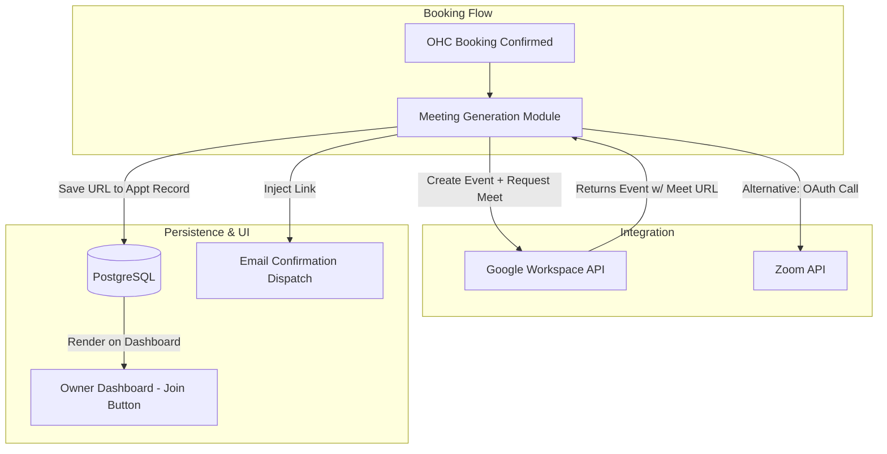

**Title**: Automated Video Consultation Link Generation

**Problem Statement**:
Consultants, online tutors, remote therapists, and virtual service providers need to generate a secure, unique video meeting link every time a client books a session. Doing this manually for every booking is tedious, looks unprofessional, and is highly prone to errors (e.g., accidentally sending the wrong link to the wrong person, or reusing the same personal meeting room resulting in clients interrupting each other).

**Research Report**:
*   **Target Persona 1**: A remote high-school math tutor booking 5-8 daily sessions.
*   **Target Persona 2**: A business consultant offering initial 30-minute discovery calls.
*   **Key Findings**:
    *   Zoom and Google Meet are the dominant platforms.
    *   Integrating Google Meet is often the path of least resistance because it can be bundled seamlessly with the Google Calendar sync integration (by simply appending `conferenceData` to the calendar event request).
    *   Zoom requires a separate, dedicated OAuth application approval process which adds friction.
*   **Video Platform Assessment**:

| Tool | Integration Method | Brand Recognition | User Preference | Friction Level |
| :--- | :--- | :--- | :--- | :--- |
| **Google Meet** | via Google Calendar API | Very High | High | Very Low (Bundled) |
| **Zoom** | via Zoom API (OAuth app) | Universal | Very High | Medium (Separate Auth) |
| **Whereby** | via API | Low | Low | Low |
| **Teams** | via MS Graph API | Corporate | Low for SMBs | High |

*   **Pricing Estimate**: Free. The integration leverages the user's existing authenticated accounts (e.g., their Google Workspace or free Gmail account) to generate the links.
*   **Cloud vs. Standalone Architecture Considerations**:
    *   Works identically in both environments, as it relies purely on API calls authenticated by the user's stored OAuth tokens.

### The Professionalism Gap

| Workflow | Client Experience | Owner Effort | Risk Level |
| :--- | :--- | :--- | :--- |
| Manual Link Generation | Disjointed. Might receive link right before meeting. | High. Constant context switching. | High (Sending wrong link) |
| **Automated OHC Sync** | Seamless. Link is in the initial calendar invite. | Zero. Entirely automated. | Zero |

**Design Doc**:
*   **Trigger Mechanism**: A booking is successfully confirmed within the OHC platform.
*   **System Action**: OHC requests a dynamic meeting link via the connected integration (e.g., when creating the Google Calendar event, it requests Meet generation).
*   **User Interface View**: The final booking confirmation page automatically displays a prominent "Join Meeting" button. The auto-generated email confirmation includes the exact URL.

**Implementation Prompt**:
Extend the core calendar scheduling integration (see Calendar Brief) to automatically append video conferencing capabilities.
1. When a new appointment is created, the system should default to using the Google Calendar API to automatically generate a unique Google Meet room link.
2. This unique URL must be stored safely with the appointment record in the database.
3. Update the frontend UI to display a prominent, actionable "Join Video Call" button on the dashboard when the appointment time is approaching (e.g., within 15 minutes of start time).

**Priority**: P2 (Important, but dependent on Calendar Sync)
**Estimated Scope**: Small (If piggybacking on Calendar API)
