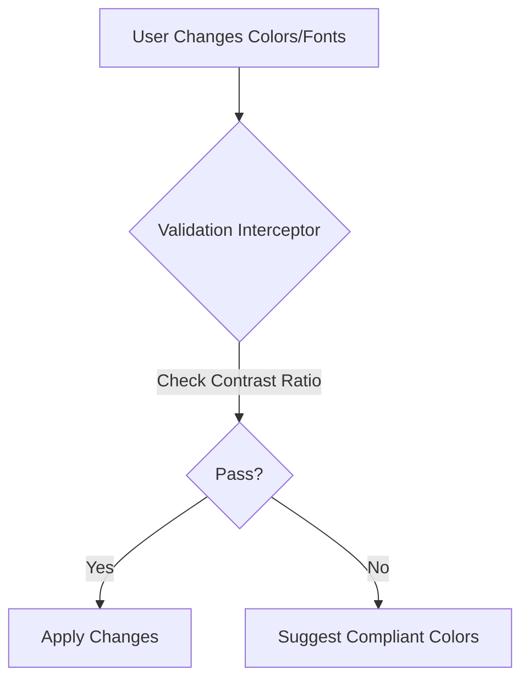

**Title**: Automated WCAG Compliance Enforcement
**Problem Statement**: Most SMB websites fail basic accessibility standards, exposing owners to potential lawsuits and excluding disabled customers.
**Research Report**: Accessibility lawsuits against small businesses are rising rapidly. Current website builders offer accessibility "checkers" but rarely enforce compliance.
**Design Doc**:
*   Architecture: Storefront Builder UI -> Accessibility Validation Interceptor -> Render Pipeline.

**Implementation Prompt**: Implement a strict accessibility enforcement layer in the storefront builder. If a user selects a background and text color combination that fails WCAG AA contrast ratios, the system should actively block the change and use an AI agent to suggest the nearest color palette that meets the compliance standard.
**Priority**: P1
**Estimated Scope**: Medium
