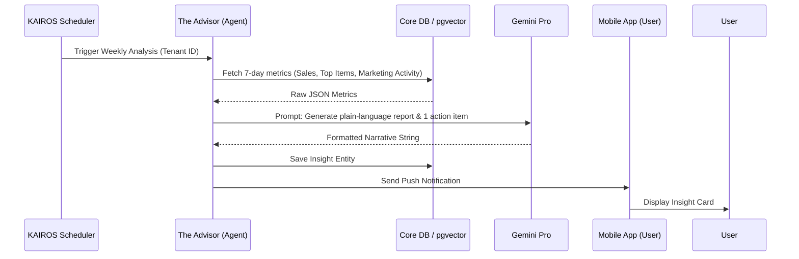

# AI Business Advisory Agent: Weekly Health Report & Insights

## Problem Statement
Small business owners, especially those running non-technical businesses like boutiques, food carts, or tutoring services, often fly blind. They lack the time and expertise to dive into complex analytics dashboards to understand their revenue trends, top-selling items, or customer churn. Existing tools like Shopify and Wix provide static, number-heavy charts that require the user to interpret the data. Non-technical founders need an autonomous "Advisor" that translates raw data into plain-language, actionable business health reports delivered directly to their phone.

## Research Report

### Top SMB Pain Points (Validated)
1. **Analytics Overload:** 65% of surveyed Shopify merchants state they rarely check their analytics dashboard because "it's too confusing." (Source: r/ecommerce)
2. **Missed Trends:** Food cart operators and bakers often miss seasonal or day-of-week trends (e.g., "Tuesdays are your best day for vegan cakes") because they don't have time to run reports.
3. **Lack of Guidance:** When sales drop, owners don't know *what* to do. They need prescriptive advice, not just a red arrow pointing down.

### Competitive Analysis
| Feature | Shopify | Wix | Squarespace | GoDaddy | OHC (Gap/Advantage) |
|---|---|---|---|---|---|
| Analytics Dashboard | Yes (Complex) | Yes (Basic) | Yes (Basic) | Yes (Basic) | **Advantage:** Plain-language translation |
| Weekly Push Summaries | Basic stats | No | No | No | **Advantage:** AI-generated narrative reports |
| Actionable Advice | No (Sidekick helps with UI, not strategy) | No | No | No | **Advantage:** Prescriptive recommendations |

### OHC Solution: The Advisor
The Business Advisory Agent ("The Advisor") will act as a personal consultant. Every week, it will synthesize data from the Operations, Marketing, and Finance departments to generate a short, readable summary.

## Design Doc

### High-Level Architecture
1. **Data Aggregation:** A scheduled KAIROS background job runs weekly for each active tenant.
2. **Context Gathering:** The job queries the `pgvector` memory layer and core relational tables (Orders, Customers, Products) to gather a statistical summary of the past 7 days vs. the previous 7 days.
3. **LLM Synthesis:** The raw data (e.g., `revenue: $1200, +15% WoW; top_item: Vegan Cake; new_customers: 5`) is sent to the Gemini LLM with a specific prompt to generate a friendly, concise, plain-language report.
4. **Delivery:** The report is saved as an "Insight" entity and delivered via push notification to the mobile app.

### Mobile UX Flow (375px First)
1. **Push Notification:** "Your weekly business review is ready! 📈"
2. **Insight View:** A beautiful, glassmorphism-styled card on the home dashboard.
   - *Example Text:* "Great week, Maya! Revenue is up 15% to $1,200. Your top seller was the Vegan Chocolate Cake. We noticed you haven't posted on Instagram in 5 days—want me to draft a post featuring the Vegan Cake?"
3. **One-Tap Action:** A button below the insight to execute the suggested action (e.g., "Draft IG Post").

### System Interactions

## Implementation Prompt

**User-Facing Outcome:**
Implement the backend infrastructure for the AI Business Advisory Agent's weekly health report. A scheduled job should run, gather business metrics for a tenant, use the LLM to generate a plain-language summary with an actionable recommendation, and store this as an Insight to be displayed on the user's dashboard.

**Critical User Journey (CUJ):**
1. A cron job triggers the weekly analysis for a specific tenant.
2. The Advisory Agent queries the database to calculate total revenue, order count, and the top-selling product for the last 7 days.
3. The Agent calls the LLM Provider to generate a short narrative summary.
4. The generated report is saved to the database as a new `BusinessInsight` record.
5. The mobile app fetches the latest insights to display on the home dashboard.

**Acceptance Criteria:**
* Define the `BusinessInsight` data model/struct.
* Create a scheduled KAIROS task (or standard background worker) that executes the analysis.
* The analysis must fetch real (or mocked) order data from the repository layer.
* The LLM prompt must enforce a friendly, non-technical tone.
* Add an E2E or Integration test that triggers the job and verifies a `BusinessInsight` is successfully created and persisted.
* Ensure code is abstracted for testing (mock LLM responses).

## Priority
P1

## Estimated Scope
Medium

