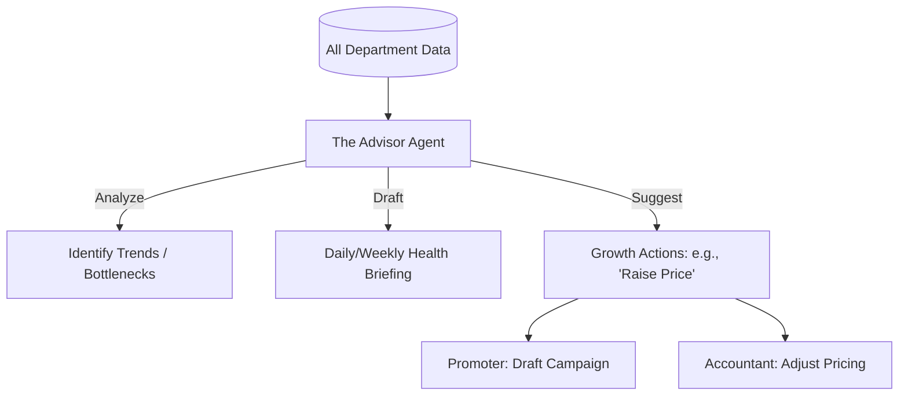

# [Advisory] Architecture Brief: "The Advisor"

## Title
OHC "The Advisor": Strategic Insights and Cross-Department Orchestration

## Problem Statement
Small business owners are often too "in the business" to work "on the business." They have data but no direction. Maya knows she's busy, but she doesn't know *why* Tuesday is her best day or that she should raise her prices. They need a personal consultant who understands the whole picture.

## Research Report
- **The "Whole Picture" Advantage**: "The Advisor" is the only agent with a "read-only" view of all other departments (Finance, Marketing, Sales, Ops).
- **Plain-Language Insights**: No complex charts. "Your vegan cake is trending. You could make $100 more this week if you post a video on Instagram."
- **Actionable Growth**: "The Advisor" doesn't just report; it **queues tasks** for other departments (e.g., "The Promoter") to execute growth ideas.

## Design Doc

### High-Level Architecture (Mermaid.js)

### UI Flow (375px First)
- **Morning Briefing**: A high-end glassmorphic card on the home screen: "Good morning, Maya. You have 3 orders to bake. Insight: Customers love your cupcakes—add a 6-pack bundle to increase revenue."
- **Next-Step Cards**: Proactive suggestions like "Your inventory is low," or "You haven't posted on TikTok in 3 days."

### AI Agent Integration
- **Triggers**: `tenant.briefing.scheduled`, `tenant.insight.detected`.
- **Tools**: `finance_report`, `trend_analysis`, `cross_department_suggest`.

## Implementation Prompt
**To Implementer Agent:**
Implement "The Advisor" (Business Advisory) department. This agent's primary function is to synthesize data from all other AI departments to provide strategic guidance. Implement the "Daily Health Briefing" which generates a concise, plain-language summary of the business's status. The agent should also monitor for "Growth Triggers" (e.g., a high-velocity product) and autonomously queue "Draft-for-Review" tasks for "The Promoter" or "The Salesperson" to capitalize on the opportunity.

## Priority
P0

## Estimated Scope
Medium
