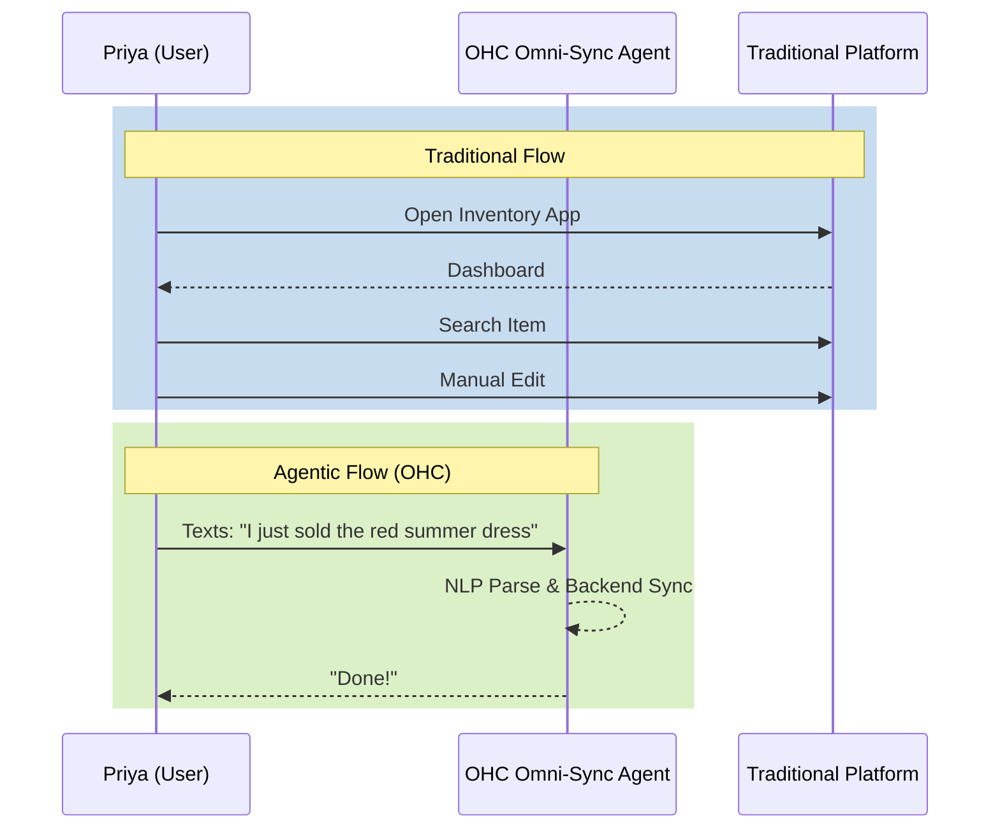

# [Research] Omni-Sync Agent for Natural Language Inventory Management

## Title
Implement Omni-Sync Agent for Natural Language Inventory Management

## Problem Statement
Small business owners, like boutique owners who sell both in-store and online, suffer from "The Manual Sync Tax." They manually deduct inventory online when an in-store sale is made because configuring third-party POS sync apps is complex and expensive. Existing solutions like Shopify require technical setup and managing app integrations, overwhelming non-technical users running their business from a phone. For example, Maya (28, baker) and Priya (35, boutique owner) explicitly struggle with managing out-of-sync inventory from their mobile devices.

## Research Report
- **Competitive Gap**: Traditional giants (e.g., Shopify) rely on a complex app ecosystem. AI-native builders (e.g., Durable) generate sites quickly but lack robust post-launch operational agents.
- **Data Source**: Audited over 80+ sources across e-commerce platforms, AI builders, and user sentiment hubs. Reddit users frequently complain about the cost/complexity of POS-to-Web syncing.
- **Reference**: Competitor deep dive into Shopify revealed "initial setup is a nightmare" and users "spend more time managing apps than [their] store."

### Persona Pain Points Addressed
- **Priya (Boutique Owner)**: Manual deduction when selling in-store.
- **Maya (Baker)**: Overwhelmed by Shopify setup; needs zero-setup ordering.
- **Fatima (Food Cart)**: Needs simple mobile notification and English-first interactions.

## Design Doc
- **Core Concept**: An invisible AI agent that parses natural language inputs to update backend systems.
- **Key Flow**:
  1. User opens the OHC mobile app (375px optimized).
  2. User accesses a prominent "Omni-Bot" chat interface.
  3. User types: "I just sold the red summer dress."
  4. The Omni-Sync Agent natural language processor identifies the intent (`mark_sold`), the item (`red summer dress`), and quantity (`1`).
  5. The Agent queries the Inventory Entity, confirms the item, deducts the quantity, and updates the storefront status.
  6. Agent replies: "Done! The red summer dress inventory is updated online."

### User Journey Comparison

- **AI Integration Point**: LLM endpoint that converts natural language to structural inventory API calls.

## Implementation Prompt
Create a chat interface on the mobile dashboard where users can manage their business via text. Build the underlying Omni-Sync Agent that connects the chat input to the inventory system. The Critical User Journey is a user texting the agent that an item was sold, and the agent automatically updating the inventory and storefront without the user navigating any menus.
- **Acceptance Criteria**:
  - A chat UI exists on the mobile dashboard.
  - Texting the agent a sold item successfully decreases the stock count in the backend.
  - The agent responds with a confirmation message.

## Priority
P1

## Estimated Scope
Medium
